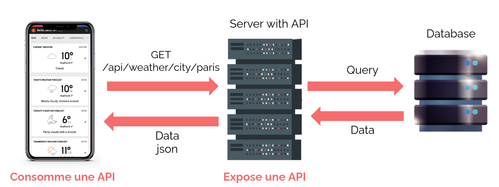
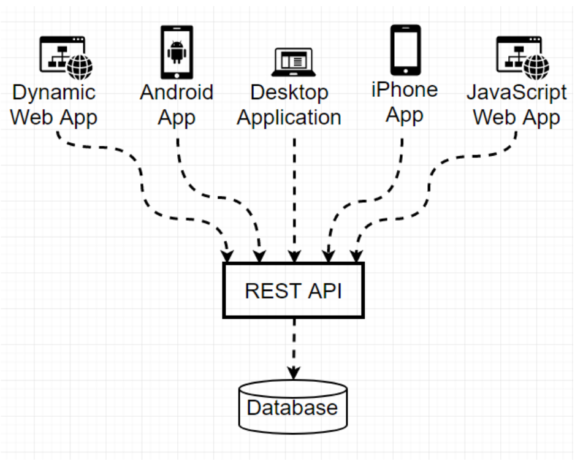
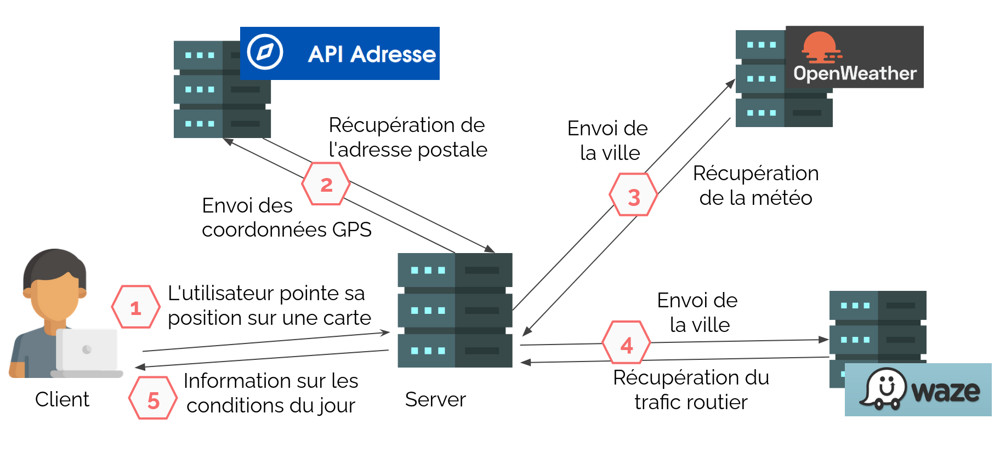
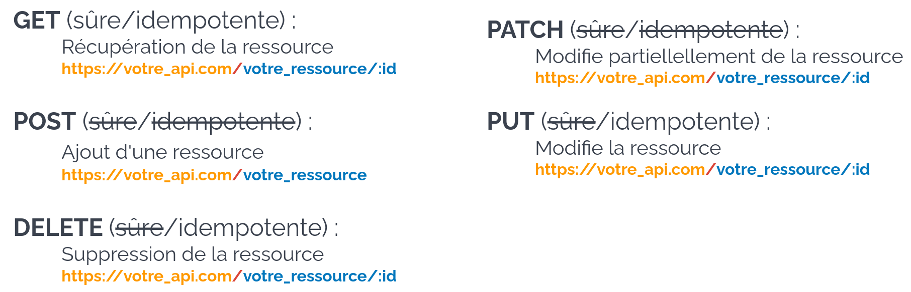
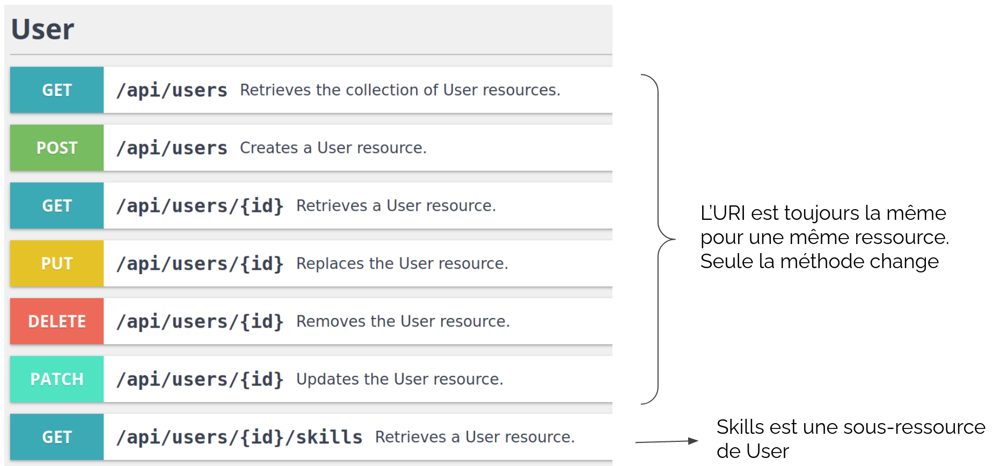
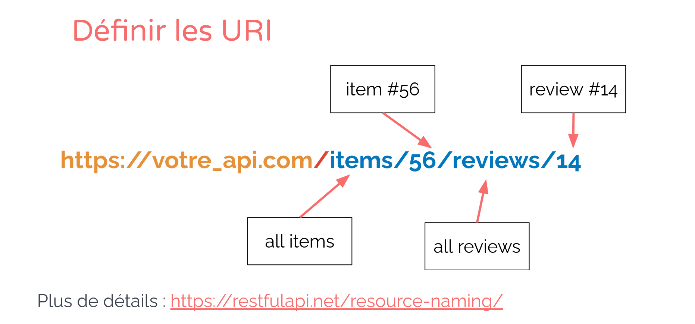
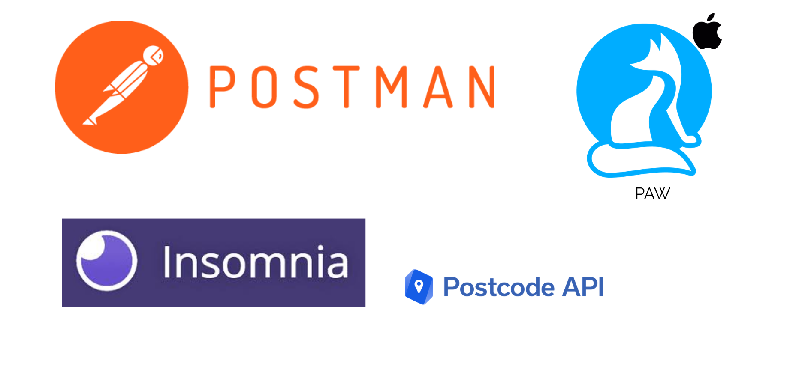
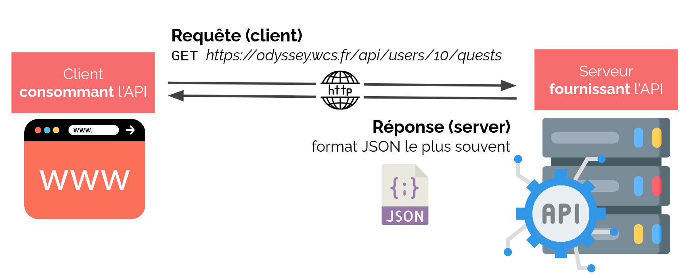
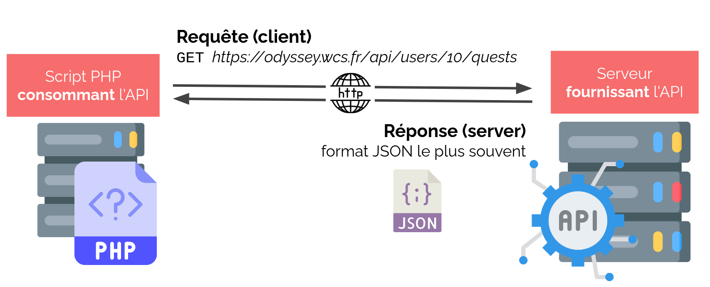

# Notes API

## Tables of contents

- [Notes API](#notes-api)
  - [Tables of contents](#tables-of-contents)
- [1. **C'est quoi une API**](#1-cest-quoi-une-api)
- [2. **C'est quoi une API web**](#2-cest-quoi-une-api-web)
- [3. **API REST**](#3-api-rest)
- [4. **Consommer une API en PHP**](#4-consommer-une-api-en-php)
- [5. **Exposer une API en PHP**](#5-exposer-une-api-en-php)
  - [5.1. Création d'une BDD et d'un manager](#51-création-dune-bdd-et-dun-manager)
  - [5.2. Création d'un controlleur méthode GET](#52-création-dun-controlleur-méthode-get)
  - [5.3. Création d'un controlleur méthode POST](#53-création-dun-controlleur-méthode-post)
  - [5.4. Utilisation de l'API méthode GET](#54-utilisation-de-lapi-méthode-get)
  - [5.5. Utilisation de l'API méthode POST](#55-utilisation-de-lapi-méthode-post)
- [6. **Main Title**](#6-main-title)

[Return to Top](#notes-api)
# 1. **C'est quoi une API**

**Application programming interface** : c'est une interface entre deux programmes informatiques.  
Contrairement à une CLI ou à une GUI qui permettent à un utilisateur d'interagir avec un programme, une API permet à un programme d'interagir avec un autre programme :
- Un programme expose une API. (serveur souvent)  
- Un autre programme consomme une API. (navigateur souvent)

Un système d'exploitation fourni plusieurs API , que les logiciels peuvent utiliser afin d'accéder aux ressources systèmes : comme afficher des chose sà l'écran, récupérer les entrées de la souris, du clavier, avoir accès à la caméra, aux haut parleurs etc... ce sont des fonctions utilisables directement dans un programme mais dont le code fait partie du système d'exploitation.

Exemple :  
https://swiperjs.com/  
On fabrique nos carroussel grâce à l'API :
https://swiperjs.com/swiper-api   
La page nous explique comment l'utiliser.

Exemple :  
Firefox communique avec plusieurs API de votre système d'exploitation, afin d'avoir accès à Internet, afficher des choses à l'écran, récupérer les entrées de la souris et du clavier, avoir accès la caméra, aux haut-parleurs, etc...

[Return to Top](#notes-api)
# 2. **C'est quoi une API web**

Une API web est une API dont la communication passe par le web. C'est un ensemble de fonctionnalités offertes aux développeurs pour utiliser les services d'un autre logiciel dans leur propre application.

Le plus souvent il s'agit d'un serveur web qui reçoit des requêtes HTTP et qui répond du JSON.
- Comme toute requête http, une requête API peut contenir des données d'entrées (ex: POST)
- La réponse aussi peut contenir des données de sorties, mais pas forcément (ex : 404)

Par exemple, à chaque fois que l'on utilise une application de messagerie instantanée, ou que l'on veut savoir le temps qu'il fait, on utilise une API :



Exemple appli météo :
Le serveur requête la BDD, reçoit des données sous forme JSON. L'application consomme donc l'API de la météo avant de l'afficher.


* ## Pourquoi faire une API ?

C'est une façon de permettre l'accès à des données ou à des traitements depuis des applications multiples.  
Elle permet de rendre l'application indépendante de l'interface utilisateur. Ainsi il deveint envisageable d'avoir des interfaces pour accéder à une application.



Utiliser une API tierce permet d'accéder à un service externe sans avoir besoin de le recoder. Toutes les API sont fournis, en principe, avec une document pour savoir comment elles sont structurées. (le fichier JSON). Une majorité est gratuite mais il en existe aussi des payantes. Notemment quand les données sont monétisées.

**Exemple :**
API de réseaux sociaux : récupérer les derniers posts
API de météo : connaître la météo pour une ville donnée
API ed géolocalisation : obtenir les coordonnées GPS depuis une adresse
API de communication ; envoyer un SMS ou un mailing à ses clients.

Récupérer des infos concernant Star Wars :  
https://swapi.dev/

Récupérer des résultats sportifs en live :  
https://live-score-api.com/documentation

Récupérer des blagues nulles :  
https://dadjokes.io/

Un générateur de même :  
https://imgflip.com/api

Intégrer Deezer à son application :  
https://developers.deezer.com/login?redirect=/api

Une application qui affice plusieurs informations sur ma position GPS :



[Return to Top](#notes-api)
# 3. **API REST**

Il existe aussi SOAP  mais elle est beaucoup plus ancienne et de moins en moins utilisée. Il y a aussi du graphql. Le principe est le même, l'architecture change.


REST signifie : **`RE`prensentational `S`tate `T`rans**

C'est un style d'architecture logicielle proposée par Roy Fielding (né en sept 1965 à Laguna Beach, qui a fait beaucoup de travaux de développement du serveur web apache,  DOCTOR OF PHILOSOPHY, in Information and Computer Science, 2000).
Les principes Rest étaient auparavant connus comme le modèle objet de HTTP depuis 1994.
Roy Fielding est l’un des principaux auteurs de la spécification HTTP, mais aussi membre fondateur d’Apache, dont il a été le directeur de 1999 à 2003.

* ## **REST : La requête**

Identifiants de ressources : URI/URL  
    => une URL = une ressource (ex : https://votre_api.com/votre_ressource)

Objectif de la requête : méthode HTTP  
    => action à faire sur la ressource

**Les différentes requêtes, actions sur une ressource :**


Une requête **sûre** est une requête qui n'a aucune modification sur le serveur.  
Une requête **idempotente** est une requête que l'on rejouer et qui donnera le même résultat : on ne change pas l'état du serveur.



**Définir les URI :**


https://restfulapi.net/resource-naming/

Mais on peut aussi y ajouter des filtres, tris, etc. Dans ce cas, le standard est d'utiliser la query string :

Liste filtrée et triée d'items :
>❌ https://mywebsite.com/items/category/game/sort/price/asc  
✅ https://mywebsite.com/items?category=game&sort=price&order=asc


* ## **REST : La réponse**

La répons est composée de :

- **Un code status :** Succès - 2xx / erreur - 4xx etc...
- **En têtes :** information sur la réponse : format, codage, langue etc...
- **Corps de la réponse :** texte type JSON majoritairement mais XML, HTML, YML possible.


Code status de réponse :
- 1xx - information
- 2xx - sucess (200 - OK, 201 - created)
- 3xx - redirect
- 4xx - client side error (400 - Bad request, 401 - Unauthorized)
- 5xx - server side error (500 - Internal Server Error)

https://en.wikipedia.org/wiki/List_of_HTTP_status_codes

Le corps de la réponse est un objet `JSON` : clé: valeur. Pas de limite de profondeur. Ressemble Tableaux associatifs multidimentionnel ou à dictionnaire en Python.

Des applications de gestion d'API :


[Return to Top](#notes-api)
# 4. **Consommer une API en PHP**



Le **client** (souvent le navigateur) effectue une **requête** et récupère la réponse fournie par le **serveur** fournissant l'API. 
Les données s'affichent dans le navigateur (difficilement exploitable en l'état pour du **JSON**)


* ## Utiliser une API depuis un script PHP

Comme pour des résultats de base de données, le `JSON` peut-être exploité facilement par **PHP**. Dans ce cas, la **requête** doit venir du script **PHP**. 
Le **serveur** consommant l'API devient le **client** du serveur fournissant API.



Un client HTTP est un logiciel permettant :  
- d'effectuer des requêtes vers un serveur HTTP
- de récupérer la réponse HTTP renvoyée par le serveur interrogé

Le navigateur web est un client, parmi de nombreux autres
- logiciels dédiés (postman…)
- CLI (via curl)
- Librairies intégrées à ton code 
    - en JS : fetch, axios…
    - en PHP: HTTP client, Guzzle…

Le **navigateur** est limité aux méthodes GET et POST, mais ces autres **clients** peuvent effectuer tous types de **requêtes** (DELETE, PATCH, PUT…) 

Il sont donc très utilisés pour **consommer** des API.

Avec PHP, on utilise `HttpClient`. C'est un librairie PHP intégrée à Symfony (mais utilisable facilement en dehors). C'est un client HTTP moderne possédant de nombreuses fonctionnalités.

**Pour l'installer :**
https://symfony.com/doc/current/components/http_client.html#installation
``` sh
composer require symfony/http-client
```

* ## Exemple de script PHP pour une requête **GET** :

``` php
<?php
use Symfony\Component\HttpClient\HttpClient;

// Récupération d'un objet HttpClient :
$client = HttpClient::create();

$response = $client->request('GET', 'https://path/to/api');

$statusCode = $response->getStatusCode();
$type = $response->getHeaders()['content-type'][0];

if ($statusCode === 200 && $type === 'application/json')) {
   $content = $response->getContent();
   // get the response in JSON format

   $content = $response->toArray();
   // convert the response (here in JSON) to an PHP array
}
```
La méthode `request()` prend en paramètre la méthode HTTP et l'URL de l'API à consommer.

Un objet `Response` est retourné, contenant toutes les informations de la réponse HTTP (code, headers, body).

On peut tester si la réponse est exploitable (code, content-type…)

HTTP client fournit différentes méthodes pour exploiter le corps de la requête :

`getContent()` renvoie le corps de la réponse (ici du JSON brut)

`toArray()` renvoie le corps de la réponse directement dans un tableau PHP (en convertissant le JSON)

* ## Exemple de script PHP pour une requête **GET** avec **paramètre** :

Si la requête en **GET** nécessite une query string, il vaut mieux passer par l'option '`query`', plus lisible.

``` php
<?php

// Bad practice
$response = $client->request('GET', 'https://path/to/api?param1=value1&param2=value2'
);

// Good practice
$response = $client->request('GET', 'https://path/to/api', [ 
       'query' => [
               'param1' => 'value1',
               'param2' => 'value2',
           ],
]);
```
`request()` peut prendre un tableau d'options en 3ème paramètre.

Les paramètres sont automatiquement **encodés** et **ajoutés** à la query string.

* ## Exemple de script PHP pour une requête **POST** avec **paramètre** :

Pour une requête en POST, il faut utiliser l'option 'body' pour ajouter des données au corps de la requête.

``` php
<?php

use Symfony\Component\HttpClient\HttpClient;

$client = HttpClient::create();

$response = $client->request('POST', 'https://path/to/api', [
           'body' => [
               'parameter1' => 'value1',
               'parameter2' => 'value2'
           ],
       ]);
```
Remarque : En plus de 'POST', HTTP Client supporte aussi les autres verbes HTTP (DELETE, PATCH, PUT…).

**Et en MVC ?**

L'API consommée renvoie des données métier au même titre qu’une base de données.

Idéalement, le code effectuant les requêtes se placent dans le Model, dans un Manager dédié à l'API.

Le contrôleur fait appel à ce Manager et récupère les données de l'API.

[Return to Top](#notes-api)
# 5. **Exposer une API en PHP**

## 5.1. Création d'une BDD et d'un manager

On crée une BDD avec MySQL par exemple et on crée ensuite un ou plusieurs **Manager** en relation avec les tables de notre base et des méthodes pour accéder à nos données.

Exemple : on crée une table `nut` qui rassemble les *stocks* de différentes *nuts*.

On crée donc un `NutManager` qui va hérité de `AbstractManager` et possèdera donc déjà des méthodes de bases comme `selectAll()` que l'on va utiliser ensuite :

``` php
<?php
namespace App\Model;

class NutManager extends AbstractManager
{
    public const TABLE = 'nut';
}
```

## 5.2. Création d'un controlleur méthode GET

Il faut adapter notre MVC en créant un `AbstractAPIControlleur.php` avec le code suivant :

``` php
<?php
namespace App\Controller;

abstract class AbstractAPIController
{
    public function __construct()
    {
        header('Content-Type: application/json');
        header("Access-Control-Allow-Origin: *");
        header("Access-Control-Allow-Methods: POST,GET,PUT,DELETE, OPTIONS");
        header("Access-Control-Allow-Headers: Authorization, Origin, X-Requested-With, Content-Type, Accept");
    }
}
```
On indique lors de la communication **client/serveur** le type de contenu qui sera envoyé. On le place dans les headers. Comme ce sera une API, on indique que le type de fichier sera du JSON.

On crée donc un **contrôleur** que l'on va étendre de l'`AbstractAPIControlleur`. On crée une méthode `index()` dans ce **contrôleur**, qui fera appel à une méthode du **Manager** créé précédemment et on retournera alors un string contenant du `JSON` :

``` php
<?php

namespace App\Controller;

use App\Model\TableManager;

class NutController extends AbstractAPIController
{
    public function index()
    {
        $nutManager = new NutManager();
        $stock = $nutManager->selectAll();
        return json_encode($stock);
    }
}
```

On n'a plus qu'à créer une route `nuts/index` qui fera appel à la méthode `index()` de notre contrôleur. 

Le but de cette méthode est donc de renvoyer toute la table de la BDD au client de l'API qui appellera cette route.


## 5.3. Création d'un controlleur méthode POST

Une méthode POST a pour but de modifier la BDD. On implémente donc une méthode dans notre `NutManager` qui permet par exemple de faire baisser le stock de Nut dans le cadre d'un achat par exemple : La méthode `decrementStock(int $id)`.

``` php
<?php
namespace App\Model;

class NutManager extends AbstractManager
{
    public const TABLE = 'nut';

    public function decrementStock(int $id)
    {
        $query = 'UPDATE ' . self::TABLE . ' SET stock=stock-1 WHERE id=:id';
        $statement = $this->pdo->prepare($query);
        $statement->bindValue(':id', $id, \PDO::PARAM_INT);
        return $statement->execute();
    }
}
```

On ajoute donc une méthode `buy()` dans notre `NutControlleur`. Cette méthode attendra une requête de type `POST`, fera les contrôles nécessaires avant de faire appel à la méthode `decrementStock()` définie précédemment :

``` php
<?php

namespace App\Controller;

use App\Model\NutManager;

class NutController extends AbstractAPIController
{
    public function buy()
    {
        if ($_SERVER['REQUEST_METHOD'] === "POST") {
            $id = $_POST['id'];
            /** @todo make some controls on $id */
            $nutManager = new NutManager();
            $nutManager->decrementStock($id);
            return $this->index();
        }
    }
}
```

Crée donc la route `nuts/buy` qui fera appel à cette méthode. Cette méthode devra être appelé en `POST`.


## 5.4. Utilisation de l'API méthode GET

Pour utiliser une API en tant que client sur un projet, on va y créer un `StockManager` mais qui n'aura pas besoin d'hériter de l'`AbstractManager` car il ne va pas se connecter à notre BDD.

Dans ce **Manager**, on crée une méthode `getAll()` par exemple qui va se connecter à l'adresse sur lequel est hébergé le créateur de l'API et récupérer les stocks de la base de données précédentes :

``` php
<?php
namespace App\Model;
use Symfony\Component\HttpClient\HttpClient;

class StockManager
{
    public function getAll()
    {
        /** replace http://localhost:8000 with ngrok url */
        $client = HttpClient::create();
        $response = $client->request('GET', 'http://localhost:8000/nuts/index');
        return $response->toArray();
    }
}
```

La route est celle qui a été créé à la fin de l'étape 2. Elle appelle donc la méthode qui renvoie toutes les données de la table de la BDD précédente.

La réponse est donc reçu en JSON. La méthode `toArray()` permet de la transformer en array pour l'utiliser en PHP.

Il faut donc rajouter un **contrôleur** sur notre projet pour qu'il fasse appel à la méthode de notre **Manager** :

``` php
<?php
namespace App\Controller;

use App\Model\StockManager;

class HomeController extends AbstractController
{
    /**
     * Display home page
     */
    public function index(): string
    {
        $stockManager = new StockManager();
        $stock = $stockManager->getAll();
        return $this->twig->render('Home/index.html.twig', [
            'stock' => $stock
        ]);
    }
}
```

Ce **Contrôleur**, fait appel au **Manager** qui va faire la requête `API` et retourner un tableau. Ce tableau est ensuite envoyé pour une création de la page avec `twig` où l'on pourra afficher sur notre site, les différentes *nuts* et l'état des *stocks*.

## 5.5. Utilisation de l'API méthode POST

On veut ajouter la fonctionnalité d'achat pour faire baisser le stock de nuts depuis le projet client.

On va donc rajouter une méthode `buy(int $id)` à notre `StockManager` qui aura pour rôle de faire une requête `POST` à l'`API`. Elle fera donc appel à la méthode `buy()` de l'API :

``` php
<?php
namespace App\Model;

use Symfony\Component\HttpClient\HttpClient;

class StockManager
{
    public function buy(int $id)
    {
        /** replace http://localhost:8000 with ngrok url */
        $client = HttpClient::create();
        $response = $client->request('POST', 'http://localhost:8000/nuts/buy', [
            'body' => [
                'id' => $id
            ]
        ]);
        return $response;
    }
}
```
Explication pour requête `POST` :
https://symfony.com/doc/current/http_client.html#uploading-data


Sur notre page web, à côté de chaque nut, on peut ajouter un bouton "acheter" qui pointera vers le lien suivant : `href=/buy?id={id}`

Il faut donc créer une méthode `buy(int $id)` et l'ajouter dans notre HomeController :

``` php
<?php
namespace App\Controller;

use App\Model\StockManager;

class HomeController extends AbstractController
{
    public function buy(int $id)
    {
        $stockManager = new StockManager();
        $stockManager->buy($id);
        header('Location: /');
    }
}
```
La méthode `buy()` du `HomeController` va faire appel à la méthode `buy()` du `StockManager` qui va faire la requête API en POST. Ensuite, l'utilisateur sera redirigé vers la page d'accueil et le stock sera décrémenté.

Et on n'oublie d'ajouter une route faisant appel à cette méthode :

``` php
<?php
'buy' => ['HomeController', 'buy', ['id',]],
```
Cette méthode reçoit un paramètre `$id` issu d'une requête de type GET.


[Return to Top](#notes)
# 6. **Main Title**
* ## Subtitle

``` php
<?php

```