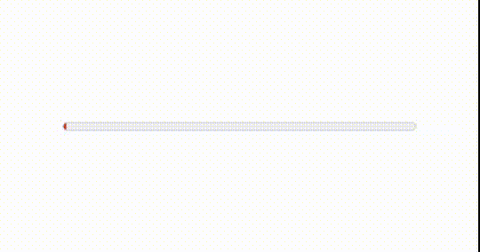

# Notes HTML

## COOL HTML ELEMENTS

* meter & progress


``` html
<meter
  min="0"
  max="100"
  low="25"
  high="75"
  optimum="80"
  value="50"
></meter>
```
  

* Sup & Sub
Permet d'écrire en exposant ou en indice :
``` html
<p>D'apèrs le théorème de pythagore</p>
<p>length<sup>2</sup> + width<sup>2</sup> = hypotenuse<sup>2</sup></p> 
```
Cela donne :
<p>D'apèrs le théorème de pythagore</p>
<p>length<sup>2</sup> + width<sup>2</sup> = hypotenuse<sup>2</sup></p> 

* datalist
Permet d'ajouter une autocompletion dans un input

``` html
<label for="ice-cream-choice">Choose a flavor:</label>
<input list="ice-cream-flavors" id="ice-cream-choice" name="ice-cream-choice">

<datalist id="ice-cream-flavors">
    <option value="Chocolate">
    <option value="Coconut">
    <option value="Mint">
    <option value="Strawberry">
    <option value="Vanilla">
</datalist>
```
Cela donne : 
<label for="ice-cream-choice">Choose a flavor:</label>
<input list="ice-cream-flavors" id="ice-cream-choice" name="ice-cream-choice">

<datalist id="ice-cream-flavors">
    <option value="Chocolate">
    <option value="Coconut">
    <option value="Mint">
    <option value="Strawberry">
    <option value="Vanilla">
</datalist>
Cela peut être utilisé avec les couleurs, les dates, l'heure, range.
Cela peut être stylisé en CSS

* map & area

Permet de créer une carte image avec des zones clickable.

``` html

<map name="workmap">
  <area
    shape="rect"
    coords="34,44,270,350"
    alt="Computer"
    href="computer.html"
  />
  <area
    shape="rect"
    coords="290,172,333,250"
    alt="Phone"
    href="phone.html"
  />
  <area
    shape="circle"
    coords="337,300,44"
    alt="Cup of coffee"
    href="coffee.html"
  />
</map>
```
* details & summary

Permet de créer du contenu déroulant sans utilisé javascript
``` html
<details>
    <summary>Details</summary>
    Something small enough to escape casual notice
</details>
```
<details>
    <summary>Details</summary>
    Something small enough to escape casual notice
</details>

* object

Cela permet d'intégrer une large gamme de fichiers tels que les pdf, les images, les vidéos, de l'audio et même des vidéos YouTube :

``` html
<div>
    <object data = "./HTML.pdf" style = "width: 90vw; height:90vh"/>
</div>
```
