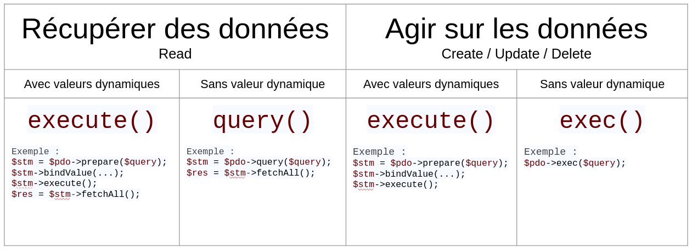

# Notes PDO

## Tables of contents

1. [Mysqli vs PDO](#mysqli-vs-pdo)
2. [Connexion à une base de données via PDO](#connexion-à-une-base-de-données-via-pdo)
3. [Effectuer une requête simple](#effectuer-une-requête-simple)
4. [Injections SQL](#injections-sql)
5. [Requêtes préparées](#requêtes-préparées)
6. [Récupération des données](#récupération-des-données)
7. [Récapitulatif](#récapitulatif)


##### [Return to Top](#notes-pdo)
# **Mysqli vs PDO**

Il existe deux bibliothèques principales en PHP pour se connecter à une base de données.

- Mysqli, qui est simple et possède une approche majoritairement procédurale (même si un pendant “objet” existe également). Celle-ci est de moins en moins utilisée car elle est spécifique à MySQL et il est donc compliqué de migrer un projet l'utilisant vers un autre SGBD par la suite.

- PDO pour PHP Data Objects, qui est une bibliothèque avec une approche uniquement orientée objet et qui apporte une couche d'abstraction supplémentaire, car elle permet de se connecter à tous types de SGBD, avec une syntaxe similaire. Cette fois-ci, changer de SGBD en cours de projet peut se faire relativement sans effort.
Cette quête ne développera que PDO.

##### [Return to Top](#notes-pdo)
# **Connexion à une base de données via PDO**

* ## Syntaxe
Pour se connecter à une base de données, tu as besoin de quatre informations :

1. le nom d'utilisateur pour se connecter à la base de données
2. le mot de passe pour se connecter à la base de données
3. le nom de l'hôte (dans la grande majorité des cas, ce sera localhost, car dans la plupart des projets, la base de données est hébergée sur la même machine que le serveur HTTP. Dans le cas contraire, il faudra modifier par l'adresse IP de la machine hébergeant la DB.
4. le nom de la base de données sur laquelle tu souhaites te connecter.

Synthaxe MySQL :
``` sh
mysql -u wilder_username -D database_name -h localhost -p
```


Synthaxe PDO :
``` php
<?php
$pdo = new \PDO('mysql:host=localhost;dbname=database_name', 'wilder_username', 'wilder_password');
```
Il sera peut être nécessaire d'installer l'utilitaire qui permet de faire le pont entre php et mysql :
``` sh
$sudo apt-get install php-mysql
```
Pour commencer on doit donc :
1. Instancier un nouvel objet de type \PDO via le mot clé `new` qui va prendre trois paramètres de type chaîne de caractères.
2. 1er paramètre : le DSN (Domain Server Name) qui permet d'identifier le SGBD et le nom de la base de données à laquelleon souhaite se connecter. C'est seulement ici que l'on précise que l'on souhaite se connecter à une BDD de type MySQL. Si on souhaite modifier le SGBD (PostgreSQL, Oracle etc...) il n'y aura que ce début de ligne à modifier. Ensuite le DSN comporte le nom d'hôte (ici localhost), puis après un point virgule, le nom de la BDD ciblée.
3. Le 2e paramètre attendu est le nom d'utilisateur de la BDD
4. Le 3e paramètre est le mot de passe de la BDD

À la place de localhost, tu peux saisir un nom de domaine ou une adresse IP. 

La connexion à la base de données est donc un objet PDO qui est ici stocké dans la variable `$pdo`.

Si tu rencontres des problèmes avec certains types de caractères (accents, cédille…) c’est que PDO n’arrive pas à traiter l'encodage UTF8. Dans ce cas, ajoute `;charset=utf8` à la fin de ton DSN, qui devrait donc ressembler à : `mysql:host=localhost;dbname=database_name;charset=utf8`.

* ## Un peu de confidentialité

Avec cette méthode le mot de passe se retrouve en clair dans le code. Cela entraîne un problème de confidentialité car tout développeur récupérant ce projet verra notre mot de passe. Et comme chaque développeur a son nom et son mot de passe, il devra modifier chaque page du code pour on effectuera une connexion à la BDD.

La solution est donc de stocker les informations propres à la connexion dans un autre fichier que l'on viendra inclure dans les pages nécessitant une connexion. On va stocker les informations de connexion dans des constantes et pas des variables. Les constantes ne pouvant pas être modifiées une fois définies et elles ont une portée globale. On pourra donc les utiliser n'importe où dans le code même au sein de fonction.

On va donc créé un fichier `connec.php` qui contiendra le code suivant :

``` php
<?php
define('DSN', 'mysql:host=localhost;dbname=database_name');
define('USER', 'wilder_username');
define('PASS', 'wilder_password');
```

C'est la fonction define() qui permet de créer une constante avec son nom en 1er paramètre (en majuscule par convention) et sa valeur en second paramètre.

Pour appeler ces constantes, il faut inclure le fichier en début des scripts qui en auront besoin. Elles n'utilisent pas le $ comme les variables classiques.
``` php
<?php
require_once '_connec.php';
$pdo = new \PDO(DSN, USER, PASS);
```
Enfin, pour que les informations confidentielles contenues dans `connec.php` ne soient pas diffusées partout, il faudra penser à NE PAS VERSIONNER ce fichier, en le rajoutant simplement au fichier `.gitignore`.

Les constantes DSN, USER et PASS ne sont pas figées, tu peux utiliser d’autres noms pour ces constantes. Il faut juste qu’elles soient appelées de la même manière lors de l’instanciation de ton objet PDO.

##### [Return to Top](#notes-pdo)
# **Effectuer une requête simple**

Exemple : on charge un fichier sql qui va créer une base de données appelée `pdo_quest` qui possède une unique table `friend`, contenant les champs `id`, `firstname` et `lastname`, ainsi que quelques valeurs.

``` sh
mysql -u username -p < friends.sql
```

Ou bien :
``` sh
mysql> source ~/path/to/file.sql
```
Si on est déjà connecté à MySQL.

Le fichier `connec.php` devient alors :
``` php
<?php
define('DSN', 'mysql:host=localhost;dbname=pdo_quest');
define('USER', 'wilder_username');
define('PASS', 'wilder_password');
```
Dans notre fichier qui contient notre code on met donc :
``` php
<?php
// A exécuter afin d'afficher vos lignes déjà insérées dans la table friends
$query = "SELECT * FROM friend";
$statement = $pdo->query($query);
$friends = $statement->fetchAll();
```
La méthode `query()` de l'objet PDO (préalablement instancié et stocké dans la variable $pdo) permet d'exécuter une requête qui renvoie des résultats. La méthode retourne un objet de type `PDOStatement` (c'est pour cela que la variable a été nommée `$statement`). Ce nouvel objet possède lui-même plusieurs méthodes (dont `fetchAll()` utilisée ici) permettant de récupérer les données sous différents formats.

##### [Return to Top](#notes-pdo)
# **Injections SQL**

On vient de voir le cas d'une requête SELECT qui renvoie effectivement un résultat. 

Pour le cas des requêtes INSERT, UPDATE, DELETE, etc. qui ne renvoient rien, on n'utilise plus query() mais la méthode exec() :

``` php
<?php 
// A exécuter afin d'insérer une ligne dans votre table friends
$query = "INSERT INTO friend (firstname, lastname) VALUES ('Chandler', 'Bing')";
$statement = $pdo->exec($query);
```

Ne fais jamais, JAMAIS, confiance à une donnée provenant d'un utilisateur (paramètre de query string, donnée d'un formulaire, etc.)

Que ce soit volontaire ou non, les données saisies par l'utilisateur sont potentiellement malveillantes ou sujettes à la création de bugs. On doit donc t'assurer par un traitement spécifique qu'elles ne pourront pas nuire à notre site. Ici, c'est le cas de l'injection SQL qui va être développé, c'est-à-dire une donnée utilisateur qui va venir s'insérer dans une requête SQL pour en changer le comportement initial.

Par exemple, si tu as un formulaire permettant de créer un nouveau *friend*, avec un champ "*firstname*" et un champ *lastname*, ta requête devrait ressembler à :

``` php
<?php
// Ne pas exécuter
// Cette requête est à titre d'exemple
$query = "INSERT INTO friend (firstname, lastname) VALUES ('Rachel', 'Green')";
```
Dans ce cas il n'y a aucun problème. Mais si l'utilisateur malveillant saisit *Rachel* en prénom et *');TRUNCATE TABLE friend;* en nom, on obtiendra la requête suivant :

``` php
<?php
// Ne pas exécuter
// Cette requête est à titre d'exemple
$query = "INSERT INTO friend (firstname, lastname) VALUES ('Rachel', '');TRUNCATE TABLE friend;')";
```
Du code SQL potentiellement destructeur vient d'être injecté et, dans ce cas, vient de supprimer toutes les données de la table (mais cela aurait pu tout aussi bien récupérer une liste de mots de passe, supprimer toute la base de données, ou effectuer toute autre requête à ton insu !). Tu comprends donc l'importance absolue de se prémunir des injections sur absolument toutes tes requêtes SQL pouvant contenir des informations provenant d'un utilisateur.


##### [Return to Top](#notes-pdo)
# **Requêtes préparées**

Pour se protéger contre ces injections, la solution est d'échapper tous les caractères qui pourraient venir modifier une requête SQL : quote, parenthèse, point-virgule etc... Il y a par exemple la fonction `mysql_real_escape_string()`, qui vont ajouter par exemple un antislash devant les caractères potentiellement dangereux, les rendant ainsi *“inoffensifs”*. C'est assez fastidieux car il ne faut rien oublier.

PDO apporte ici une solution pratique via les requêtes préparées. Ces requêtes sont à utiliser *systématiquement* dès qu'une donnée provenant de l'utilisateur fait partie de la requête SQL. Une requête préparée va alors automatiquement s'occuper d'échapper les caractères problématiques. Et voilà, c'est sécurisé ! Comment ?

On va signaler à PDO qu'il travaille avec une requête préparée via la méthode `prepare()`. Une requête préparée n'est qu'un "*moule*" qui va servir à créer des requêtes SQL. Ce moule contient des valeurs *"à remplir"* qui sont appelées des **placeholders**. Il va donc falloir indiquer à la requête préparée quelles valeurs mettre dans chaque **placeholder** défini. Ce sont ces **placeholders** qui seront automatiquement échappés pour éviter les injections.

L'instruction devient :
``` php
<?php
// Ne pas exécuter, mais comprendre ce que fait ce bout de code. 
// Ceci est à titre d'exemple
// On récupère les informations saisies précédemment dans un formulaire
$firstname = trim($_POST['firstname']); 
$lastname = trim($_POST['lastname']);

// On prépare notre requête d'insertion
$query = 'INSERT INTO friend (firstname, lastname) VALUES (:firstname, :lastname)';
$statement = $pdo->prepare($query);

// On lie les valeurs saisies dans le formulaire à nos placeholders
$statement->bindValue(':firstname', $firstname, \PDO::PARAM_STR);
$statement->bindValue(':lastname', $lastname, \PDO::PARAM_STR);

$statement->execute();
```
Dans l'exemple ci-dessus :
1. Les placeholders sont `:firstname` et `:lastname`. On ne doit pas mettre de quote autour du placeholder dans la requête préparée, et ce même si la valeur finale est un string.

2. La méthode `prepare()` retourne à son tour un objet *PDOStatement* sur lequel tu vas pouvoir utiliser la méthode `bindValue()` qui permet de relier un **placeholder** avec une valeur, ici par exemple `$lastname`. La méthode prend un troisième paramètre optionnel (une constante de la classe PDO) permettant de restreindre le type de la valeur qui va venir prendre la place du placeholder (par exemple uniquement un string, ou un integer...).  
Ici, la requête préparée possède deux placeholders. Il faut donc utiliser deux fois bindValue().

3. Pour exécuter la requête préparée, il faut utiliser la méthode `execute()` de l'objet *PDOStatement* (à ne pas confondre avec la méthode `exec()` de PDO).

L'autre intérêt des requêtes préparées consiste en une amélioration des performances, si la requête doit être effectuée plusieurs fois. C’est la structure de la requête qui va être optimisée, et ce même si la valeur des placeholders change à chaque fois.

Il faut donc tout le temps utiliser de requêtes préparées ! Sauf si on doit effectuer une requête unique qui ne nécessite pas de données provenant de l'utilisateur. Dans ce cas on utilise plutôt les méthodes `query()` `ou exec()` qui sont alors faites pour ça.

Tes requêtes préparées sont protégées des injections SQL. Cependant, il faudra également penser systématiquement à vérifier que le format des données (type, longueur, etc.) correspond bien au format défini dans ta base de données, au risque d'avoir des erreurs ou des données corrompues. Les requêtes préparées ne s’occupent pas de cette validation des données qui est également indispensable !

##### [Return to Top](#notes-pdo)
# **Récupération des données**

Il existe deux méthodes principales que sont `fetch()` et `fetchAll()` qui s'utilisent toutes deux sur des objets de type *PDOStatement*.
1. `fetch()` permet de récupérer un seul résultat. Utile si notre requête ne doit renvoyer qu'une seule et unique ligne. Dans le cas contraire, si on utilise `fetch()` on n'obtiendra uniquement que les résultats du premier enregistrement.
2. `fetchAll()` retourne tous les résultats de la requête, sous la forme d'un tableau avec une ligne par enregistrement.

Dans les deux cas, il est possible de choisir le format sous lequel tu souhaites récupérer ces "*enregistrements*" provenant de la base de données. Pour cela, il faut utiliser des paramètres appelés des "*fetch styles*". Les plus usuels sont :
1. `FETCH_BOTH` : c'est la valeur par défaut. Le format de sortie est un peu particulier, car sous la forme d'un double tableau indexé numériquement ET associatif (les valeurs y sont donc répétées deux fois chacune). Voici le résultat d'un var_dump($friends) :

``` php
<?php
// A exécuter afin de tester le contenu de votre table friend
$query = "SELECT * FROM friend";
$statement = $pdo->query($query);
$friends = $statement->fetchAll(PDO::FETCH_BOTH); // same as $statement->fetchAll()
var_dump($friends);
```

``` sh
array (size=5)
  0 =>
    array (size=6)
                'id' => string '1' (length=1)
                0 => string '1' (length=1)
                'firstname' => string 'Ross' (length=4)
                1 => string 'Ross' (length=4)
                'lastname' => string 'Geller' (length=6)
                2 => string 'Geller' (length=6)
  1 =>
    array (size=6)
                'id' => string '2' (length=1)
                0 => string '2' (length=1)
                'firstname' => string 'Monica' (length=6)
                1 => string 'Monica' (length=6)
                'lastname' => string 'Geller' (length=6)
                2 => string 'Geller' (length=6)
  2 =>
    [...]

```
Un simple `fetch()` aurait renvoyé uniquement :
``` sh
array (size=6)
  'id' => string '1' (length=1)
  0 => string '1' (length=1)
  'firstname' => string 'Ross' (length=4)
  1 => string 'Ross' (length=4)
  'lastname' => string 'Geller' (length=6)
  2 => string 'Geller' (length=6)
```
2. `FETCH_ASSOC` : C'est un tableau uniquement associatif avec les noms de champ en clés et les données en valeurs. C'est ce qu'on utilise dans la plupart des cas.
3. `FETCH_NUM` : renvoie un tableau indexé numériquement (dans ce cas, le nom du champ n'est donc pas retourné). Le FETCH_BOTH est donc la combinaison de FETCH_ASSOC et FETCH_NUM.
4. `FETCH_OBJ` : renvoie un tableau d'objets. Ainsi, il sera possible d'accéder aux champs de chaque élément avec une syntaxe objet de cette manière là : $data[0]->firstname
5. `FETCH_CLASS` : ce style est également très utile, car il permet de transformer les résultats directement en objet d'une classe prédéterminée. Il sera très utile pour une approche "tout objet" du code.


Une fois les valeurs de la requête récupérées via un `fetchAll()`, tu n'as plus qu'à boucler dessus pour manipuler les données une à une :
``` php
<?php

// A exécuter afin de tester le contenu de votre table friend
$query = "SELECT * FROM friend";
$statement = $pdo->query($query);

// On veut afficher notre résultat via un tableau associatif (PDO::FETCH_ASSOC)
$friendsArray = $statement->fetchAll(PDO::FETCH_ASSOC);

foreach($friendsArray as $friend) {
    echo $friend['firstname'] . ' ' . $friend['lastname'];
}

// On veut afficher notre résultat via un tableau associatif (PDO::FETCH_OBJ)
$friendsObject = $statement->fetchAll(PDO::FETCH_OBJ);

foreach($friendsObject as $friend) {
    echo $friend->firstname . ' ' . $friend->lastname;
}
```
##### [Return to Top](#notes-pdo)
# **Récapitulatif**



* ## Récupérer des données avec valeurs dynamiques :

La variable `$letter` est une saisie utilisateur, ou modifiable par l'utilisateur
``` php
<?php
$query = "SELECT * FROM bribe WHERE name LIKE :letter ORDER BY name ASC";
$statement = $pdo->prepare($query);
$statement->bindValue(':letter', $letter.'%', \PDO::PARAM_STR);
$statement->execute();
$bribes = $statement->fetchAll(PDO::FETCH_ASSOC);
```

* ## Récupérer les données sans valeurs dynamiques :
``` php
<?php
$query = "SELECT * FROM bribe ORDER BY name ASC LIMIT 10";
$statement = $pdo->query($query);
$bribes = $statement->fetchAll(PDO::FETCH_ASSOC);
```

* ## Action (ajout) de valeur dans une BDD avec valeurs dynamiques :
``` php
<?php
$query = 'INSERT INTO friend (firstname, lastname) VALUES (:firstname, :lastname)';
$statement = $pdo->prepare($query);
$statement->bindValue(':firstname', $firstname, \PDO::PARAM_STR);
$statement->bindValue(':lastname', $lastname, \PDO::PARAM_STR);
$statement->execute();
```

* ## Action (suppression) de valeur dans une BDD sans valeurs dynamiques :
``` php
// Pour suppression d'une entrée
$query = "DELETE FROM friend WHERE firstname LIKE 'P%'LIMIT 1";
$statement = $pdo->exec($query);
```


``` php
<?php

```
