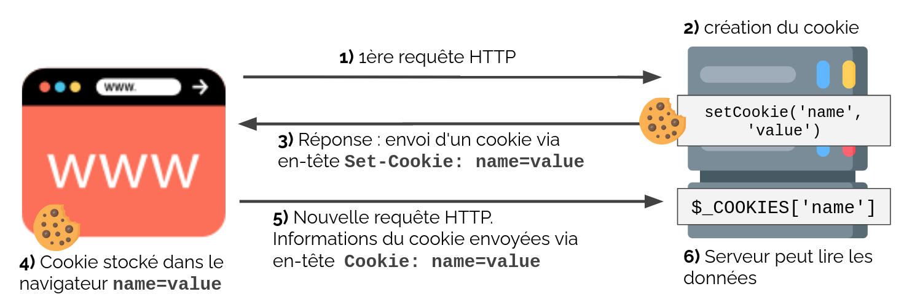
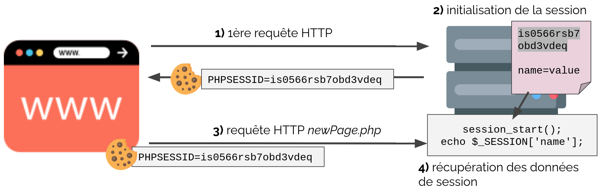

# Notes PHP

## Tables of contents

1. [Fonction intéressantes en PHP](#fonction-intéressante-en-php)
2. [L'opérateur ternaire](#lopérateur-ternaire)
3. [L'upload de fichier](#lupload-de-fichier)
4. [Les cookies](#les-cookies)
5. [Les Sessions](#les-sessions)
6. [créer des comptes utilisateurs](#créer-des-comptes-utilisateur)

##### [Return to Top](#notes-php)
# **Fonction intéressante en PHP**

* ## array_map()
Appliquer une fonction à tous les membres d'un tableau : utilisation de la fonction `array_map()`. Utilise pour appliquer le même filtre à toutes les valeurs de la varibale $_POST d'un formulaire.

``` php
array_map('htmlentities', $_POST)
```
* ## intval()
Retourner le integer d'une variable avec `intval()`
``` php
intval($var)
```
Fonctionne de la même manière : `floatval()`

* ## instanceof
Vérifier qu'un objet est une instance d'une classe : `instanceof`

``` php
$obj instanceof MyClass
// Return true or false
```
* ## Différence entre `isset()` vs `empty()` vs `is_null()`

    * `isset()` : Détermine sur une variable est définie et non nulle. La fonction retourne `true` seulement si la varibale est **définie** et **non nulle.**
    * `empty()` : Détermine si une variable est vide. Elle retourne `true` si la variable est une **string vide**, **false**, tableau vide (**array()**), **NULL**, **0** (string ou integer) et une varibale non définie (**unset**).
    * `is_null()` : La fonction retourne `true` seulement si la varibale vaut **null**. `is_null()` est l'opposé de `isset()` sauf que `isset()` peut être appliquée à des **varibales inconnue** alors que `is_null()` ne peut être appliquée qu'à des **variables déclarée**.


##### [Return to Top](#notes-php)
# **L'opérateur ternaire**

Exemple savoir si un nombre est pair :
``` php
if ($nb%2 === 0) {
    return "Even Number";
} else {
    reurn "Odd Number;
}
```
Peut s'écrire en une seule ligne
``` php
return ($nb%2 === 0) ? "Even Number" : "Odd Number";
```
L'opérateur ternaire `?:` est une porte qui laisse passer tout ce qui est faux y compris NULL : 0, empty string, NULL, false, !isset(), empty().

L'opérateur ?: permet donc de vérifier empty(), !isset(), is_null() et permet donc de raccourcir certaines écriture comme :

``` php
!empty($x) ? $x : $y;
// Equivaut à
$x ?: $y
```
``` php
if(!$x) { 
    echo $x; 
} else { 
    echo $y; 
}
// Equivaut à
echo $x ?: $y
```

* ## Opérateur coalescent : ??

``` php 
$defaultNumber = 25;
$userNumber;
if (isset($userNumber)) {
    echo $userNumber;
}else {
    echo $defaultNumber;
}
// Output => 25
```
Peut s'écrire plus simplement :
``` php 
$defaultNumber = 25;
 // Null Values and value is not set
$userNumber;
 echo $userNumber ?? $defaultNumber;
 // Output => 25
```
On peut également faire un chaînage :
``` php
$defaultNumber = 25;
$browserNumber;
$userNumber;
echo $userNumber ?? $browserNumber ?? $defaultNumber;
// Output => 25
```
``` php
$defaultNumber = 25;
$browserNumber = 20;
$userNumber;
echo $userNumber ?? $browserNumber ?? $defaultNumber;
// Output => 20
```
On peut en utiliser plusieurs sur une même ligne mais il faut mettre des parenthèses :
``` php
$firstName = "John";
$lastName = "Doe";
echo ($firstName ?? "Unknown") . " " . ($lastName ?? "");
```
Sans parenthèse on obtiendrait uniquement `John`.

**Exemple :**
``` php
var_export (false ?? 'value2');   // false
var_export (true  ?? 'value2');   // true
var_export (null  ?? 'value2');   // value2
var_export (''    ?? 'value2');   // ""
var_export (0     ?? 'value2');   // 0
 
var_export (false ?: 'value2');   // value2
var_export (true  ?: 'value2');   // true
var_export (null  ?: 'value2');   // value2
var_export (''    ?: 'value2');   // value2
var_export (0     ?: 'value2');   // value2
```

##### [Return to Top](#notes-php)
# **L'upload de fichier**

* ## Le formulaire

On commence par ajouter un champ de type `file` dans un formulaire :

``` html
<form method="post" enctype="multipart/form-data">
    <div class="field">
        <label for="driverPicture">Ajoutez votre photo ici :</label>
        <input type="file" name="driverPicture" id="driverPicture" accept="image/*"/>
    </div>
</form>
```

 L'attribut `enctype="multipart/form-data"` est obligatoire pour gérer correctement les fichiers uploadés via un formulaire, sans cet attribut l'upload ne fonctionnera pas.

* ## Le script

Lors de l'envoie d'un formulaire avec un fichier on utilise une autre superglobale : `$_FILES` qui permet la gestion des fichiers.

Cette variable est un tableau de tableaux, qui prend en première clé le nom du/des champ(s) de type `file` du formulaire, et en seconde dimension un tableau de 5 éléments. Exemple pour un champ de type file portant le nom `driverPicture` :

- $_FILES['driverPicture']['name'] : Contient le nom d'origine du fichier (sur le poste du client)
- $_FILES['driverPicture']['tmp_name'] : Contient le nom temporaire du fichier dans le dossier temporaire du système (sur le serveur)
- $_FILES['driverPicture']['type'] : Contient le type MIME du fichier (plus fiable que l'extension)
- $_FILES['driverPicture']['size'] : Contient la taille du fichier en octets
- $_FILES['driverPicture']['error'] : Contient le code de l'erreur (le cas échéant)

Il y a plusieurs codes erreur possible que l'on peut mettre dans un tableau pour afficher l'erreur en cas de problème :

``` php
$phpFileUploadErrors = array(
    0 => 'There is no error, the file uploaded with success',
    1 => 'The uploaded file exceeds the upload_max_filesize directive in php.ini',
    2 => 'The uploaded file exceeds the MAX_FILE_SIZE directive that was specified in the HTML form',
    3 => 'The uploaded file was only partially uploaded',
    4 => 'No file was uploaded',
    6 => 'Missing a temporary folder',
    7 => 'Failed to write file to disk.',
    8 => 'A PHP extension stopped the file upload.',
);
```

Il faut ensuite gérer la sécurisation et l'upload de la photo :

``` php
if($_SERVER['REQUEST_METHOD'] === 'POST') {
    // On regarde le code erreur :
    // Si le code erreur vaut zero
    if (!$_FILES['driverPicture']['error']) {
        // Je récupère l'extension du fichier
        $extension = pathinfo($_FILES['driverPicture']['name'], PATHINFO_EXTENSION);
        // Les extensions autorisées
        $authorizedExtensions = ['jpg','jpeg','png', 'gif', 'webp'];
        // Le poids max géré par PHP par défaut est de 2M
        $maxFileSize = 2000000;
        
        /****** Si l'extension est autorisée *************/
        if( (!in_array($extension, $authorizedExtensions)) ){
            $errors['format'] = 'Veuillez sélectionner une image de type Jpg ou Jpeg ou Png !';
        }

        /****** On vérifie si l'image existe et si le poids est autorisé en octets *************/
        if( file_exists($_FILES['driverPicture']['tmp_name']) && filesize($_FILES['driverPicture']['tmp_name']) > $maxFileSize){
            $errors['size'] = "Votre fichier doit faire moins de 2M !";
        }

    //Si le code erreur ne vaut pas zero on enregistre l'erreur :
    } else {
        $errors['error'] = $phpFileUploadErrors[$_FILES['driverPicture']['error']];
    }
}
```
Si on n'a pas d'erreur on peut donc gérer l'upload du fichier :
``` php
    if (empty($errors)) {
        
        // ON récupère l'extension
        $file_extension = pathinfo($_FILES['driverPicture']['full_path'])['extension'];
        //ON donne un nom unique au fichier avec son extension
        $_FILES['driverPicture']['name'] = uniqid() . '.' . $file_extension;
        // chemin vers un dossier sur le serveur qui va recevoir les fichiers transférés (attention ce dossier doit être accessible en écriture)
        $uploadDir = 'uploads/';
        // le nom de fichier sur le serveur est celui du nom d'origine du fichier sur le poste du client (mais d'autre stratégies de nommage sont possibles)
        $uploadFile = $uploadDir . basename($_FILES['driverPicture']['name']);
        //pour récupérer le type MIME
        //var_dump(mime_content_type($_FILES['driverPicture']['tmp_name']));
        // on déplace le fichier temporaire vers le nouvel emplacement sur le serveur. Ça y est, le fichier est uploadé
        move_uploaded_file($_FILES['driverPicture']['tmp_name'], $uploadFile);
    }
```
**Taille de fichier**

Par défaut, l'upload de fichier en PHP est limité à 2Mo. Ceci est configurable dans le fichier php.ini via la directive upload_max_filesize. Il y en a d'autres également :
- `upload_max_filesize` Taille maximale en octets d'un fichier à charger.
- `post_max_size` Taille maximale d'un POST (il ne doit donc pas être inférieur à upload_max_filesize)
- `file_uploads` Autorise ou non le chargement de fichiers par HTTP. Voir aussi les directives upload_max_filesize, upload_tmp_dir et post_max_size.
- `upload_tmp_dir` Le répertoire temporaire utilisé pour stocker les fichiers lors du chargement. C'est le répertoire /tmp qui est utilisé par défaut sous les systèmes GNU/Linux
- `max_file_upload` Le nombre maximum de fichiers pouvant être envoyés simultanément (cela sera utile pour l'upload multiple)

Il est également possible de limiter la taille de l'upload pour chaque formulaire (en plus de la gestion globale du php.ini). Pour cela, on utilise la fonction `filesize()` et autoriser ou non l'exécution de `move_uploaded_file()`.

**Type de fichier**

Pour vérifier si le type de fichier est autorisé (seulement des images par exemple), il est possible de vérifier si le type `MIME` (plus précis que l'extension) correspond à une liste prédéterminée, sinon l'upload sera refusé. POur cela on utilise la fonction PHP `mime_content_type()`.

**Nom du fichier**

Si l'on téléverse le fichier en conservant son nom d'origine, il y a un risque d'uploader 2 fichiers différents avec un nom identique. Dans ce cas, PHP écrasera le 1er fichier par le second, ce qui peut se révéler très problématique.  
Une solution, pour éviter cela, est de donner un nom unique aux fichiers uploadés. Ainsi il n'y a plus de risque de conflit. Plusieurs techniques existent. On peut citer par exemple la fonction `uniqid()` qui génère, comme son nom l'indique, un identifiant unique.
Il ne faut cependant pas oublier de récupérer l'extension du fichier d'origine, en utilisant par exemple `pathinfo()`.


##### [Return to Top](#notes-php)
# **Les Cookies**

PHP accède aux données des requêtes et les enregistre dans des tableaux particuliers (les superglobales) afin de faciliter leur lecture.

**Superglobale** :
- variable prédéfniie de portée globale
- Nom en majuscule préfixé d'un underscore
- Tableaux associatifs

>`$_SERVER` : Informations en provenance du serveur HTTP  
`$_COOKIE` : Informations des cookies  
`$_SESSION` : Informations liées à la session utilisateur  
`$_GET/$_POST/$_FILES` Données envoyées lors de la requête

$_SERVER permet de récupérer des informations sur le contexte d'exécution
- Serveur HTTP ou CLI
- Requête HTTP (entêtes, informations réseaux)
- Serveur, script, dossier, etc…

Exemple :
>$_SERVER['SERVER_PROTOCOL']: 'HTTP/1.1' (Version HTTP)  
$_SERVER['REQUEST_METHOD']: 'GET' (Méthode HTTP)  
$_SERVER['HTTP_REFERER']: Contenu entête HTTP referer  
$_SERVER['HTTP_USER_AGENT']: Contenu entête user-agent  
$_SERVER['REMOTE_ADDR']: Adresse ip du client


HTTP prévoit le **stockage** d'information sur le **client** (navigateur) à la demande du **serveur** : le **cookie HTTP**.

**Description d'un cookie HTTP** :
- Ensemble de paires : Clé - Valeur (format texte)
- Associé à un nom de domaine (celui du serveur)
- Enregistré dans le navigateur
- Envoyé par le navigateur lors de chaque requête vers ce domaine


1. Le client fait une requête vers le serveur, pas encore de cookie pour ce nom de domaine
2. Le serveur souhaite générer un cookie, utilisation de setCookie()
3. Les données du cookie sont envoyées au client dans la réponse HTTP, via le header Set-Cookie
4. Le navigateur enregistre l'information dans un cookie relié au nom de domaine du serveur
5. Si le navigateur possède un cookie pour le nom de domaine ciblé, il lui envoie les informations dans le header Cookie de la requête HTTP
6. Le serveur peut récupérer les données envoyées par le client via la superglobale $_COOKIES

* ## Stockage de cookie avec PHP

Avec la fonction PHP :

``` php
setcookie(string $name, string $value = "", array $options = []): bool
```
Ajoute un entête Set-Cookie à la réponse HTTP
- **Name** : nom du cookie (clé)
- **Value** : valeur associée
- **Options**: date d'expiration, domain, secure… (voir doc)
    
**Attention** :
- Doit être appelé avant l’envoie de contenu (corps de la réponse)
- Ne pas stocker d’informations sensibles (car sur le client en clair) !

* ## Lecture de cookie avec PHP

Les informations de l'entête **Cookie** de la requête HTTP sont accessibles via `$_COOKIE`.

Tableau associatif
- **Clés** : nom des valeurs du cookie (string)
- **Valeurs** : valeurs stockée (string)

**Attention** : le client est maître de son navigateur donc côté serveur :
- Toujours vérifier l'existence d'une clé avant de lire la valeur
- Les informations doivent être validées avant d'être utilisées (elles peuvent avoir été modifiées par le client)
- Sert à rien de modifier directement `$_COOKIE`

* ## Inspecter les cookies

Console du navigateur (ex pour chrome) : 
- Allez sur un site 
- Ouvrir la console (F12)
- Ouvrir l’onglet Application. Puis dans le menu Storage (à gauche) sélectionnez Cookies, puis une “origin”.

Les cookies peuvent servir à stocker n'importe quel texte court. En pratique, on l'utilise par exemple pour :
- Stocker des préférences (dark mode, langue par défaut, menu déplié…)
- Faire un suivi de navigation (tracking)
- Stocker les préférences RGPD (la barre de cookie)
- … stocker un identifiant de session (on va y venir…) !

* ## Cookies & RGPD

Aujourd'hui, les cookies sont dans l'actualité
- Bandeaux "accepter les cookies", publicité ciblée, etc.

Le RGPD (en 1 min)
- Règlement Général sur la Protection des Données Personnelles
- En résumé, la collecte de données personnelles sans aucun cadre, c'est fini

Petit exemple pour un dark mode :
``` php
<?php
// $darkMode = (int) ($_GET['dark_mode'] ?? $_COOKIE['dark_mode'] ?? 0)
if (isset($_GET['dark_mode'])) { 
  $darkMode = (int) $_GET['dark_mode'];
} elseif (isset($_COOKIE['dark_mode'])) {
  $darkMode = (int) $_COOKIE['dark_mode'];
} else {
  $darkMode = 0;
}

setcookie('dark_mode', (string) $darkMode, [
  'expires' => time() + 30*24*60*60 // 30 jours
]);

// génération du html en fonction de $darkMode
?>
<body class="<?= $darkMode ? 'dark' : '' ?>"></body>
```

https://github.com/WildCodeSchool/2022-09-php-remote-p2-guide-line/commit/8614bd9c3dc175ceac7dad20ff68ddd4a01286d2


##### [Return to Top](#notes-php)
# **Les Sessions**

Une session :
- des informations stockées sur le serveur
- associée à un client particulier
- un mécanisme automatique de récupération de ces informations à chaque requête



1. Le client fait une requête vers le serveur, **pas encore** de session pour ce client
2. génération d'un **identifiant de session unique (PHPSESSID)**  ex is0566rsb7obd3vdeqo
envoie uniquement de l'identifiant au client via un cookie   
en parallèle, création d'un fichier (par défaut) correspondant au **PHPSESSID**, stocké sur le serveur et contenant les données enregistrées dans `$_SESSION`.  
3. nouvelle requête vers le serveur, le **PHPSESSID** existe pour ce nom de domaine et est envoyé dans la requête.  
le serveur récupère les informations stockées pour ce client  
`$_SESSION` contient les données, alors accessible sur toutes les pages du site par le client


Les sessions permettent de pouvoir transférer des informations de pages en pages. Ce sont des informations qui sont stockées côté serveur. Le lien perdure grâce à l'utilisation d'un `cookie` qui contient l'identifiant de session, le `PHPSESSID`.

Les sessions sont à utiliser uniquement pour stocker des données éphémères, de faible importance et non critiques. Les sessions, de part leur courte durée de vie, sont à utiliser pour des informations qu'on ne souhaite pas conserver. Elles sont idéales pour stocker :
- le nom de l'utilisateur courant
- les droits d'accès (ex : le rôle de l'utilisateur pour savoir quels éléments de navigation afficher)
- une géolocalisation

* ## Initialisation d'une session

PHP introduit nativement une unique fonction permettant de démarrer ou de continuer une session. Il s'agit de session_start(). Cette fonction ne prend pas de paramètre et renvoit toujours true. Elle vérifie l'état de la session courante. Si elle est inexistante, alors le serveur la crée sinon il la poursuit. 

``` php
<?php  
    session_start(array $options = []): bool
?>
```
Cette fonction lance le mécanisme de création ou de récupération d'une session existante :
- Lecture de l'id de session dans le cookie (PHPSESSID pour défaut)
- Vérification de l'existence sur le serveur
- Vérification qu'elle ne soit pas expirée.

``` php
<?php  
     session_start();  
?>
```

**Remarque** : À appeler une seule fois par script, généralement en début de script (MVC ? Dans l’index !!)

* ## Lecture et écriture d'une session

**Création d'une session**

Lorsqu'une session est créée, elle est par défaut vide. Il faut donc lui attribuer des valeurs à sauvegarder temporairement. Pour cela il y a la supergloable `$_SESSION`. Le tableau `$_SESSION` peut-être indexé numériquement mais aussi associativement. En règle générale, on préfère la seconde afin de pouvoir donner des noms de variables de session clairs et porteurs de sens. 

Pour enregistrer une nouvelle variable de session, c'est tout simple. Il suffit juste d'ajouter un couple clé / valeur au tableau `$_SESSION` comme l'illustre l'exemple suivant. 

``` php
<?php
  // Démarrage ou restauration de la session
  session_start();
  // Ecriture d'une nouvelle valeur dans le tableau de session
  $_SESSION['login'] = 'Dupond';
?>
```
Le tableau `$_SESSION`, qui était vide jusqu'à présent, s'est agrandit dynamiquement et contient maintenant une valeur (Dupond) à la clé associative login.

**Lecture d'une session**
Pour cela il faut tout simplement appeler le tableau de session avec la clé concernée :

``` php
<?php
  // Démarrage ou restauration de la session
  session_start();
  // Lecture d'une valeur du tableau de session
  echo $_SESSION['login'];
?>
```


**Destruction d'une session**

Le serveur détruit lui même la session au bout d'un certain temps si la session n'a pas été renouvelée. Il est aussi possible de forcer sa destructeur au moyen de la fonction `session_destroy()`. Cela permet de proposer une page de déconnextion aux memebres loggués à leur espace personnel. L'utilisation de `session_destroy()` seule n'est pas très propre, voici une manière plus correcte de mettre fin à une session :

``` php
<?php
  // Démarrage ou restauration de la session
  session_start();
  // Réinitialisation du tableau de session
  // On le vide intégralement
  $_SESSION = array();
  // Destruction de la session
  session_destroy();
  // Destruction du tableau de session
  unset($_SESSION);
?>
```

**Configuration des sessions**
La session ne reste ouvert qu'un certain temps. Ce temps est indiqué par la directive session.gc_maxlifetime du php.ini, entre deux clics consécutifs du client. Il est recommandé de ne pas augmenter la valeur inscrite par défaut car avec une session à durée de vie importante on s'expose à des risques de piratage par vol de session.  
Pour des raisons de sécurité, il est conseillé de configurer le serveur de la façon suivante :

``` php
session.use_cookies 1 
session.use_only_cookies 1 
session.use_trans_sid 0
```
* ## Connu ou inconnu ?

``` php
// login.php
session_start();
if ($_SERVER['REQUEST_METHOD'] === 'POST') {
   $email = trim($_POST['email']); // TODO validations
   $password = trim($_POST['password']);
   $userManager = new UserManager();
   // get the user with $email
   $user = $userManager->getUserByEmail($email);
   // check password from user = password from form
   // password_verify is the secure way to do it ;-)
   if (password_verify($user['password'], $password)) {
       // authentication is OK, store id in session
       $_SESSION['user_id'] = $user['id'];
   }
}
```

``` php
//index.php
session_start();
if (isset($_SESSION['user_id'])) {
   $id = $_SESSION['user_id'];
   $userManager = new UserManager();
   $user = $userManager->getUserById($id);
   echo 'Welcome ' . $user['name'];
} else {
   echo 'Click here to log in (link to login form)';
}
```

* ## Conclusion
Cookies et session permettent de persister des données

Les **cookies** stockent des infos sur le **navigateur**
- Modifiables par le client
- Récupérable côté serveur via `$_COOKIE`

Les **sessions** stockent des informations sur le **serveur**
- Spécifique à un client particulier
- Récupérable côté serveur via `$_SESSION`


##### [Return to Top](#notes-php)
# **Créer des comptes utilisateur**

* ## User Manager

Pour identifier les utilisateurs il faut effectuer une requête sur la table `user`. Dans une structure MVC, c'est le rôle du Model.
Dans le dossier `src/Model`, On crée une classe `UserManager`. Dans le cas du framework simple-mvc il ne faut pas oublier l'héritage de l'`AbstractManager`, le `namespace`, la constante `TABLE`, etc. 😏.
Dans cette classe, on crée une méthode `selectOneByEmail` qui prendra en paramètre l'email `string $email` et qui retournera l'enregistrement correspondant de la table user grâce à la méthode fetch().

``` php
public function selectOneByEmail(string $email): array|false
{
    $statement = $this->pdo->prepare("SELECT * FROM " . self::TABLE . " WHERE email=:email");
    $statement->bindValue('email', $email, \PDO::PARAM_STR);
    $statement->execute();
    return $statement->fetch();
}
```

* ## User Controller

Dans l'`UserController` on crée un méthode login pour que lors de la soumission de l'email saisi dans le formulaire soit renvoyé la méthode `selectOneByEmail` que l'on vient de créer.  
On vérifie ensuite que le mot de passe envoyé par le formulaire corresponde à celui de l'utilisateur. Dans la BDD le mot de passe est hasher grâce à la méthode `password_hash()` et il est vérifié grâce à la méthode `password_verify()`.  
Si ces deux étapes sont un succès, alors on conclut que la connexion est établie. On enregistre l'id de l'utilisateur à l'index ['user_id'] du tableau `$_SESSION` puis redirige l'utilisateur vers la page d'accueil.

``` php
public function login(): string
{
    $errors = [];
    if ($_SERVER['REQUEST_METHOD'] === 'POST') {
        // clean $_POST data
        $loginInfos = array_map('trim', $_POST);
        $loginInfos = array_map('htmlspecialchars', $loginInfos);

        foreach ($loginInfos as $field => $userInput) {
            $userInput ?: $errors[$field] = 'Ce champ doit être complété';
        }
        if(!filter_var($loginInfos['email'], FILTER_VALIDATE_EMAIL)) 
                $errors['email'] = "Une adresse mail valide est obligatoire";
        // if validation is ok, insert and redirection
        if (empty($errors)) {
            $userManager = new UserManager();
            $user = $userManager->selectOneByEmail($loginInfos['email']);

            if ($user && password_verify($loginInfos['password'], $user['password'])) {
                $_SESSION['user_id'] = $user['id'];
                header('Location: /');
                exit();
            }
            return $this->twig->render('User/login.html.twig');
        }

        return $this->twig->render('User/login.html.twig', [
            'errors' => $errors
        ]);
    }
    
    return $this->twig->render('User/login.html.twig');
}
```
* ## $_SESSION

`$_SESSION` est une variable globale PHP du type array. On persiste ici l'id de notre utilisateur identifié dans la session PHP à l'index ['user_id'].

    Pour rappel, le lien entre la session PHP enregistrée sur le serveur et le navigateur est rendu possible grâce au cookie PHPSESSID.

Il faut maintenant rendre notre utilisateur disponible dans notre application. Rendez-vous dans l'`AbstractController`.

* ## AbstractController

C'est ici qu'est instancié l'objet `Twig` ayant en charge la gestion des templates et accessible par les classes enfants.
Dans le constructeur, on initialise une propriété `$user` qui sera :
- soit un tableau contenant les données de l'utilisateur si il est connecté ;
- soit false

Enfin, on ajoute `$user` aux variables globales de twig pour l'avoir à disposition aussi dans tes templates. Voici ce que cela donne :

``` php
abstract class AbstractController
{
    protected Environment $twig;
    protected array|false $user;
    /**
     *  Initializes this class.
     */
    public function __construct()
    {
        $loader = new FilesystemLoader(APP_VIEW_PATH);
        $this->twig = new Environment(
            $loader,
            [
                'cache' => false,
                'debug' => (ENV === 'dev'),
            ]
        );
        $this->twig->addExtension(new DebugExtension());
        $userManager = new UserManager();
        $this->user = isset($_SESSION['user_id']) ? $userManager->selectOneById($_SESSION['user_id']) : false;
        $this->twig->addGlobal('user', $this->user);
    }
}
```


* ## Deconnexion

On crée une fonction logout() dans le `UserController` pour gérer la déconnexion des utilisateurs.
On détruit d'abord l'index `user_id` de la superglobale `$_SESSION` puis on redirige l'utilisateur vers la page d'accueil (par exemple)

``` php
    public function logout()
    {
        // On supprime l'index ['user_id'] du tableau $_SESSION
        unset($_SESSION['user_id']);
        // puis on le redirige sur une autre page (page d'accueil ici)
        header('Location: /');
        exit();
    }
```

* ## Restriction des routes

Dans les views des pages on peut mettre dans les fichiers twig du code faisant référence à la variable globale user définie précédemment :

``` twig

    🥳
    <p>
        You are connected as
        <strong>{{ user.pseudo }}</strong>!
    </p>
    <a href="/logout">
        <i class="bi bi-box-arrow-right"></i>
        Logout</a>.

    <a href="/login">Go to login page</a>
    or
    <a href="/register">register an account</a>.

```

Cette vérification peut être fait n'importe où dans les templates.


On peut également limiter l'accès à certaines pages directement depuis une classe `Controller` puisque la propriété `$user` est `protected`.
Exemple :
``` php
class ItemController extends AbstractController
{
    /**
     * List items
     */
    public function index(): string
    {
        if (!$this->user) {
            echo 'Unauthorized access';
            header('HTTP/1.1 401 Unauthorized');
            exit();
        }
        //...
    }
}
```

* ## Créer un compte


>Au réalable on a créer une route `/register` fait référence à la méthode `register` de notre `UserController` appelant la vue `User/register.html.twig`. On va aussi faire appel au `UserManager` pour insérer en BDD les informations du formulaire lorsque celui-ci sera soumis.

ON ajoute donc une méthode `insert()` à la classe `App\Model\UserManager` qui prendra en paramètre un tableau `$credentials` contenant les champs du formulaire d'inscription. Cette méthode doit donc effectuer une requête SQL `INSERT` sur la table `user`. 

>⚠️ Attention ⚠️ l'enregistrement du mot de passe nécessite quelques précautions. En effet, il ne faut jamais (mais alors JAMAIS !) enregistrer un mot de passe tel quel en base de données (donnée beaucoup trop sensible 😱). 

Comme vu précédemment, PHP possède la fonction `password_hash()` qui retourne la clé de hashage (ou empreinte) d'une chaîne de caractères passée en premier paramètre en utilisant l'algorithme passé en deuxième paramètre (on utilise PASSWORD_DEFAULT comme algorithme pour commencer). La clé générée pourra ensuite être vérifiée avec la fonction `password_verify()`. 

``` php
//src/Model/UserManager.php
public function insert(array $credentials): int
{
    $statement = $this->pdo->prepare("INSERT INTO " . static::TABLE .
        " (`email`, `password`, `pseudo`, `firstname`, `lastname`)
        VALUES (:email, :password, :pseudo, :firstname, :lastname)");
    $statement->bindValue(':email', $credentials['email']);
    $statement->bindValue(':password', password_hash($credentials['password'], PASSWORD_DEFAULT));
    $statement->bindValue(':pseudo', $credentials['pseudo']);
    $statement->bindValue(':firstname', $credentials['firstname']);
    $statement->bindValue(':lastname', $credentials['lastname']);
    $statement->execute();
    return (int)$this->pdo->lastInsertId();
}
```

On peut maintenant faire appel à cette méthode depuis le controller UserController et sa méthode register comme ceci. Il faut bien sur rajouter les vérifications et renvoyer les erreurs s'il y en a :

``` php
//src/Controller/UserController.php
public function register()
{
    if ($_SERVER['REQUEST_METHOD'] === 'POST') {
//      @todo make some controls and if errors send them to the view
        $credentials = $_POST;
        $userManager = new UserManager();
        if ($userManager->insert($credentials)) {
            return $this->login();
        }
    }
    return $this->twig->render('User/register.html.twig');
}
```

Si l'insertion en BDD s'est correctement déroulée, alors on connecte l'utilisateur grâce à la méthode `$this->login()`.


##### [Return to Top](#notes-php)
# **Les Dates**

Avant les dates étaient générées à partir du [timestamp](#https://fr.wikipedia.org/wiki/Heure_Unix)
, c'est à dire le nombre de seconde depuis le 1er janvier 1970. Cela fonctionne encore très bien mais a une limite théorique à la date du 19 janvier 2038 (sur les systèmes codés en 32bits) ainsi que des lacunes dans la gestion des fuseaux horaires, d'heures d'été et d'hiver etc...

Pour pallier ces limitations sur les dates, une série de classes est apparue avec PHP 5.2/5.3. Ces classes permettent de manipuler les dates plus facilement, de manière plus avancée et en s'affranchissant notamment des problématiques de fuseaux horaires.

Ces classes sont au nombre de 5 :

- [**DateTime**](https://www.php.net/manual/fr/class.datetime.php) qui permet d'instancier un objet date/heure et d'afficher une date au format souhaité. C'est la classe de base et celle que tu utiliseras le plus.

- [**DateTimeImmutable**](https://www.php.net/manual/fr/class.datetimeimmutable.php) par défaut, chaque manipulation d'un objet DateTime modifie l'objet lui-même. Si tu souhaites qu'une manipulation crée un nouvel objet au lieu de modifier l'existant, tu devras plutôt utiliser DateTimeImmutable.

- [**DateTimeZone**](https://www.php.net/manual/fr/class.datetimezone.php) qui permet de définir le fuseau horaire sur lequel tu souhaites travailler. Cet objet ne sera pas abordé en détail. Sache que, par défaut, il reprendra la timezone définie dans le fichier php.ini du serveur.

- [**DateInterval**](https://www.php.net/manual/fr/class.dateinterval.php) qui permet de définir et manipuler un intervalle de temps.

- [**DatePeriod**](https://www.php.net/manual/fr/class.dateperiod.php) qui permet de travailler sur une période de temps, et gérer par exemple les problématiques de récurrences.

Ici un sommaire de toutes les fonctions [date/heure](https://www.php.net/manual/fr/ref.datetime.php) en php. Ici également :
https://www.php.net/manual/fr/book.datetime.php

Pour formater une date :
https://www.php.net/manual/fr/datetime.format.php

Pour formater un interval :
https://www.php.net/manual/fr/dateinterval.format.php

Quelques exemples :
https://code.tutsplus.com/tutorials/dates-and-time-the-oop-way--net-35395
https://www.phpfacile.com/apprendre_le_php/dates_avec_classe_datetime


``` php

```

##### [Return to Top](#notes-php)
# **L'opérateur ternaire**


``` php

```

