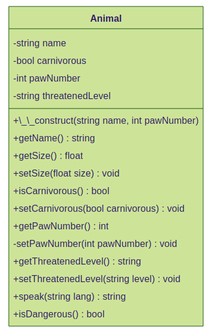
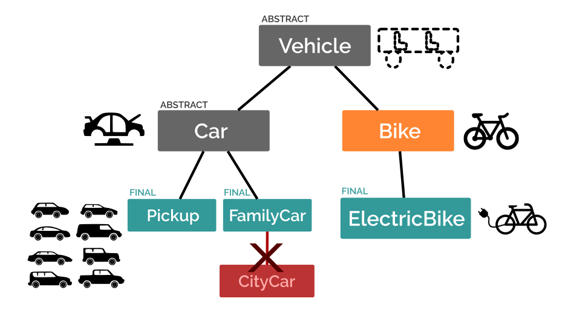
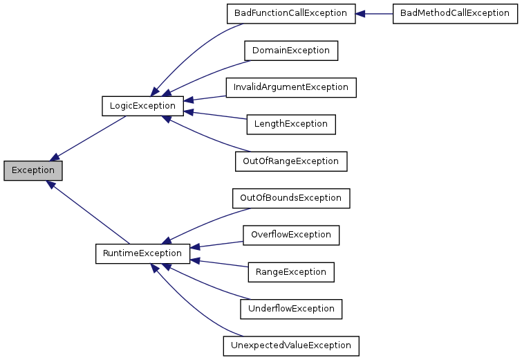

# Notes POO

## Tables of contents

- [Notes POO](#notes-poo)
  - [Tables of contents](#tables-of-contents)
- [1. **Les classes et les objets**](#1-les-classes-et-les-objets)
- [2. **Les propriétés**](#2-les-propriétés)
- [3. **Les méthodes**](#3-les-méthodes)
- [4. **Constructeur et visibilité**](#4-constructeur-et-visibilité)
- [5. **Les constantes de classe**](#5-les-constantes-de-classe)
- [6. **Héritage et parentalité**](#6-héritage-et-parentalité)
- [7. **AutoLoading**](#7-autoloading)
- [8. **Le Polymorphisme**](#8-le-polymorphisme)
- [9. **Propriétés et méthodes de classe**](#9-propriétés-et-méthodes-de-classe)
  - [9.1. Rappels](#91-rappels)
  - [9.2. Propriétés et méthodes de classe](#92-propriétés-et-méthodes-de-classe)
- [10. **Abstraction**](#10-abstraction)
- [11. **Exceptions**](#11-exceptions)
- [12. **Implémentations d'interfaces**](#12-implémentations-dinterfaces)
- [13. **Le mot clé static**](#13-le-mot-clé-static)
- [14. **Principes SOLID**](#14-principes-solid)
- [15. **Main Title**](#15-main-title)


La POO permet :
- Une meilleure robustesse du code en rajoutant du typage par objet/class. Peut limiter voir restreindre certains comportement.
- De faire plus facilement des test de partie du code (TDD). 
- D'isoler des parties de code.
- Créer des interactions entre méthodes et classe.
- une plus grande clarté du code.
- une meilleure maintenabilité.
- un meilleur travail d'équipe
- une représentation UML

[Return to Top](#notes-poo)
# 1. **Les classes et les objets**


* ## Les classes

La classe permet de définir/modéliser le concept à manipuler. Cette modélisation est la plus importante, il faut donc décider ce dont on aura besoin pour définir correctement le concept :

``` php
<?php
// src/Animal.php
class Animal
{
    public string $name;
    
// size expressed in whatever unit    
    
    public int $pawNumber;
    
    public bool $isCarnivorous;
}
```
La classe doit être définie dans son propre fichier, et le fihcier doit avoir exactement le même nom que la classe.  
Une classe doit être nommé en PascalCase.

* ## Les objets

A partir de cette classe animal, que l'on peut comparer à un moule, il est possible de créer des animaux différents. C'est ce qu'on appelle les **objets** ou **instance d'une classe.**

``` php
<?php
// public/index.php

require __DIR__ . '/../src/Animal.php';

$animal1 = new Animal();
$animal2 = new Animal();
```
On doit d'abord *require* la classe que l'on veut utiliser.  
Puis on utilise le mot clé `new` pour instancier l'objet. On peut créer autant d'objet à partir d'une même classe, ils auront chacun les mêmes propriétés mais avec des valeurs différentes. Ces **objets** issus de la même classe s'appellent des **instances**. 

``` sh
object(Animal)[1]
  public string 'name' => *uninitialized*
  public float 'size' => *uninitialized*
  public int 'pawNumber' => *uninitialized*
  public int 'isCarnivorous' => *uninitialized*

object(Animal)[2]
  public string 'name' => *uninitialized*
  public float 'size' => *uninitialized*
  public int 'pawNumber' => *uninitialized*
  public int 'isCarnivorous' => *uninitialized*
```
[Return to Top](#notes-poo)
# 2. **Les propriétés**

Reprenons la classe `Animal` :
``` php
<?php
class Animal
{
    public string $name;
    public float $size;
    public bool $carnivorous;
    public int $pawNumber;
}
```
Dans cette classe, le nom, la taille, le régime alimentaire, le nombre de pattes sont les **propriétés** auxquelles il va être possible d'affecter des **valeurs**.

Il ne faut pas oublier de typer ces propriétés.

Le mot `public` indique que l'on peut accéder aux variables depuis l'extérieur. Ce concept sera vu en détail plus tard.

* ## Affecter une valeur par défaut
Pour affecter une valeur par défaut, il faut le faire dès sa définition. Cela peut être intéressant mais pas toujours. Donner un `$name` par défaut n'a pas grand intérêt.
``` php
<?php
class Animal
{
    public string $name;
    public float $size = 100;
    public bool $carnivorous = false;
    public int $pawNumber;
}
```
* ## Affecter une valeur dépuis l'extérieur de la classe

Pour modifier les propriétés depuis l'extérieur de la classe, on utilise la syntaxe suivante :
``` php
<?php
$lion->name = 'lion';
$lion->pawNumber = 4;
$lion->carnivorous = true;
```
Pour récupérer la valeur d'une propriété, on utilise la même syntaxe :
``` php
echo 'Bonjour je suis un ' . $lion->name . ' et j\'ai ' . $lion->pawNumber . ' patte(s)';
```
[Return to Top](#notes-poo)
# 3. **Les méthodes**

* ## Définir une méthode

En plus de propriétés, une classe est dotée de fonction que l'on appelle des méthodes dans le contexte objet.  
Les méthodes s'écrivent exactement comme des fonctions, avec un nom, des paramètres obligatoires et optionnels, des accolades contenant le corps de la fonction. Les paramètres etla valeur de sortie seront typés.

Premier exemple :
``` php
<?php
class Animal
{
    public string $name;
    public float $size = 100;
    public bool $carnivorous = false;
    public int $pawNumber;
    public string $threatenedLevel = 'NE';

    public function speak(): string
    {
        return 'Welcome to the zoo';
    }
}
```

* ## Utiliser une méthode
Syntaxe de base :

``` php
<?php
echo $lion->speak();
```
Elle est similaire à celle des propriétés. Les () en plus car c'est une fonction.


* ## Accéder aux propriétés avec `$this`

Une méthode permet de manipuler les propriétés d'un objet. Les portées sont limitées. On a déjà vu qu'une variable définie à l'extérieur d'une fonction n'était pas accessible à l'intérieur de celle-ci.

Dans une classe, les méthodes ont la possibilités d'accéder aux propriétés de la classe à l'aide du mot clé `$this`.

``` php
<?php
public function speak(): string
{
    return 'Welcome to the zoo, I\'am a ' . $this->name;
}
```
`$this` représente l'instance de la classe en cours d'utilisation. Si on appelle la méthode sur l'objet `$lion`, `$this` correspond donc à `$lion` et donc $name vaut 'lion' pour cet objet. De même si on fait `$parrot->speak()`, le `$this` correspondra à l'instance `$parrot` et le `$name` sera alors 'Parrot'.

* ## Les méthodes avec paramètres

Une méthode est une fonction de classe. Elle a donc le même fonctionnement et peut prendre donc des paramètres. Ceux-ci ont la même portée que pour des fonctions classiques. Il ne faut donc pas confondre ces variables "paramètres" avec les propriétés accessibles via `$this`.

``` php
public function speak(string $lang = 'fr'): string
{
    if($lang === 'fr') {
        $message = 'Bienvenue au zoo, je suis un ';
    } else {
        $message = 'Welcome to the zoo, I\'am a ';
    }
    return $message . $this->name;
}
```
Dans cette méthode, on mélange un paramètre externe `$lang` (qui n'est pas une propriété de l'aimal et n'est accessible que dans cette méthode) avec `$name` qui est une propriété et s'appelle donc via la syntaxe `$this->name`.

``` php
<?php
echo $lion->speak('fr');
echo $lion->speak('en');
echo $lion->speak();
```
Sur le 1er appel, on demande au lion de parler français
Sur le second, on demande de parler anglais
Sur le 3e on n'indique pas d'argument, la valeur par défaut "fr" va donc s'appliquer et le texte sera de nouveau en français.

Une autre méthode :
``` php
<?php
public function isDangerous(): bool
{
    return ($this->size > 50 && $this->carnivorous);
}
```
[Return to Top](#notes-poo)
# 4. **Constructeur et visibilité**

* ## Constructeur
Avec les syntaxes précédentes, toutes les propriétés ne sont pas définies à la création de l'objet et donc si on fait cela :
``` php
<?php
// $lion->name = 'lion';
var_dump($lion);
echo $lion->name;
```
On aura donc ici une Fatal Error car le `$name` du lion n'est pas définie.

Si on regarde le résultat du `var_dump()`, on voit que la propriété `$name` est `uninitialized`. Or il est impossible d'afficher une propriété non initialisée.

Il faudra donc s'assurer que le développeur utilisant la classe soit forcée de définir un nom au moment de l'intanciation.

La solution c'est le constructeur ! C'est une méthode particulière qui, si elle est définie, impose d'utiliser un certain nombre de paramètre au moment de l'instanciation de l'objet, c'est à dire au moment d'utiliser le mot clé `new`.

En PHP, le constructeur s'écrit `__construct()` avec DEUX underscores. C'est une "méthode magique", il y en a d'autres en PHP mais celle-ci est la plus utilisée. Voici le code correspondant :

``` php
<?php
public string $name;
public function __construct(string $name)
{
    $this->name = $name;
}
```
Un constructeur ne renvoie rien, on ne doit donc pas y mettre de return.

Le `$this->name` correspond à la propriété de la classe définie avec public `$name` et le `$name` en paramètre correspond au `$name` que l’on attribue à `$this->name`.

Maintenant à l'instanciation on doit mettre le paramètre `$name`.
``` php
<?php
$lion = new Animal('lion');
```
* ## Visibilité : public ou private ?

Depuis le début, on utilise le mot clé `public` devant toutes les propriétés et les méthodes. C'est ce qu'on appelle la visibilité. Il en existe 3 niveaux :

        - public
        - protected
        - private

Ils permettent de définir si une propriété ou une méthode est accessible depuis l'extérieur de la classe ou non. Si le mot clé `public` est utilisé, la propritété/méthode sera utilisable partout, si elle est définie sur `private`, la propriété/méthode ne sera accessible que depuis la classe elle-même.

Exemple si on change la visibilité de la propriété `$size`
``` php
<?php
private float $size;
```
On obtient :
``` sh
php Fatal error: Uncaught Error: Cannot access private property Animal::$size in ...`.
```

* ## Les Getters & Setters

Dans Animal.php tu vas devoir définir une méthode publique `getSize()` qui va avoir pour rôle deretourner la propriété qui, elle, est privée.

``` php
<?php
private float $size;
//...
public function getSize(): float
{
    return $this->size;
}
```
Cette méthode, puisqu'elle se trouve dans la même classe, a le droit d'accéder aux propriétés `private`.

Ensuite, dans un fichier externe comme *index.php,* pour afficher la taille du lion on fera `echo $lion->getSize()` et non plus directement `$lion->size`, size n'étant plus accessible depuis l'extérieur. Il en va de même pour affectuer ou modifier la valeur de size:  `$lion->size = 70` ne fonctionnera plus.

On va donc créer une nouvelle méthode `setSize()` qui va prendre un entier en paramètre et va permettre de modifier la valeur de `$size`.

``` php
<?php
public function setSize(int $size): void
{
    $this->size = $size;
}
```
Cette méthode prend le paramètre $size et affecte cette valeur à la propriété `$size`, qui est ici récupéréer via la syntaxe `$this->size`.

Par convention, le paramètre de la méthode a le même nom que la propriété, mais le premier est accessible uniquement dans la méthode et il sert uniquement à donner une valeur à la propriété, qui elle, est accessible dans toute la classe. Ainsi :

``` php
<?php
$lion->setSize(70);
// TODO for other animals.
```

Ces deux types de méthodes, qui ont pour unique but de récupérer ou de modifier une propriété sont appelés des getters et setters (accesseurs et mutateurs en français). Ils ne sont pas obligatoires (si par exemple tu n'as jamais à modifier une propriété, tu n'as pas besoin de setter).  Leur utilisation (qui évite de manipuler directement les propriétés) est une bonne pratique, reconnue par la communauté des développeurs.
- Les getters (du verbe anglais "get", "obtenir") commencent généralement par le préfixe get (is est aussi utilisé si le type de la propriété est un booléen), suivi du nom de la propriété.
- Les setters (du verbe anglais "set", "mettre en place", "définir"), sont préfixés généralement par set, suivi du nom de la propriété.

Ces deux outils permettent de contrôler son code et parfois de devoir y mettre des verrous, de contrôler les valeurs que l'on veut donner aux propriétés. Exemple :

``` php
<?php
public function setPawNumber(int $pawNumber): void
{
    if($pawNumber < 0) {
        $pawNumber = 0;
    }
    $this->pawNumber = $pawNumber;
}
```
Avec ce code, il ne sera pas possible de saisir un nombre de pattes négatif.

Certaines méthodes n'ont qu'un usage interne, et il est donc recommandé de les passer en `private`. C'est le cas de `setPawNumber()`: lorsque l'animal est créé, le nombre de pattes est connu, fixe et n'a pas vocation à changer. Il est donc tout à fait logique de demander de saisir le nombre de pattes lors de l'instanciation, donc dans le `__construct()`.
``` php
<?php
private string $name;
private int $pawNumber;
// ...
public function __construct(string $name, int $pawNumber) 
{
    $this->name = $name;
    $this->setPawNumber($pawNumber);
}
// method is private because only use inside the constructor 
private function setPawNumber(int $pawNumber): void
{
    if($pawNumber < 0) {
        $pawNumber = 0;
    }
    $this->pawNumber = $pawNumber;
}
```
* ## Les propriétés dans le constructeur
Dans PHP8, une nouvelle syntaxe est apparue pour simplifier l'écriture d'un constructeur. Cette syntaxe, encore peu utilisée, est facultative et cumulable avec la syntaxe classique :


``` php
<?php
public function __construct(private string $name) {};

```

Ici, la visibilité est indiquée avec le paramètre du constructeur. Dans ce cas, PHP va créer la propriété et lui assigner la valeur passée en argument, il n'y a donc plus besoin de définir la propriété au dessus du constructeur. Le code est ainsi plus concis.

Les diagrammes de classe :




Ces diagrammes permettent une représentation d'éléments lors de la conception. LE standart c'est l'UML.
Dans les différents blocs on retrouve :
1. le nom de la classe
2. les propriétés avec leur type
3. les méthodes

Pour les différents éléments on retrouve :
* un + pour `public`
* un - pour `private`
* un # pour `protected`

[Return to Top](#notes-poo)
# 5. **Les constantes de classe**

Après les propriétés et les méthodes, un troisième élément peut y-être défini, les **constantes**.  
À la différence d'une propriété (appelée aussi variable de classe) dont la valeur peut changer d'une instance à l'autre, une constante de classe est un élément dont **la valeur est immuable**, elle sera la même pour tous les objets d'une même classe.  
**La propriété est propre à l'instance, tandis que la constante est propre à la classe !**

Exemple : Pour chaque animal créé, un mètre fera toujours 100cm ! Dans d'autres contextes, une constante pourrait être la température du zéro absolu, la valeur de pi, le rayon de la terre, la vitesse de la lumière, le nombre de carte dans un jeu de tarot, un tableau contenant les lettres de l'alphabet latin, etc.

* ## Syntaxe pour créer une constante

Puisqu'une constante n'est pas modifiable, sauf cas particulier elle est généralement définie en `public`.  
Généralement, dans ta classe, pour faciliter la lisibilité, tu organiseras les éléments dans cet ordre de haut en bas : constantes, propriétés, méthodes (avec le constructeur en premier s'il y a lieu)

``` php
<?php
<?php

class Animal
{
    public const CENTIMERS_IN_METER = 100;

    private string $name;
    private float $size = 100;
    private bool $carnivorous = false;
    private int $pawNumber;
    private string $threatenedLevel = 'NE';
    
    public function __construct(string $name, int $pawNumber)
    {
        $this->name = $name;
        $this->setPawNumber($pawNumber);
    }

    // ....
}
```

* ## Depuis l'extérieur de la classe

On utilise la syntaxe `$objet->propertyName`, car la propriété est propre à l'objet.

Pour la constante, il faut utiliser la syntaxe `ClassName::CONSTANT_NAME`.

``` php
<?php
var_dump(Animal::CENTIMERS_IN_METER);
```
L'opérateur `::` est appelé opérateur de résolution de portée.  
La flèche `->` est utilisé pour ce qui a trait à l'objet.  
Le `->` est utilisé pour ce qui a trait à la classe.


* ## Depuis l'intérieur de la classe

Pour une propriété tu utilises la syntaxe `$this->propertyName`, où `$this` représente l'objet en cours d'exécution.

On peut toujours utiliser `ClassName::CONSTANT_NAME`, mais il y a un mot-clé qui permet à une classe de faire référence à elle-même, c'est `self`. Ainsi à l'intérieur d'elle-même, tu feras plutôt `self::CONSTANT_NAME`.

``` php
<?php
self::CENTIMETERS_IN_METER
```
* ## Quand utiliser les constantes ?

On utilise les constantes pour les valeurs que l'on aurait saisie en dur dans le code. Cela permet d'avoir un code plus lisible et plus compréhensible. Cela permet également de rendre le code plus maintenable au cas où on souhaite modifier la valeur, on ne le fait qu'à un seul endroit.

* Sans constante :
``` php
<?php
public function getSizeWithUnit() :string
{
    if($this->getSize() < 100) {
        return $this->getSize() . 'cm';     
    } else {
        return ($this->getSize / 100) . 'm';
    }
}
```

* Avec constante :
``` php
<?php
public const CENTIMETERS_IN_METER = 100;
public const SIZE_UNIT_CHANGE_LIMIT = 100;

public function getSizeWithUnit() :string
{
    if($this->getSize() < self::SIZE_UNIT_CHANGE_LIMIT) {
        return $this->getSize() . 'cm';     
    } else {
        return ($this->getSize() / self::CENTIMETERS_IN_METER) . 'm';
    }
}
```

Autre exemple :

``` php
<?php
// php

<?php

/* Seules les définitions de la constante et de la méthode sont mises ici*/

class Animal
{

    public const THREATENED_LEVELS = ['NE', 'DD', 'LC', 'NT', 'VU', 'EN','CR','EW','EX'];

    public function setThreatenedLevel(string $threatenedLevel): void
    {
        $this->threatenedLevel = in_array($threatenedLevel, self::THREATENED_LEVELS) ? $threatenedLevel : 'NE';
    }
}
```
[Return to Top](#notes-poo)
# 6. **Héritage et parentalité**

* ## Héritage

En POO, l'héritage permet à un objet d'hériter automatiquement toutes les propriétés et méthodes de son/ses parents.
Dans le cas des véhicules roulant (vélo, voiture, camion), ils ont tous des propriétés communes mais également des différences.

On peut donc créer une classe `Vehicle` qui contient les méthodes communes pour deux autres classes `Bicyle` et `Car`. 

Classe Vehicle :
``` php
<?php
// Vehicle.php

class Vehicle
{
    private string $color;
    private int $currentSpeed;
    private int $nbSeats;
    private int $nbWheels;

    public function __construct(string $color, int $nbSeats)
    {
        $this->color = $color;
        $this->nbSeats = $nbSeats;
    }

    public function forward(): string
    {
        $this->currentSpeed = 15;
        return "Go !";
    }

    public function brake(): string
    {
        $sentence = "";
        while ($this->currentSpeed > 0) {
            $this->currentSpeed--;
            $sentence .= "Brake !!!";
        }
        $sentence .= "I'm stopped !";
        return $sentence;
    }

    public function getCurrentSpeed(): int
    {
        return $this->currentSpeed;
    }

    public function setCurrentSpeed(int $currentSpeed): void
    {
        if($currentSpeed >= 0){
            $this->currentSpeed = $currentSpeed;
        }
    }

    public function getColor(): string
    {
        return $this->color;
    }

    public function setColor(string $color): void
    {
        $this->color = $color;
    }

    public function getNbSeats(): int
    {
        return $this->nbSeats;
    }

    public function setNbSeats(int $nbSeats): void
    {
        $this->nbSeats = $nbSeats;
    }

    public function getNbWheels(): int
    {
        return $this->nbWheels;
    }

    public function setNbWheels(int $nbWheels): void
    {
        $this->nbWheels = $nbWheels;
    }
}
```
La classe Bicycle ressemblera donc à ça :

``` php
<?php
//Fichier Bicycle.php
require_once 'Vehicle.php';
class Bicycle extends Vehicle
{
}
```
C’est `extends`, suivi du nom d’une classe, qui permet de créer une relation de parenté entre celles-ci.

Il ne faut pas oublier d'importer avec `require_once` la classe `Vehicle` que l'on veut utiliser. Attention, en PHP, une classe ne peut avoir qu'une seule classe parent. Par contre, il est tout à fait possible à une classe mère d'avoir plusieurs filles !

Tout en laissant vide la classe Bicyle, on peut écrire le code suivant :
``` php
<?php
require_once 'Bicycle.php';

$bicycle = new Bicycle('blue', 1);
echo $bicycle->forward();
var_dump($bicycle);
```
La classe `Bicycle` hérite du constructeur de sa classe parente.   
On peut donc maintenant utiliser la classe `Bicycle`. Les méthodes du parent sont directement accessibles par l'enfant.

La classe Car serait donc alors celle ci :

``` php
<?php
require_once 'Vehicle.php';

class Car extends Vehicle
{
    private string $energy;
    private int $energyLevel;

    public function __construct(string $color, int $nbSeats, string $energy)
    {
        $this->color = $color;
        $this->nbSeats = $nbSeats;
        $this->energy = $energy;
    }

    public function getEnergy(): string
    {
        return $this->energy;
    }

    public function setEnergy(string $energy): void
    {
        $this->energy = $energy;
    }

    public function getEnergyLevel(): int
    {
        return $this->energyLevel;
    }

    public function setEnergyLevel(int $energyLevel): void
    {
        $this->energyLevel = $energyLevel;
    }
}
```

On peut alors utiliser la classe comme ceci :
``` php
<?php
$car = new Car('green', 4, 'electric');
echo $car->forward();
var_dump($car);
```

Cela donnera :
``` sh
Go !
object(Car)[2]
  private string 'energy' => string 'electric' (length=8)
  private int 'energyLevel' => *uninitialized*
  private string 'color' (Vehicle) => *uninitialized*
  private int 'currentSpeed' (Vehicle) => int 15
  private int 'nbSeats' (Vehicle) => *uninitialized*
  private int 'nbWheels' (Vehicle) => *uninitialized*
  public 'color' => string 'green' (length=5)
  public 'nbSeats' => int 4
```

Les deux propriétés `$color` et `$nbSeat` qu'on a défini dans le constructeur ne sont pas accessibles par la classe enfant `Car`, car elles sont définies en visibilité `private` dans `Vehicle`. Le mot clé `private` rend inaccessible l'utilisation d'une propriété ou d’une méthode dans une classe fille. PHP les crée donc automatiquement à la volée en `public`.

Pour accéder aux propriétés de la classe parente `Vehicle`, il faut passer les visibilités de tes propriétés de `private` à `protected`.

`Protected` a une visibilité qui se place entre `private` et `public`. Les propriétés et méthodes protected deviennent donc accessibles uniquement aux classes enfants de `Vehicle`.

Le résultat devient donc alors le suivant :
``` sh
Go !
object(Car)[2]
  private string 'energy' => string 'electric' (length=8)
  private int 'energyLevel' => *uninitialized*
  protected string 'color' => string 'green' (length=5)
  protected int 'currentSpeed' => int 15
  protected int 'nbSeats' => int 4
  protected int 'nbWheels' => *uninitialized*
```

Une classe fille a un comportement identique à la classe mère : les mêmes méthodes publiques, les mêmes constantes de classe, les mêmes propriétés.

* ## Mot clé parent

Pour la classe `Car`, on a créé un nouveau constructeur dédié à la classe

``` php
<?php
public function __construct (string $color, int $nbSeats, string $energy)
{
    $this->color = $color;
    $this->nbSeats = $nbSeats;
    $this->energy = $energy;
}
```
Une partie de ce code est similaire à la classe `Vehicle`. On va donc la réutiliser plutôt que la réécrire. Surtout si la classe parente fait de l'algorithmie au moment de l'instanciation.

On va donc utiliser le mot clé `parent`. C'est lui qui se chargera d'appeler la méthode de la classe parente. En voici la syntaxe :

``` php
<?php
public function __construct(string $color, int $nbSeats, string $energy)
{
    parent::__construct($color, $nbSeats);
    $this->energy = $energy;
}
```
Pour résumer :

Le constructeur est hérité du parent comme n'importe quelle méthode. Ici, comme il est défini, il remplace le constructeur parent. Le mot clé `::parent` permet un accès explicite à un membre de la classe mère, ici le constructeur.

Dans la classe `Car`, la méthode `__construct()` prend 3 paramètres en entrée. Elle appelle ensuite via le mot clé `parent::`, la méthode `__construct()` définie dans la classe parente `Vehicle` puis applique sa propre logique pour l'énergie.

* ## Redéfinition

Une redéfinition de méthode permet de modifier la classe fille pour adapter le comportement spécifique à celle-ci. La méthode de la classe mère est alors écrasée dans la classe fille.
``` php
<?php
class Boat
{
   protected int $speed;
   public function getSpeed(): int 
   {
       return $this->speed;
   }
}
```
``` php
<?php
class RowBoat extends Boat
{
   private int $rowerNumber;
   public function getSpeed(): int 
   {
       return $this->speed + $this->getRowerNumber();
   }
}
```

* ## Le mot clé final

Le mot clé final rend l'héritage interdit. Le but est de limiter la création d'une classe qui n'aurait pas d'intérêt dans le contexte métier.
``` php
final class RowBoat extends Boat
{
   //…
}
```

``` php
class SpecialRowBoat extends RowBoat
{
  // ERROR doesn't work because RowBoat is "final"
}

```


[Return to Top](#notes-poo)
# 7. **AutoLoading**

Avec la fonction `spl_autoload_register()`. Cela est désormais bien simplifié avec `composer`.

Son objectif est de faire un require automatique du fichier contenant la classe, par exemple si toutes les classes sont dans le dossier `src/` et que les fichiers portent le nom de leur classe avec un suffixe `.php` :

``` php
<?php
spl_autoload_register(function($class){
    include __DIR__ . '/src/' . $class . ".php";
});

// src/Boat.php automatically required
$boat = new Boat(); 

// src/Amphora.php automatically required
$amphora = new Amphora(); 
```

Permet d'éviter tous les `require` des classes qui sont dans le dossier src.

On peut mettre ce bout de code dans un fichier `autoload.php` en racine du projet. Et c'est lui que l'on require au début.

``` php
<?php
require './autoload.php'; 
```

[Return to Top](#notes-poo)
# 8. **Le Polymorphisme**

Un objet fille peut faire tout ce que peut faire un objet mère.

Si un objet est paramètre d'une fonction, il est possible d'utiliser ses descendants à la place :

``` php
<?php
class Boat
{
  private array $containers;
  // Add a container to a boat
  public function load(Container $container): bool
  {
     $this->containers[] = $container;
  }
}
```
Ici on type la méthode load avec la classe `Container`. Mais on peut l'utiliser avec tous les objets créés à partir de classe enfant. Il est courant de typer avec la classe Mère.

Si une nouvelle classe hérite de Container, le code fonctionnera toujours.

**Limite** : Seules les méthodes de la classe mère sont alors disponible, non celles spécifiques à chaque fille.

Les instances d'une classe mère ou de ses filles peuvent être indistinctement utilisées ici. Tous les contenants sont *compatibles* avec l'actiond d'être chargé dans un bateau, puis qu'ils héritent de `Container`.
``` php
<?php
require_once "classes/Boat.php";
require_once "classes/Container.php";
require_once "classes/Barrel.php";
require_once "classes/Amphora.php";
require_once "classes/Bottle.php";

$boat = new Boat("Héra", 10);
$genericContainer = new Container(10);
$amphora = new Amphora(5);
$bottle = new Bottle(1);
$barrel = new Barrel(50);

$boat->load($genericContainer);
$boat->load($amphora);
$boat->load($bottle);
$boat->load($barrel);

echo count($boat->getContainers()); // 4
```

[Return to Top](#notes-poo)
# 9. **Propriétés et méthodes de classe**
## 9.1. Rappels

- Propriétés :
    - Chaque objet dispose des mêmes propriétés mais avec des valeurs différentes
    - Elles sont allouées à l'instanciation de l'objet

- Méthodes :
    - Doivent être appelées sur un objet
    - S'appliquent aux propriétés de cet objet ($this)

## 9.2. Propriétés et méthodes de classe

- Propriétés de classe :
    - Existent au niveau de la **classe**
    - Une seule instance accessible dès la déclaration de la classe
    - Implicitement **partagées entre tous les objets de la classe**
    - Visibilité : comme les propriétés *normales*

- Méthode de classe :
    - Ne sont pas appelées sur un objet (≅fonction)
    - Pas accès aux propriétés *normales*, uniquement aux propriétés de classe

1. Propriétés de classe

On utilise le mot clé `static` devant une propriété qui vient alors une propriété de classe.  
On y accède dans la classe via `self::` comme les constantes de classes.  
this représente l'instance en cours.  
self représente la classe.  

``` php
<?php
class Boat
{
  // The total number of boat created
  private static int $boatCounter = 0;

  public function __construct(string $name, int $speed)
  {
      // Counting boats
      self::$boatCounter++;
      $this->name = $name;
      $this->speed = $speed;
  }
}
```

2. Méthodes de classe

On utilise le mot clé `static` devant une méthode qui devient alors une propriété de classe.  
On y accède dans la classe via `self::`
On y accède ailleurs via `NomClasse::méthode()`
``` php
<?php
class Boat
{
   // Display the number of created devices
   public static function count(): int
   {
       return self::$boatCounter;
   }
}
```
``` php
<?php
$boat = new Boat('Hera', 10);
$secondBoat = new Boat('Rhéa', 15);
echo Boat::count(); //2
$anotherBoat = new Boat('Gaia', 8);
echo Boat::count(); //3
```

[Return to Top](#notes-poo)
# 10. **Abstraction**

L'héritage peut répondre à des problématiques simples. La POO apporte d'autres outils, plus subtils, pour répondre à des cas de figure avancées.

* ## L'abstraction

Dans le cas des véhicules, on a créé plusieurs classes enfants. Cependant rien n'empêche encore de faire cela :

``` php
<?php
$vehicle = new Vehicle('pink', 4);
```
Or la POO a pour but de représenter programmatiquement des concepts *concrets*. Dans le cas de la conduite, la classe Vehicle est trop générique et ne veut pas dire grand chose.

Pour interdir l'utilisation directe de cette classe, on peut donc lui ajouter le mot clé `abstract`. Cela permet d'indiquer que cette classe est abstraite, qu'elle n'a pour but que de servir de "*mère*" à d'autres classes plus précises qui partageront certaines caractéristiques communes. 

La syntaxe est la suivante :
``` php
<?php
abstract class Vehicle
{
   // ...
}
```
En aucun cas, cette classe abstraite ne doit donc être intanciée en l'état et désormais cela n'est plus possible.

Il en va de même pour une classe `container` par exemple qui est bien trop vague. On va donc créer des classes enfants de la classe `container` pour donner un peu plus de sens au `container`. Et on va donc rendre cette classe container `abstraite` avec le mot clé `abstract`. On est obligé de passer par une classe fille qui est bien plus concrète.

Il est possible d'appliquer le mot clé `abstract` à une **méthode** précise. Dans ce cas, la méthode devra être **obligatoirement être redéfinie dans toutes les classes filles.**

Imaginons par exemple une méthode permettant d’indiquer comment changer une roue. Entre une voiture, un vélo ou un skate, l’implémentation de la méthode va être totalement différente ! Pourtant, il est possible de changer une roue sur tous ces véhicules, c’est donc bien un point commun entre eux.

Une méthode abstraite `changeWheel()` va alors être définie dans la classe parente `Vehicle`, afin **d’obliger** chaque fille à l’implémenter à sa manière. De ce fait, le corps d’une méthode abstraite est toujours vide (puisque l’implémentation dépend de la classe fille) et **les accolades ne sont pas ajoutées.** Il y a juste un point virgule à la fin.
``` php
<?php
abstract class Vehicle
{
   //...
   abstract public function changeWheel();`
}
```

**Remarque :**
Si une classe **au moins une** méthode abstraite, elle doit forcément être elle-même abstraite (le mot clé `abstract` doit alors être ajouté avant le mot clé `class`). Cependant, une classe abstraite peut posséder des méthodes qui ne sont pas abstraites, si le comportement de ces dernières est commun à toutes les filles.

* ## Le mot clé final

C'est un peu l'inverse du mot clé abstract. Il permet cette fois-ci d'indiquer qu'une classe ou une méthode ne peut pas être héritée par une autre.

**Selon les besoins métiers** de notre application, c'est à nous de défnir le degré de liberté que l'on souhaite donner aux développeurs utilisant nos classes. Le mot clé final permet donc d'**empêcher l'héritage** de telle ou telle classe si cela est pertinent.

Il suffit alors d'écrire :
``` php
<?php
final class ElectricCar
{
    //…
}
```
**Remarque :**
Il est possible de définir uniquement une méthode en `final` (mais pas une propriété ou une constante). Dans ce cas, la redéfinition de cette méthode est impossible dans une classe fille, mais la classe peut toujours être héritée.
Il n’est pas obligatoire (comme avec `abstract`) de rendre toute la classe `final` si seulement une ou des méthodes sont définies comme telles.

* ## Exemple




[Return to Top](#notes-poo)
# 11. **Exceptions**
* ## Qu'est-ce qu'une exception ?

Pour gérer les erreurs, on peut utiliser des "if" mais il y a une classe qui permet de gérer les erreurs : la classe `Exception`.
Voici un exemple avec une fonction qui permet d'inverser un entier. Il est impossible de diviser par zéro. C'est avec une `Exception` que l'on va gérer l'erreur :

``` php
<?php
function invert(int $number): float
{
   if ($number === 0) {
       throw new Exception('division by zero');
   }
   return 1 / $number;
}
```
C'est le mot clé `throw` qui permet d'indiquer que l'on souhaite lever une exception. Il faut ensuite instancier un objet de type `Exception` (ou d'une classe plus précise héritant d'exception : il en existe plusieurs). L'objet demande un paramètre qui sera le message d'erreur à afficher si besoin.


* ## Comment capturer une exception ?

Par défaut, si une exception est lancée (via `throw`), le code s’arrête. Ce n’est pas toujours pratique. Pour traiter l’erreur “proprement” et non stopper brutalement l'exécution, grâce aux exceptions on va pouvoir “capturer” chaque erreur, et décider de comment les traiter. Par exemple, on peut souhaiter enregistrer le problème dans des logs, envoyer un mail à l’administrateur, afficher un message d’erreur personnalisé à l’utilisateur, etc.

Pour capturer une erreur, on va utiliser le mot clé try :

``` php
<?php
try {
    echo division(5) . PHP_EOL;
    echo division(0) . PHP_EOL;
} catch(Exception $e){
    // code to manage exceptions
    echo 'Exception received  : ' . $e->getMessage() . PHP_EOL;
} finally {
    echo "End !" . PHP_EOL;
}
```

On entoure le code par l’instruction `try`. Si une exception est levée durant l’exécution de ce code, l'exécution ne s’arrête pas tout de suite. L’exception est alors “capturée” dans le bloc `catch` qui suit. `catch()` prend un paramètre typé par un nom d'`Exception`.

Remarque : on peut enchaîner plusieurs bloc `catch`, chacun traitant alors un type d’exception de type précis. L’ordre des blocs `catch` est alors important, traitant les exceptions des plus précises aux plus générales. Tu peux également finir par un bloc `finally` : le code contenu à l’intérieur sera alors exécuté dans tous les cas, qu’une erreur ait été lancée ou non.


``` php
<?php
     try{
       // Code to try
    } catch(LogicException $e){
       // code to manage exceptions
    } catch(Exception $e){
       // code to manage all other exceptions
    } finally{
       // this code is always executed
   }
```

Autre exemple :

``` php
class Container
{
  public function fill(int $volume): void
  {
      if ($volume < 0) {
          throw new RuntimeException('Negative volume');
      }
      if ($volume < $this->capacity - $this->filling) {
          $this->filling += $volume;
      } else {
          throw new RangeException('Volume error');
      }
  }
}
```

``` php
$amphora = new Amphora(50);
try {
  $amphora->fill(-10); //Negative, throw RuntimeException
  $amphora->empty(20); 
  $message = 'Filling OK';
} catch (RangeException $exception) {
   $message = $exception->getMessage(); 
} catch (RuntimeException $exception) {
   $message = $exception->getMessage(); // error message
   $amphora->setFilling(0); // reset filling
} finally {
   // always Executed
   echo $message . ': ' . $amphora->getFilling(); 
}
$boat->load($amphora); 
```


* ## Les exceptions les plus courantes



Il existe de nombreuses classes d’`Exception`, héritant toutes de la classe générique Exception. Chacune d’entre elles permet de spécifier plus précisément un type d’erreur. Par exemple:

- La classe `LogicException` : représente les erreurs dans la logique du programme. Ce type d'exceptions doit obligatoirement faire l'objet d'une correction de ton code.

- La classe `RuntimeException` : émise quand une erreur est rencontrée durant l'exécution.

Remarque : en tant que développeur, il est tout à fait possible (et même assez fréquent), de créer ses propres classes d’exception (héritant forcément d’une classe Exception préexistante) correspondant à la logique métier de son programme.

https://www.php.net/manual/fr/class.exception.php  
https://www.php.net/manual/fr/language.exceptions.extending.php

[Créer ses propres classes d'exception](https://www.php.net/manual/fr/language.exceptions.extending.php)

[Propager une Exception](https://www.php.net/manual/fr/language.exceptions.php)

[Le gestionnaire global](https://www.php.net/manual/fr/function.set-exception-handler.php)

[Exception, Error et Throwable](https://www.php.net/manual/fr/language.errors.php7.php)


[Return to Top](#notes-poo)
# 12. **Implémentations d'interfaces**

https://www.php.net/manual/fr/language.oop5.interfaces.php

Les interfaces sont souvent comparées à des **contrats**, qu'une classe implémentant une interface devra **obligatoirement suivre**. L'interface ne sert à rien d'autre car elle ne contient **aucune logique**, aucun code métier. Les interfaces contiennent seulement des **définitions de méthodes** (les méthodes sont vides), comme les méthodes abstraites. Les classes qui implémentent ces interfaces seront donc obligées de définir les méthodes contenues dans ces interfaces dans leur corps. Comme une classe abstraite, on ne peut pas directement utiliser une interface.  


L'**abstraction** est liée au concept d'**héritage**, il doit donc y avoir un lien logique entre la classe mère et sa fille. Mais dans certains cas, deux **classes totalement différentes** peuvent avoir un certain nombre de **comportements commun**. Il n'est alors pas possible de définir un héritage, mais les interfaces viendront définir des règles pour que ce comportement commun soit implémenté de manière similaire.

Le polymorphisme permet de donc de typer un argument d'une fonction par une interface. Une classe qui hérite d'une autre et qui implémente une interface peut donc être typée par son interface, sa classe parente ou sa propre classe.

* ## Créer une interface

Il faut créer un **nouveau fichier** dédié (comme pour une classe). Le nom du fichier et de l'interface est le même et généralement il est formé d'un verbe avec le suffixe -able et terminant par interface. Ce n'est pas obligatoire, ce n'est qu'une convention.

``` php
<?php
interface RechargeableInterface
{
    public function charge(int $percentage): int;

    public function unLoad(int $percentage): int;
}
```
Cette interface va pouvoir gérer la recharge de n'importe quel appareil comme une voiture, un téléphone ou tout autre appareil avec une batterie et il n'aurait pas été logique qu'ils héritent de la même classe.

L'**interface** va donc **obliger** la classe qui l’implémente à suivre un certain nombre de spécifications attendues (définition de méthode, avec des signatures bien précises) afin d’être sûr que le comportement correspondant à cette interface va être similaire entre deux objets. Cela n’empêche pas ces deux objets d'avoir des implémentations différentes des méthodes, ainsi que d’autres méthodes propres (en dehors de celles imposées par l’interface).

Une autre différence entre **l’abstraction** (et l’héritage plus généralement) et les interfaces, est qu’**une classe peut implémenter plusieurs interfaces** (alors qu’elle ne peut étendre qu’une seule classe mère). Cela permet de découper en petits morceaux logiques les comportements, plutôt que d’avoir de très grosses classes mères contenant des méthodes qui ne sont pas spécifiques à tous ses enfants. Ce concept est appelé “ségrégation des interfaces” et fait partie des 5 grands principes de SOLID, un ensemble de bonnes pratiques à suivre en POO, dont tu entendras souvent parler.

* ## Utiliser une inteface

``` php
<?php
class ElectricBike extends Vehicle implements RechargeableInterface
{
    public function charge(int $percentage): int
    {
        // you must implement this method
    }

    public function unLoad(int $percentage): int
    {
        // you must implement this method
    }
}
```
L’interface est un **“contrat”**. Si les méthodes `charge()` et `unLoad()` ne sont pas définies dans la classe implémentant l’interface RechargeableInterface, le code renverra une erreur !

Si on prend l'exemple d'une station de recharge, on peut donc typer un appareil implémentant une interface particulière :

``` php
<?php
class ChargingStation
{
    public function fullCharge(RechargeableInterface $vehicle) 
    {
        $vehicle->charge(100);
    }
}
```
La station possède une méthode `fullCharge()` permettant de charger intégralement la batterie d’un véhicule électrique (que ce soit un vélo, une voiture, etc.). Dans cet exemple, l’implémentation est très simple et passe la batterie à 100%. Le **type** utilisé pour le paramètre `$vehicle` **n’est pas** la classe `Vehicle` directement, mais l’interface `RechargeableInterface`. Tu t’assures ainsi de **n’accepter** en paramètre que des objets **implémentant cette interface**, un objet `ElectricBike` par exemple, mais pas l’objet `Bike`. Et c’est ici absolument indispensable car, le contrat de l’interface étant forcément rempli, on est sûr que le véhicule utilisé dans la méthode `fullCharge` possédera bien une méthode s’appelant `charge()` et prenant un entier en paramètre. La façon dont l’objet implémente cette méthode `charge()` n’est pas important pour la classe ChargingStation.

[Return to Top](#notes-poo)
# 13. **Le mot clé static**
* ## Subtitle

Une méthode `static` est un **service** proposé par la classe. Une **classe** peut être **instanciée**, et devenir un **objet**, mais elle peut aussi rendre des **services** sans avoir besoin d'être instanciée. C'est ça une méthode `static`. Pour préciser dans une classe qu'une méthode est statique, il faut lui ajouter le mot clé `static`.

``` php
<?php
class MySuperClass {
    public static function myStaticMethod()
    {
        // (...)
    }
}
```
Pour accéder à une méthode statique, il faut s’y prendre de la même façon que pour accéder à une constante de classe. Exemple `PDO::FETCH_ASSOC`. Ceci permet d’accéder directement à la constante nommée FETCH_ASSOC, sans même avoir besoin d’instancier un objet PDO.
Pour les méthodes statiques, c’est pareil. `MySuperClass::myStaticMethod($parameter)`;

Alors que pour une méthode qui ne serait pas statique, tu aurais du faire :

``` php
<?php
$mySuperClass = new MySuperClass()
$mySuperClass->myMethod($parameter);
```

**Explications :**  
En POO, on n'accède pas aux membres d'une classe de la même manière selon si l'on doit faire référence à la classe ou à l'objet.
- `$this` et -> font référence à l'**objet**
- `self::` et :: font référence à la **classe**

Une méthode **statique** ne pourra accéder qu’aux méthodes **statiques** de la classe
car les autres sont liées à l’instance (qui n’existe pas lorsque l’on exécute une méthode statique).
Il ne faut pas confondre **visibilité** et **staticité** ! Une méthode statique peut être `public`, `private` ou même `protected`.

**Cas concret :**

La classe `Recipe` contient une méthode `static` `retrieveTemperature()`. Cette méthode permet de réaliser une conversion thermostat de four / température : pour passer d'un "thermostat" à la température, il suffit de multiplier ce dernier par 30, par exemple thermostat 6 correspond à 6*30 = 180°.

``` php
<?php
Class Recipe
{
    public const THERMOSTAT_CONVERSION = 30;
    private $ingredients;
    private $duration;
    private $tools;
    // (...) etc.

    // (...) getters / setters, méthodes métiers, etc

    public static function retrieveTemperature(int $thermostat): ?int
    {   
        return $thermostat * self::THERMOSTAT_CONVERSION;
    }
}
```
Pourquoi avoir mis cette méthode `static` ?
Parce que nous n'avons pas besoin d'**intancier** une recette en particulier pour faire cette conversion ? Quel que soit l'objet `Recipe`, même avec des propriétés différentes, `retrieveTemperature()` retournera toujours la même chose. Le comportement de la méthode est indépendant de l'objet.
Nous pourrons donc réaliser cette conversion tout simplement de la façon suivante :
``` php
<?php
Recipe::retrieveTemperature('7');
```
Sans même avoir eu besoin de faire un `new`. Et tant mieux, car quelle que soit la recette, le fonctionnement d’un thermostat sera toujours le même.

[Return to Top](#notes-poo)
# 14. **Principes SOLID**
1. **Responsabilité unique** (Single responsibility principle) :
Une classe (méthode, fonction…) doit avoir une seule responsabilité
2. **Ouvert/Fermé** (Open/closed principle) :
Ouverte à l'extension  / fermé à la modification => ne pas ajouter indéfiniment des méthodes à une classe pour la spécialisée, mais utiliser l'héritage
3. **Principe de substitution de Liskov** (Liskov substitution principle) :
L'instance d'une classe mère doit pouvoir être remplacée par l'instance d'une classe fille sans altérer la cohérence globale.
4. **Ségrégation des interfaces** (Interface segregation principle) :
Une interface = un comportement => privilégier la multiplication des interfaces, une classe ne doit jamais être forcée d'implémenter une méthode dont elle n'a pas besoin
5. **Inversion de dépendance** (Dependency inversion principle) :
Il faut dépendre des abstractions et non des implémentations


[Return to Top](#notes-poo)
# 15. **Main Title**
* ## Subtitle

``` php
<?php

```