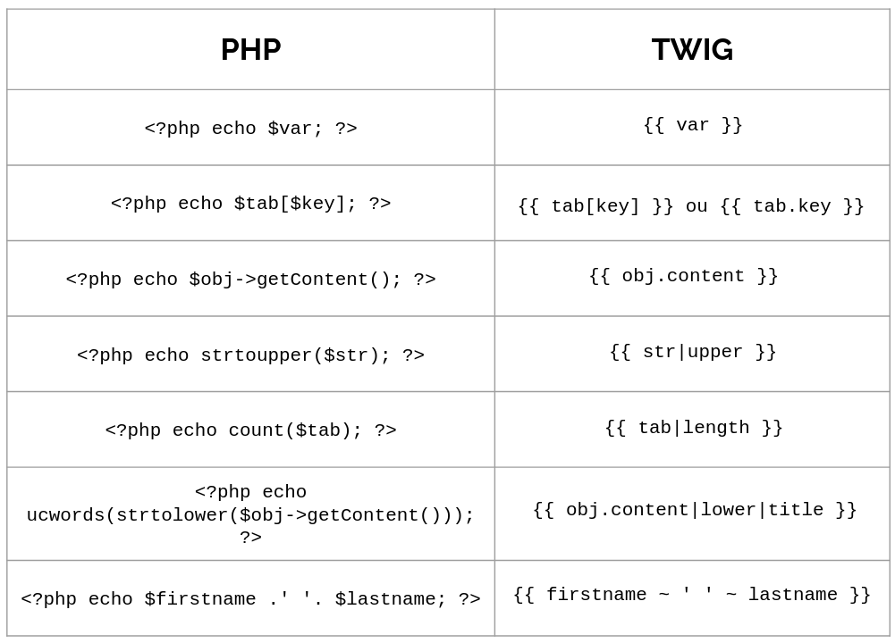

# Notes Twig

## Tables of contents


1. [Introdcution](#introduction)
2. [Installer & Utiliser Twig](#installer--utiliser-twig)
3. [Syntaxe](#syntaxe)


##### [Return to Top](#notes-twig)
# **Introduction**

C'est un moteur de template,utilisé par défaut dans symfony. Il offre une meilleure lisibilité et apportent des fonctinnalités facilitant l'écriture des vues via une syntaxe plus claire et plus concise. A l'exécution du script, le fichier *template* est transformé en PHP "natif".


## Avantage

* Plus besoind 'écrire du PHP directement dans la vue : meilleure séparation.
* Idéal pour le travail d'équipe un intégrateur peut faire du twig sans connaître php
* Syntaxe simple à prendre en main :
``` php
<?php echo $myVar; ?> 
<?= $myVar ?> // syntaxe alternative
```
Devient 
``` twig
{{ myVar }}
```
* Système avancé d'héritage de templace
* Sécurisation automatique des variables. Finis les htmlentities() etc...
* Possibilité de stocker du rendu dans une variable (par exemple lors de l'envoie d'un mail.)

## Inconvénient

* 1er chargement des pages assez long pour la première fois.
Twig possède un système de mise en cache qui permet de récupérer une vitesse de chargement normale.

* Apprentissage d'une nouvelle syntaxe.


##### [Return to Top](#notes-twig)
# **Installer & Utiliser Twig**
* ## Installer

Pour l'installer sur un projet :
``` sh
composer require twig/twig
```
Twig se trouve dans le dossier vendor. Il faut utiliser **l’autoload**

``` php
<?php
$loader = new \Twig\Loader\FilesystemLoader('/path/to/templates');
$twig = new \Twig\Environment($loader, [
       'cache' => '/path/to/cache',
   ]
);
```
Exemple :
``` php
// tu indiques ici à Twig où aller chercher tes fichiers de vues
$loader = new Twig\Loader\FilesystemLoader(__DIR__.'/../View');
$twig = new Twig\Environment($loader, ['debug' => true]);
$twig->addExtension(new Twig\Extension\DebugExtension());
echo $twig->render('myView.html.twig');
```
- Twig\Loader\FilesystemLoader permet d’indiquer où se trouvent les fichiers de templates
- Twig\Environment est le coeur de twig, il permet de configurer le cache, les éventuelles extensions…
- Le cache est utilisé en production. En environnement de développement, on indique 'cache' => false


* ## Utiliser

``` php
<?php
echo $twig->render('file.html.twig', [
       'firstname' => 'Fabien',
       'lastname' => 'Potencier'
   ]
);
```
La méthode `render()` permet de compiler le template `file.html.twig` en lui passant un certain nombre de variables en paramètres.

Le fichier twig :
``` twig
<!DOCTYPE html>
<html lang="en">
<head>...</head>

<h1>My Page</h1>
Hello {{firstname}} {{lastname}}
```


##### [Return to Top](#notes-twig)
# **Syntaxe**
* ## Syntaxe générale

``` twig
{{ … }} //affiche quelque chose (echo)

  //fait quelque chose (conditions, boucles...)

{# … #}  //n'affiche rien et ne fait rien (commentaire)
```


* ## Les filtres

* upper : string to upper
* lower : string to lower
* title : première lettre de chaque mot de la chaîne en majuscule
* length : retourne le nombre de caractères d’une chaîne ou d’un tableau
* raw : ne pas échapper le code html
* sort: trier un tableau
* date: formater une date

Filtres de block
``` twig

   this text will be in uppercase
   {{ myOtherVarInUppercaseToo }}

```

* ## Les conditions
``` twig

   We will burn :-(

   This will be great :-D

   Winter is coming

   The cold never bother me anyway...

```
``` twig
{# Defined #}

   Actual temperature is {{ temperature }} degrees.


{# Empty #}

   Thermometer is broken


{# Even and odd #}

   {{ number }} is even

   {{ number }} is odd

```

* ## Les Boucles
``` php

   The index is {{ i }}



{# loop.index starts at 1 
   loop.index0 starts at 0 #}

   The letter {{ letter }} is number {{ loop.index }} in the alphabet.




   Hello {{ user.firstname }} {{ user.name }}



{# Advanced loop for an array $products['category'] = $product #}

   The product {{ product.name }} in category {{ category }}.

```

* ## Les Variables
``` php
{# define a variable #}

{{ var }} {# display 'val' #}


{# define several variables in one time #}



{# indexed array #}



{# associative array #}

{{ myAssocArray.firstName }} {# display 'Fabien' #}
```

* ## Inclure un fichier

Utilisation de la fonction `{% include %`} de twig. C'est équivalent à un copier-coller d’un template dans un autre, équivalent à un include en PHP
``` twig

```

Possibilité d’indiquer des variables
``` twig

```

* ## Héritage
Fichier `layout.html.twig`
``` twig
<!DOCTYPE html>
…
<head>
   <title>

Generic title

   </title>
</head>
<body>
   
       <header>...</header>
   

   
   

   
       <footer>...</footer>
   
</body>
</html>
```
Fichier `idex.html.twig`
``` twig



   {{ parent() }} - Page title



   <section>
       My content
   </section>

```

Seuls les blocs à modifier sont repris ici. Même principe que l’héritage en POO.

**parent()** permet si besoin, de reprendre le contenu du bloc dans le fichier étendu. 


Généralement on nomme les fichier de template :

file.html.twig   quand on y écrit du HTML
Ce n’est pas techniquement requis, c’est une convention pour indiquer clairement le type de fichier qui va être renvoyé.

Twig peut très bien servir à générer d’autres types de fichiers

file.csv.twig  
file.txt.twig  
file.json.twig …   

##### [Return to Top](#notes-twig)
# **Application**

* ## Démarrage
On a plutôt tendance à mettre ce code dans un fichier twig.php dans un dossier config

``` php
// tu indiques ici à Twig où aller chercher tes fichiers de vues
$loader = new Twig\Loader\FilesystemLoader(__DIR__.'/../View');
$twig = new Twig\Environment($loader);
echo $twig->render('myView.html.twig');
```
Dans le fichier index.php on mettrait 
``` php
// Get a $twig object from this file.
require_once __DIR__ . '/../config/twig.php';
$name = 'Wilder';
echo $twig->render('home.html.twig', ['name' => $name]);
```
Et dans le fihcier index.twig.html on mettrait :

``` twig
<!doctype html>
<html lang="fr">
<head>
    <meta charset="utf-8">
    <meta name="viewport" content="width=device-width, initial-scale=1">
    <title>Bonjour</title>
    <link rel="icon" href="/assets/images/favicon.png">
    <link rel="stylesheet" href="/assets/css/styles.css">
</head>

<body>
    <h1>Bonjour {{ name }} !</h1>
</body>
</html>
```

Pour le débug on utilise :
``` twig
{{ dump(objectIWantExamine) }}
```

* ## Héritage

Cette fonctionnalité sera incontournable pour tout projet multipages afin de te permettre de créer un squelette de base à ton application. L'idée est la suivante: des templates "enfants" vont pouvoir hériter de ce qui a déjà été défini dans les templates "parents", à savoir le code HTML déjà écrit !

On va d'abord créer un squelette. Il faut l'imaginer comme un calque que l'on pourra poser sur tous les fichiers simplement en l'appelant : 

``` twig
{# layout.html.twig #}
<!doctype html>
<html lang="fr">
<head>
    <meta charset="utf-8">
    <meta http-equiv="x-ua-compatible" content="ie=edge">
    <meta name="viewport" content="width=device-width, initial-scale=1">

    <title>Wilders.co</title>

    <link rel="stylesheet" href="/assets/css/style.css"> 
    <link rel="icon" href="/assets/images/favicon.png">
</head>

<body>
    
</body>
</html>
```
Les block comme `` vont permettre de placer du code lorsqu'une page va hériter du squelette. Le mot *content* est choisit arbitrairement. Chaque block aura son propre nom. Il faut donc créer autant de block que nécessaire.

On va ensuite créer un fichier qui va hérité du squelette :

``` twig
{# admin.html.twig #}


    Interface d'administration


    Hello admin !

```
Dans ce cas, le `` écrase celui  qui présent dans le layout.  
Si on n'utilisais pas le block title, ce serait celui du layout qui serait utilisé.

On également conserver le title par défaut et y ajouter du contenu en plus. Pour cela on utilise la fonction `parent()`:
``` twig
{# contact.html.twig #}


    {{ parent() }} - Contactez-nous !


    Utilisez ce formulaire pour nous contacter :
    {# formulaire de contact (...) #}

```

Cet exemple s'applique aussi bien pour les title que pour les blocs de styles, scripts ou autres contextes.  
Il est d'ailleurs d'usage de créer des blocs pour title, stylesheet, content et javascript dans les layouts principaux.


>**Attention** : En héritant d'un layout, il est obligatoire d'insérer le contenu uniquement à >l'intérieur d'un élément block. Dans le cas contraire, le moteur de template >ne saura pas où afficher le contenu et lancera une erreur.


* ## Inclusion

L'inclusion avec Twig permet d'améliorer la modularité de tes applications. Cela ressemble cette fois beaucoup au `include` (ou `require`) pour inclure un fichier PHP dans un autre.

L'idée sera de réflechir en terme de composants. Lzs intérêts sont :
* Réutilisation du code (DRY)
* Organisation du code (maintenabilité, évolutivité)
* Fichiers plus lisibles, moins chargés (maintenabilité, évolutivité)

Exemple : une card, que l'on utiliserait sur plusieurs pages.

``` twig
{# component/_card.html.twig #}
<div class="card">
  
  <div class="card-body">
    <h5 class="card-title">{{ activity.title }}</h5>
    <p class="card-text">{{ activity.content }}</p>
  </div>
</div>
```
C'est tout. Ce fihcier ne sera jamais utilisé comme une vue complète mais tout le temps en tant que composant. Il ne doit surtout pas hériter du *layout* par exemple. Une bonne pratique consiste à nommer ces composants en préfixant avec un underscore. Ici `_card.html.twig`.

On utilise alors le composant ici :

``` twig
{# activities.html.twig #}


    {{ parent() }} - Liste de nos activités


    
        
    

```
Dans cet exemple, nous supposons que notre contrôleur nous aura envoyé un tableau `activities`. Ainsi une card sera affichée pour chaque activité.

* ## Les globales

Pour passer une variable à un template twig, il faut utiliser la méthode `$twig->render()`.

Si on voulait afficher une variable dans un template de footer qui se trouverait inclut dans toutes les pages de ton site comme cela :
``` twig
{# _footer_.html.twig #}
<footer>
    <p>
        Ce site a été réalisé par {{author}}.
    </p>
</footer>
```
Ici le footer attend qu'on lui passe le nom de l'auteur du site dans une variable author. Et comme le footer est présent dans toutes les pages, cela signifie que la variable doit être passée dans toutes les pages 😱 :

``` php
// index.php
$author = 'Oscar Wilder';
echo $twig->render('index.html.twig', ['author' => $author]);
```
``` php
// page1.php
$author = 'Oscar Wilder';
echo $twig->render('page1.html.twig', ['author' => $author]);
```
``` php
// page2.php
$author = 'Oscar Wilder';
echo $twig->render('page2.html.twig', ['author' => $author]);
```
Pour éviter cela on va utiliser les globales !
On va la mettre dans le fichier `twig.php` :
``` php
<?php

require_once __DIR__ . '/../vendor/autoload.php';

$loader = new Twig\Loader\FilesystemLoader(__DIR__ . '/../src/View');
$twig = new Twig\Environment($loader, ['debug' => true]);
$twig->addExtension(new Twig\Extension\DebugExtension());

//On ajoute la globale author à l'initialisation de l'objet Twig
$author = 'Oscar Wilder';
$twig->addGlobal('author', $author);
```
😄 Et voilà c'est terminé ! Ton footer est maintenant bien alimenté par le nom de l'auteur sans que tu aies besoin de le passer à la méthode `$twig->render()`.

>Attention néanmoins à ne pas abuser des globales.
>
>En effet, toutes les informations que tu mettras en global seront transmises à >toutes les vues de ton site (y compris à celles qui ne les utilisent pas !). >Quel que soit le contexte, en programmation c'est une bonne pratique d'être >parcimonieux avec l'utilisation de variables globales.
>Aussi n'utilise les globales que pour les données transverses à ton site, pour >le reste il vaut mieux utiliser $twig->render().

##### [Return to Top](#notes-twig)
# **Main Title**
* ## Subtitle

``` php
<?php

```