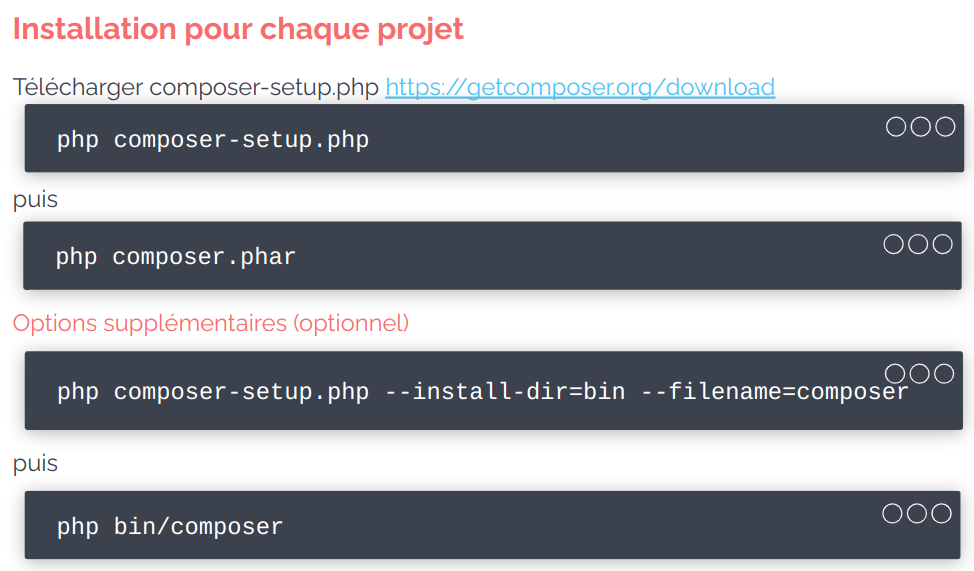
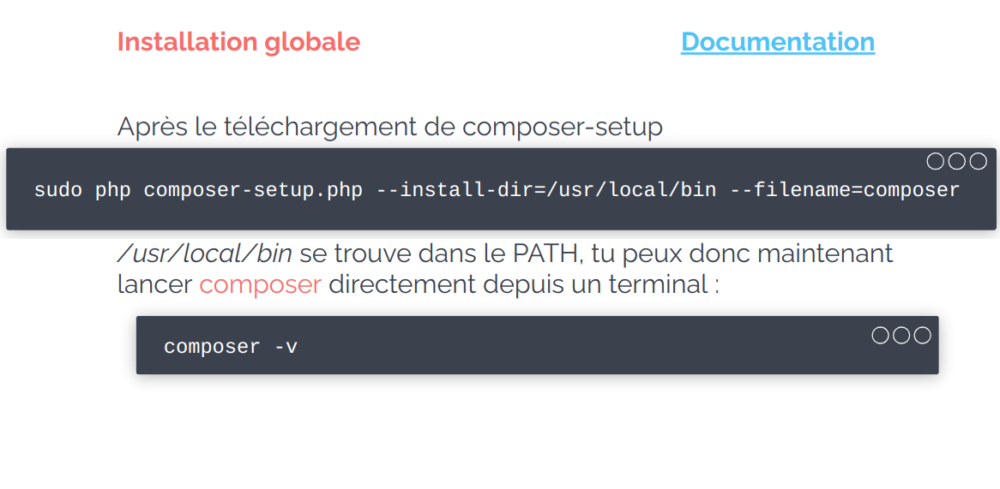
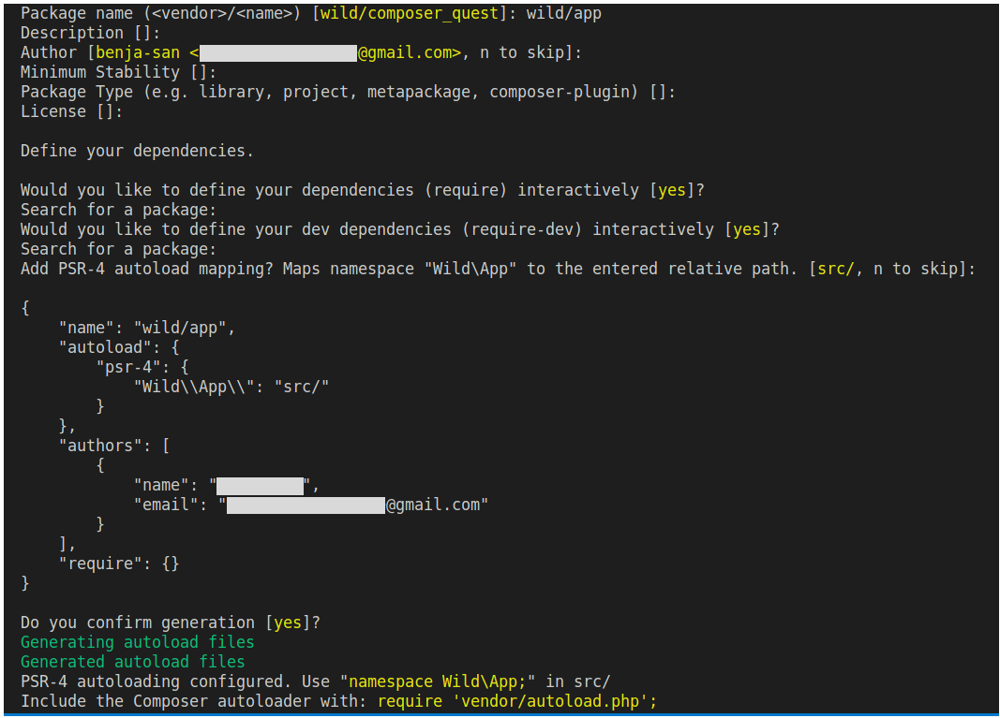

# Notes composer


## Tables of contents

1. [Introduction](#introduction)
2. [Installation](#installation)
3. [Initialisation d'un projet composer](#initialisation-dun-projet-composer)
4. [Chargement des classes (Autoloading)](#chargement-des-classes-autoloading)
5. [Ajouter et supprimer des dépendances](#ajouter-des-dépendances)
6. [composer.json VS composer.lock](#composerjson-vs-composerlock)
7. [Mise à jour](#mise-à-jour)


##### [Return to Top](#notes-composer)
# **Introduction**

Composer est un gestionnaire de dépendances pour PHP.  

* C'est quoi une dépendance ?

Pour certains projets, on ne va jamais tout développer. Certaines briques existent déjà, créées par d'autres développeurs et fonctionnent très bien. On va donc ajouter ces briques à notre projet. Ce sont des **dépendances**.  
Ces briques dépendent surement d'autres briques : ce sont des `sous-dépendances` ou des `dépendances imbriquées`. Chaque brique peut évoluer indépendemment des autres, chacune à son propre numéro de version. Un projet contient souvent des centaines de dépendances.

* C'est quoi un gestionnaire de dépendance ?

C'est un gestionnaire de paquet (APT, YUM...) Mais c'est orienté objet.  
Cela permet d'automatiser l'installation, la mise à jour, la suppression de bibliothèque dans le cadre d'une application, d'un projet. Cela résout des dépendances automatiquement et récursivement.

* D'où viennent les paquets ?
`GitHub` stocke les paquets, `Pakagist` crée un index, un pont vers composer, `Composer` installe, met en cache et configure.

* Recherche un paquet
Il faut se rendre sur `https://packagist.org/`, rechercher un paquet et suivre les indications pour l'installer.

Par exemple, pour envoyer un mail, il existe la librairie [Mailer](https://packagist.org/packages/symfony/mailer).

>Il faut faire très attention aux librairies que tu vas choisir, car tu vas intégrer du code que tu ne maîtrises pas.
Cela peut potentiellement être dangereux. Il est donc vivement recommandé de choisir uniquement des librairies sûres.

* Comment définir qu'une librairie est sure ?
    * Elle est activement maintenue
    * Elle possède une communauté importante (forums...)
    * Elle dispose d'une documentation complète et claire
    * Elle est dans un état stable (pas de beta, alpha... en production)

Tu ne peux pas installer n'importe quelle librairie via Composer. Toutes les librairies disponibles à l'installation sont présentes sur le site https://packagist.org.

* Packagist fournit des informations sur :
    * Le nombre de téléchargements
    * Le nombre de projets dépendants
    * Le Github du projet
    * Les versions
    * Les dépendances de la dépendance XD
...


##### [Return to Top](#notes-composer)
# **Installation**

* ## Installation locale

Il faut ouvrir un terminal et se rendre dans le dossier de son projet et exécuter les commandes suivantes une par une afin de télécharger **composer** dans le dossier de notre projet.

```sh
php -r "copy('https://getcomposer.org/installer', 'composer-setup.php');"
php composer-setup.php --filename=composer
php -r "unlink('composer-setup.php');"
```
Quand ces commandes seront exécutées, on devrait avoir un fichier nommé **composer** à la racine de notre projet.

* ## Installation globale

Il faut d'abord suivre les instructions de la section [installation locale](#installation-locale). Il faut ensuite déplacer le fichier **composer** que l'on a téléchargé précédemment dans n'importe quel dossier situé dans notre **PATH** avec la commande suivante :

```sh
$sudo mv composer /usr/local/bin
```

POur vérifier il faut lancer la commande :
```sh
composer --version
```
* ## BILAN 




##### [Return to Top](#notes-composer)
# **Initialisation d'un projet composer**
Avant tout utilisation de composer,il faut vérifier si on utilise bien une version à jour. Pour mettre à jour automatiquement il faut lancer la commande suivante :

On commence par faire un git init :
```sh
git init
```

```sh
composer self-update
```
Pour initialiser un projet qui va utiliser **Composer**, on se place à la racine du projet et on lance la commande :
```sh
composer init
```
Cette commande est interactive. Elle va donc te demander de renseigner des informations spécifiques à ton projet :



Attention, si un fichier `composer.json` est déjà présent dans le projet, cette commande va l'écraser et le remplacer avec le fichier `composer.json` nouvellement initialisé.

Une fois que l'on a répondu à toutes les questions, **Composer** crée un fichier très important : **composer.json**.

Ce fichier contient toutes les informations relatives au projet que l'on a renseigné dans le terminal. Il contiendra également la liste des dépendantes à gérer. Exemple :
```json
{
    "name": "wild/app",
    "description": "Wild composer quest",
    "autoload": {
        "psr-4": {
            "App\\": "src/"
    },
    "authors": [
        {
            "name": "wilderName",
            "email": "wilder@email.com"
        }
    ],
    "require": {}
}
```

Ne pas oublier de rajouter le dossier `vendor` dans le `.gitignore`.

##### [Return to Top](#notes-composer)
# **Chargement des classes (Autoloading)**

Dans certains cas, il arrive que différentes classes, fonctions ou constantes portent le même nom (d'une bibliothèque à une autre par exemple). Afin d'éviter tout conflit PHP met à disposition des espaces de noms: les **namespaces**.

Il s'agit de "*dossiers virtuels*" qui permettent de faire la distinction entre une `Class Cat` importée d'une bibliothèque externe et une `Class Cat` définie dans notre projet par exemple. Ainsi, si ta classe `Cat` se trouve dans le *Namespace Animal,* le vrai nom complet de la classe sera `Animal\Cat` et non pas Cat (ce qui permet bien de différencier deux classes portant le même nom mais dans des namespace différents). 

Ce nom, composé du *namespace* associé au nom de la classe est appelé **nom pleinement qualifié** de la classe ou *Fully Qualified Class Name* (FQCN) en anglais.

```php
<?php 

namespace App;

class Hello
{
    public function talk() : string
    {
        return "Hello World !";
    }
}
?>
```

Pour utiliser les classes dans nos projets on va devoir importer un à un les fichiers .php qui les contiennent (avec `include` ou `require`). À mesure que le nombre de fichiers grandit, cela devient vite ingérable ! C'est pour cela que PHP propose un système d'*autoloading*.

Même si, en théorie, on peut créer plusieurs classes dans un même fichier, c'est une très mauvaise pratique. Si on souhaite utiliser l'*autoload*, on va devoir faire attention de toujours créer **une seule classe par fichier**, et t'assurer que le fichier PHP ait bien le **même nom** que la classe. Soit pour `"Animal/Cat`", un fichier `Cat.php`, pour "`Animal/Dog`", un fichier "`Dog.php`", etc.

On va utiliser le système d'*autoloading* de **Composer**. Composer va se charger d'importer automatiquement tous les fichiers PHP de ton projet et de les rassembler sous un seul *namespace* racine que tu auras défini dans ton fichier `composer.json`.

Lors de la dernière phase d'initialisation de ta commande `composer init`  L'invite de commande te propose automatiquement de bénéficier de l'autoloading en intégrant une entrée `autoload:` à l'interieur de ton fichier composer.json.

    Si jamais on vient à changer les informations du fichier composer.json, il sera nécessaire de lancer la commande `composer install` pour que les changements soient pris en compte.

Si on décide de générer l'autoload de manière automatique, on pourra accéder au dossier `vendor/`. Dans ce dossier, un fichier `autoload.php` est généré. C'est lui qui va se charger d'importer les classes etc. **Il est nécessaire de `require` le fichier `autoload.php` dans index.php pour pouvoir utiliser les namesspaces**.

```php
<?php 

require_once __DIR__ . '/../vendor/autoload.php';

$object = new App\Hello();

echo $object->talk();
?>
```

Si on modifie l'autoload dans le composer.json après l'installation, il faudra jouer la commande `composer dump-autoload` pour ques les changements soient pris en compte.

```sh
composer dump-autoload
```

##### [Return to Top](#notes-composer)
# **Ajouter des dépendances**

* ## Ajout de dépendance 
La syntaxe est la suivante :
```sh
// Si installé globalement
composer require <vendor>/<package_name>
```

```sh
composer require twig/twig ^2.4 
```
Préciser la version est optionnel

Ou alors on ajoute dans composer.json

```json
"require": {
     "twig/twig": "^2.4"
 }
```
Puis dans le terinale on entre :
```sh
composer install
```
Cela  
* Ajoute la dépendance dans le fichier `composer.json`
* Télécharge les dépendances dans le dossier `vendor`
* Création/Mise à jour du fichier `composer.lock`

**IMPORTANT :**
* Le dossier vendor **toujours** dans .gitignore
* Le fichier composer.lock **jamais** dans .gitignore

Si on ne connaît pas l'identifiant de la librairie on peut saisir :
```sh
composer require
```
Et suivre les indications du terminal.

À la fin de l'installation, il est important de noter deux choses inscrites dans le terminal :

* `Writing lock file` : Cela signifie que Composer va soit créer le fichier composer.lock, soit le mettre à jour s'il existe déjà.
* Generating autoload files (cf. Composer 1 - Autoload)

Il faut aussi noter que ton fichier `composer.json` a été mis à jour. La librairie a été ajoutée dans la section `require`. Le code de la librairie a également été téléchargé dans le dossier `vendor/`.

>**Attention**  
>Le dossier `vendor/` ne doit jamais être versionné sinon le poids du repository s'alourdirait considérablement et inutilement... Pense donc à bien ajouter `vendor/` dans ton fichier `.gitignore.`


* ## Suppression de dépendance 
```sh
composer remove twig/twig
```

##### [Return to Top](#notes-composer)

# **composer.json VS composer.lock**

## composer.json

* C’est vous qui le définissez
* Reflète vos souhaits
* Les dépendances choisies, et les versions acceptées
* On l’utilise essentiellement en environnement de DEV
* Ressource de la commande update

## composer.lock

* Généré par composer
* Reflète l’existant
* Les dépendances et versions actuellement installées
* On l’utilise essentiellement en environnement de PROD
* Ressource de la commande install (sauf la première fois)

Il faut impérativement versionner ton fichier composer.lock (en plus du fichier composer.json) pour s'assurer que tous les développeurs utilisent les mêmes versions de dépendances.


##### [Return to Top](#notes-composer)
# **Mise à jour**

```sh
composer install
```
Contrairement à ce que l'on pourrait croire, la commande `install` n'est pas utilisée uniquement lors de l'installation, mais également pour les mises à jour.    
Cette commande va lire le fichier `composer.json`, et, si le fichier composer.lock est présent, installer les versions précises des dépendances qu'il contient (si différentes de celles déjà installées). Le fichier `composer.lock` sert donc de référence à cette commande et n'est pas modifié.


```sh
composer update
```
Met à jour toutes les dépendances du projet en fonction des règles définies.  Dans ce cas, le fichier composer.json sert de base et le fichier composer.lock sera mis à jour.  
Note: C'est équivalent à supprimer le fichier composer.lock et exécuter : composer install.


```sh
composer composer update twig/twig
```
Met à jour une dépendance


```sh
composer self-update
```
Met à jour composer lui-même

>Le dossier` /vendor` étant régulièrement mis à jour, son contenu est amené à être régulièrement modifié/écrasé. De plus, ce dernier ne doit pas être versionné. De ce fait, il ne faut donc JAMAIS modifier directement le contenu d'un fichier contenu dans ce dossier `/vendor`, car cette modification ne sera pas versionnée et sera ré-écrasée dès que tu mettras à jour un package.