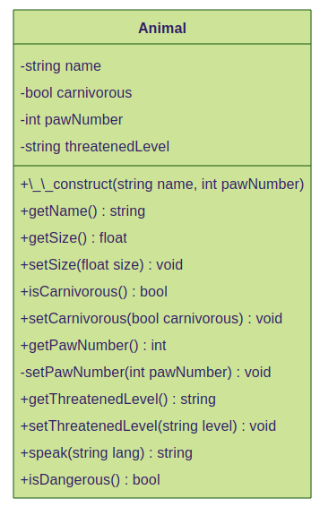

# Notes POO

## Tables of contents

1. [Les classes et les objets](#les-classes-et-les-objets)
2. [Les propriétés](#les-propriétés)
3. [Les méthodes](#les-méthodes)
4. [Constructeurs et visibilité](#constructeur-et-visibilité)
5. [Les constantes de classe](#les-constantes-de-classe)
6. [Héritage et parentalité](#héritage-et-parentalité)


##### [Return to Top](#notes-poo)
# **Les classes et les objets**


* ## Les classes

La classe permet de définir/modéliser le concept à manipuler. Cette modélisation est la plus importante, il faut donc décider ce dont on aura besoin pour définir correctement le concept :

``` php
<?php
// src/Animal.php
class Animal
{
    public string $name;
    
// size expressed in whatever unit    
    
    public int $pawNumber;
    
    public bool $isCarnivorous;
}
```
La classe doit être définie dans son propre fichier, et le fihcier doit avoir exactement le même nom que la classe.  
Une classe doit être nommé en PascalCase.

* ## Les objets

A partir de cette classe animal, que l'on peut comparer à un moule, il est possible de créer des animaux différents. C'est ce qu'on appelle les **objets** ou **instance d'une classe.**

``` php
<?php
// public/index.php

require __DIR__ . '/../src/Animal.php';

$animal1 = new Animal();
$animal2 = new Animal();
```
On doit d'abord *require* la classe que l'on veut utiliser.  
Puis on utilise le mot clé `new` pour instancier l'objet. On peut créer autant d'objet à partir d'une même classe, ils auront chacun les mêmes propriétés mais avec des valeurs différentes. Ces **objets** issus de la même classe s'appellent des **instances**. 

``` sh
object(Animal)[1]
  public string 'name' => *uninitialized*
  public float 'size' => *uninitialized*
  public int 'pawNumber' => *uninitialized*
  public int 'isCarnivorous' => *uninitialized*

object(Animal)[2]
  public string 'name' => *uninitialized*
  public float 'size' => *uninitialized*
  public int 'pawNumber' => *uninitialized*
  public int 'isCarnivorous' => *uninitialized*
```
##### [Return to Top](#notes-poo)
# **Les propriétés**

Reprenons la classe `Animal` :
``` php
<?php
class Animal
{
    public string $name;
    public float $size;
    public bool $carnivorous;
    public int $pawNumber;
}
```
Dans cette classe, le nom, la taille, le régime alimentaire, le nombre de pattes sont les **propriétés** auxquelles il va être possible d'affecter des **valeurs**.

Il ne faut pas oublier de typer ces propriétés.

Le mot `public` indique que l'on peut accéder aux variables depuis l'extérieur. Ce concept sera vu en détail plus tard.

* ## Affecter une valeur par défaut
Pour affecter une valeur par défaut, il faut le faire dès sa définition. Cela peut être intéressant mais pas toujours. Donner un `$name` par défaut n'a pas grand intérêt.
``` php
<?php
class Animal
{
    public string $name;
    public float $size = 100;
    public bool $carnivorous = false;
    public int $pawNumber;
}
```
* ## Affecter une valeur dépuis l'extérieur de la classe

Pour modifier les propriétés depuis l'extérieur de la classe, on utilise la syntaxe suivante :
``` php
<?php
$lion->name = 'lion';
$lion->pawNumber = 4;
$lion->carnivorous = true;
```
Pour récupérer la valeur d'une propriété, on utilise la même syntaxe :
``` php
echo 'Bonjour je suis un ' . $lion->name . ' et j\'ai ' . $lion->pawNumber . ' patte(s)';
```
##### [Return to Top](#notes-poo)
# **Les méthodes**

* ## Définir une méthode

En plus de propriétés, une classe est dotée de fonction que l'on appelle des méthodes dans le contexte objet.  
Les méthodes s'écrivent exactement comme des fonctions, avec un nom, des paramètres obligatoires et optionnels, des accolades contenant le corps de la fonction. Les paramètres etla valeur de sortie seront typés.

Premier exemple :
``` php
<?php
class Animal
{
    public string $name;
    public float $size = 100;
    public bool $carnivorous = false;
    public int $pawNumber;
    public string $threatenedLevel = 'NE';

    public function speak(): string
    {
        return 'Welcome to the zoo';
    }
}
```

* ## Utiliser une méthode
Syntaxe de base :

``` php
<?php
echo $lion->speak();
```
Elle est similaire à celle des propriétés. Les () en plus car c'est une fonction.


* ## Accéder aux propriétés avec `$this`

Une méthode permet de manipuler les propriétés d'un objet. Les portées sont limitées. On a déjà vu qu'une variable définie à l'extérieur d'une fonction n'était pas accessible à l'intérieur de celle-ci.

Dans une classe, les méthodes ont la possibilités d'accéder aux propriétés de la classe à l'aide du mot clé `$this`.

``` php
<?php
public function speak(): string
{
    return 'Welcome to the zoo, I\'am a ' . $this->name;
}
```
`$this` représente l'instance de la classe en cours d'utilisation. Si on appelle la méthode sur l'objet `$lion`, `$this` correspond donc à `$lion` et donc $name vaut 'lion' pour cet objet. De même si on fait `$parrot->speak()`, le `$this` correspondra à l'instance `$parrot` et le `$name` sera alors 'Parrot'.

* ## Les méthodes avec paramètres

Une méthode est une fonction de classe. Elle a donc le même fonctionnement et peut prendre donc des paramètres. Ceux-ci ont la même portée que pour des fonctions classiques. Il ne faut donc pas confondre ces variables "paramètres" avec les propriétés accessibles via `$this`.

``` php
public function speak(string $lang = 'fr'): string
{
    if($lang === 'fr') {
        $message = 'Bienvenue au zoo, je suis un ';
    } else {
        $message = 'Welcome to the zoo, I\'am a ';
    }
    return $message . $this->name;
}
```
Dans cette méthode, on mélange un paramètre externe `$lang` (qui n'est pas une propriété de l'aimal et n'est accessible que dans cette méthode) avec `$name` qui est une propriété et s'appelle donc via la syntaxe `$this->name`.

``` php
<?php
echo $lion->speak('fr');
echo $lion->speak('en');
echo $lion->speak();
```
Sur le 1er appel, on demande au lion de parler français
Sur le second, on demande de parler anglais
Sur le 3e on n'indique pas d'argument, la valeur par défaut "fr" va donc s'appliquer et le texte sera de nouveau en français.

Une autre méthode :
``` php
<?php
public function isDangerous(): bool
{
    return ($this->size > 50 && $this->carnivorous);
}
```
##### [Return to Top](#notes-poo)
# **Constructeur et visibilité**

* ## Constructeur
Avec les syntaxes précédentes, toutes les propriétés ne sont pas définies à la création de l'objet et donc si on fait cela :
``` php
<?php
// $lion->name = 'lion';
var_dump($lion);
echo $lion->name;
```
On aura donc ici une Fatal Error car le `$name` du lion n'est pas définie.

Si on regarde le résultat du `var_dump()`, on voit que la propriété `$name` est `uninitialized`. Or il est impossible d'afficher une propriété non initialisée.

Il faudra donc s'assurer que le développeur utilisant la classe soit forcée de définir un nom au moment de l'intanciation.

La solution c'est le constructeur ! C'est une méthode particulière qui, si elle est définie, impose d'utiliser un certain nombre de paramètre au moment de l'instanciation de l'objet, c'est à dire au moment d'utiliser le mot clé `new`.

En PHP, le constructeur s'écrit `__construct()` avec DEUX underscores. C'est une "méthode magique", il y en a d'autres en PHP mais celle-ci est la plus utilisée. Voici le code correspondant :

``` php
<?php
public string $name;
public function __construct(string $name)
{
    $this->name = $name;
}
```
Un constructeur ne renvoie rien, on ne doit donc pas y mettre de return.

Le `$this->name` correspond à la propriété de la classe définie avec public `$name` et le `$name` en paramètre correspond au `$name` que l’on attribue à `$this->name`.

Maintenant à l'instanciation on doit mettre le paramètre `$name`.
``` php
<?php
$lion = new Animal('lion');
```
* ## Visibilité : public ou private ?

Depuis le début, on utilise le mot clé `public` devant toutes les propriétés et les méthodes. C'est ce qu'on appelle la visibilité. Il en existe 3 niveaux :

        - public
        - protected
        - private

Ils permettent de définir si une propriété ou une méthode est accessible depuis l'extérieur de la classe ou non. Si le mot clé `public` est utilisé, la propritété/méthode sera utilisable partout, si elle est définie sur `private`, la propriété/méthode ne sera accessible que depuis la classe elle-même.

Exemple si on change la visibilité de la propriété `$size`
``` php
<?php
private float $size;
```
On obtient :
``` sh
php Fatal error: Uncaught Error: Cannot access private property Animal::$size in ...`.
```

* ## Les Getters & Setters

Dans Animal.php tu vas devoir définir une méthode publique `getSize()` qui va avoir pour rôle deretourner la propriété qui, elle, est privée.

``` php
<?php
private float $size;
//...
public function getSize(): float
{
    return $this->size;
}
```
Cette méthode, puisqu'elle se trouve dans la même classe, a le droit d'accéder aux propriétés `private`.

Ensuite, dans un fichier externe comme *index.php,* pour afficher la taille du lion on fera `echo $lion->getSize()` et non plus directement `$lion->size`, size n'étant plus accessible depuis l'extérieur. Il en va de même pour affectuer ou modifier la valeur de size:  `$lion->size = 70` ne fonctionnera plus.

On va donc créer une nouvelle méthode `setSize()` qui va prendre un entier en paramètre et va permettre de modifier la valeur de `$size`.

``` php
<?php
public function setSize(int $size): void
{
    $this->size = $size;
}
```
Cette méthode prend le paramètre $size et affecte cette valeur à la propriété `$size`, qui est ici récupéréer via la syntaxe `$this->size`.

Par convention, le paramètre de la méthode a le même nom que la propriété, mais le premier est accessible uniquement dans la méthode et il sert uniquement à donner une valeur à la propriété, qui elle, est accessible dans toute la classe. Ainsi :

``` php
<?php
$lion->setSize(70);
// TODO for other animals.
```

Ces deux types de méthodes, qui ont pour unique but de récupérer ou de modifier une propriété sont appelés des getters et setters (accesseurs et mutateurs en français). Ils ne sont pas obligatoires (si par exemple tu n'as jamais à modifier une propriété, tu n'as pas besoin de setter).  Leur utilisation (qui évite de manipuler directement les propriétés) est une bonne pratique, reconnue par la communauté des développeurs.
- Les getters (du verbe anglais "get", "obtenir") commencent généralement par le préfixe get (is est aussi utilisé si le type de la propriété est un booléen), suivi du nom de la propriété.
- Les setters (du verbe anglais "set", "mettre en place", "définir"), sont préfixés généralement par set, suivi du nom de la propriété.

Ces deux outils permettent de contrôler son code et parfois de devoir y mettre des verrous, de contrôler les valeurs que l'on veut donner aux propriétés. Exemple :

``` php
<?php
public function setPawNumber(int $pawNumber): void
{
    if($pawNumber < 0) {
        $pawNumber = 0;
    }
    $this->pawNumber = $pawNumber;
}
```
Avec ce code, il ne sera pas possible de saisir un nombre de pattes négatif.

Certaines méthodes n'ont qu'un usage interne, et il est donc recommandé de les passer en `private`. C'est le cas de `setPawNumber()`: lorsque l'animal est créé, le nombre de pattes est connu, fixe et n'a pas vocation à changer. Il est donc tout à fait logique de demander de saisir le nombre de pattes lors de l'instanciation, donc dans le `__construct()`.
``` php
<?php
private string $name;
private int $pawNumber;
// ...
public function __construct(string $name, int $pawNumber) 
{
    $this->name = $name;
    $this->setPawNumber($pawNumber);
}
// method is private because only use inside the constructor 
private function setPawNumber(int $pawNumber): void
{
    if($pawNumber < 0) {
        $pawNumber = 0;
    }
    $this->pawNumber = $pawNumber;
}
```
* ## Les propriétés dans le constructeur
Dans PHP8, une nouvelle syntaxe est apparue pour simplifier l'écriture d'un constructeur. Cette syntaxe, encore peu utilisée, est facultative et cumulable avec la syntaxe classique :


``` php
<?php
public function __construct(private string $name) {};

```

Ici, la visibilité est indiquée avec le paramètre du constructeur. Dans ce cas, PHP va créer la propriété et lui assigner la valeur passée en argument, il n'y a donc plus besoin de définir la propriété au dessus du constructeur. Le code est ainsi plus concis.

Les diagrammes de classe :




Ces diagrammes permettent une représentation d'éléments lors de la conception. LE standart c'est l'UML.
Dans les différents blocs on retrouve :
1. le nom de la classe
2. les propriétés avec leur type
3. les méthodes

Pour les différents éléments on retrouve :
* un + pour `public`
* un - pour `private`
* un # pour `protected`

##### [Return to Top](#notes-poo)
# **Les constantes de classe**

Après les propriétés et les méthodes, un troisième élément peut y-être défini, les **constantes**.  
À la différence d'une propriété (appelée aussi variable de classe) dont la valeur peut changer d'une instance à l'autre, une constante de classe est un élément dont **la valeur est immuable**, elle sera la même pour tous les objets d'une même classe.  
**La propriété est propre à l'instance, tandis que la constante est propre à la classe !**

Exemple : Pour chaque animal créé, un mètre fera toujours 100cm ! Dans d'autres contextes, une constante pourrait être la température du zéro absolu, la valeur de pi, le rayon de la terre, la vitesse de la lumière, le nombre de carte dans un jeu de tarot, un tableau contenant les lettres de l'alphabet latin, etc.

* ## Syntaxe pour créer une constante

Puisqu'une constante n'est pas modifiable, sauf cas particulier elle est généralement définie en `public`.  
Généralement, dans ta classe, pour faciliter la lisibilité, tu organiseras les éléments dans cet ordre de haut en bas : constantes, propriétés, méthodes (avec le constructeur en premier s'il y a lieu)

``` php
<?php
<?php

class Animal
{
    public const CENTIMERS_IN_METER = 100;

    private string $name;
    private float $size = 100;
    private bool $carnivorous = false;
    private int $pawNumber;
    private string $threatenedLevel = 'NE';
    
    public function __construct(string $name, int $pawNumber)
    {
        $this->name = $name;
        $this->setPawNumber($pawNumber);
    }

    // ....
}
```

* ## Depuis l'extérieur de la classe

On utilise la syntaxe `$objet->propertyName`, car la propriété est propre à l'objet.

Pour la constante, il faut utiliser la syntaxe `ClassName::CONSTANT_NAME`.

``` php
<?php
var_dump(Animal::CENTIMERS_IN_METER);
```
L'opérateur `::` est appelé opérateur de résolution de portée.  
La flèche `->` est utilisé pour ce qui a trait à l'objet.  
Le `->` est utilisé pour ce qui a trait à la classe.


* ## Depuis l'intérieur de la classe

Pour une propriété tu utilises la syntaxe `$this->propertyName`, où `$this` représente l'objet en cours d'exécution.

On peut toujours utiliser `ClassName::CONSTANT_NAME`, mais il y a un mot-clé qui permet à une classe de faire référence à elle-même, c'est `self`. Ainsi à l'intérieur d'elle-même, tu feras plutôt `self::CONSTANT_NAME`.

``` php
<?php
self::CENTIMETERS_IN_METER
```
* ## Quand utiliser les constantes ?

On utilise les constantes pour les valeurs que l'on aurait saisie en dur dans le code. Cela permet d'avoir un code plus lisible et plus compréhensible. Cela permet également de rendre le code plus maintenable au cas où on souhaite modifier la valeur, on ne le fait qu'à un seul endroit.

* Sans constante :
``` php
<?php
public function getSizeWithUnit() :string
{
    if($this->getSize() < 100) {
        return $this->getSize() . 'cm';     
    } else {
        return ($this->getSize / 100) . 'm';
    }
}
```

* Avec constante :
``` php
<?php
public const CENTIMETERS_IN_METER = 100;
public const SIZE_UNIT_CHANGE_LIMIT = 100;

public function getSizeWithUnit() :string
{
    if($this->getSize() < self::SIZE_UNIT_CHANGE_LIMIT) {
        return $this->getSize() . 'cm';     
    } else {
        return ($this->getSize() / self::CENTIMETERS_IN_METER) . 'm';
    }
}
```

Autre exemple :

``` php
<?php
// php

<?php

/* Seules les définitions de la constante et de la méthode sont mises ici*/

class Animal
{

    public const THREATENED_LEVELS = ['NE', 'DD', 'LC', 'NT', 'VU', 'EN','CR','EW','EX'];

    public function setThreatenedLevel(string $threatenedLevel): void
    {
        $this->threatenedLevel = in_array($threatenedLevel, self::THREATENED_LEVELS) ? $threatenedLevel : 'NE';
    }
}
```
##### [Return to Top](#notes-poo)
# **Héritage et parentalité**

* ## Héritage

En POO, l'héritage permet à un objet d'hériter automatiquement toutes les propriétés et méthodes de son/ses parents.
Dans le cas des véhicules roulant (vélo, voiture, camion), ils ont tous des propriétés communes mais également des différences.

On peut donc créer une classe `Vehicle` qui contient les méthodes communes pour deux autres classes `Bicyle` et `Car`. 

Classe Vehicle :
``` php
<?php
// Vehicle.php

class Vehicle
{
    private string $color;
    private int $currentSpeed;
    private int $nbSeats;
    private int $nbWheels;

    public function __construct(string $color, int $nbSeats)
    {
        $this->color = $color;
        $this->nbSeats = $nbSeats;
    }

    public function forward(): string
    {
        $this->currentSpeed = 15;
        return "Go !";
    }

    public function brake(): string
    {
        $sentence = "";
        while ($this->currentSpeed > 0) {
            $this->currentSpeed--;
            $sentence .= "Brake !!!";
        }
        $sentence .= "I'm stopped !";
        return $sentence;
    }

    public function getCurrentSpeed(): int
    {
        return $this->currentSpeed;
    }

    public function setCurrentSpeed(int $currentSpeed): void
    {
        if($currentSpeed >= 0){
            $this->currentSpeed = $currentSpeed;
        }
    }

    public function getColor(): string
    {
        return $this->color;
    }

    public function setColor(string $color): void
    {
        $this->color = $color;
    }

    public function getNbSeats(): int
    {
        return $this->nbSeats;
    }

    public function setNbSeats(int $nbSeats): void
    {
        $this->nbSeats = $nbSeats;
    }

    public function getNbWheels(): int
    {
        return $this->nbWheels;
    }

    public function setNbWheels(int $nbWheels): void
    {
        $this->nbWheels = $nbWheels;
    }
}
```
La classe Bicycle ressemblera donc à ça :

``` php
<?php
//Fichier Bicycle.php
require_once 'Vehicle.php';
class Bicycle extends Vehicle
{
}
```
C’est `extends`, suivi du nom d’une classe, qui permet de créer une relation de parenté entre celles-ci.

Il ne faut pas oublier d'importer avec `require_once` la classe `Vehicle` que l'on veut utiliser. Attention, en PHP, une classe ne peut avoir qu'une seule classe parent. Par contre, il est tout à fait possible à une classe mère d'avoir plusieurs filles !

Tout en laissant vide la classe Bicyle, on peut écrire le code suivant :
``` php
<?php
require_once 'Bicycle.php';

$bicycle = new Bicycle('blue', 1);
echo $bicycle->forward();
var_dump($bicycle);
```
Tu peux maintenant utiliser la classe `Bicycle` comme tu l’as fait précédemment. Les méthodes du parent sont directement accessibles par l'enfant.

La classe Car serait donc alors celle ci :

``` php
<?php
require_once 'Vehicle.php';

class Car extends Vehicle
{
    private string $energy;
    private int $energyLevel;

    public function __construct(string $color, int $nbSeats, string $energy)
    {
        $this->color = $color;
        $this->nbSeats = $nbSeats;
        $this->energy = $energy;
    }

    public function getEnergy(): string
    {
        return $this->energy;
    }

    public function setEnergy(string $energy): void
    {
        $this->energy = $energy;
    }

    public function getEnergyLevel(): int
    {
        return $this->energyLevel;
    }

    public function setEnergyLevel(int $energyLevel): void
    {
        $this->energyLevel = $energyLevel;
    }
}
```

On peut alors utiliser la classe comme ceci :
``` php
<?php
$car = new Car('green', 4, 'electric');
echo $car->forward();
var_dump($car);
```

Cela donnera :
``` sh
Go !
object(Car)[2]
  private string 'energy' => string 'electric' (length=8)
  private int 'energyLevel' => *uninitialized*
  private string 'color' (Vehicle) => *uninitialized*
  private int 'currentSpeed' (Vehicle) => int 15
  private int 'nbSeats' (Vehicle) => *uninitialized*
  private int 'nbWheels' (Vehicle) => *uninitialized*
  public 'color' => string 'green' (length=5)
  public 'nbSeats' => int 4
```

Les deux propriétés `$color` et `$nbSeat` qu'on a défini dans le constructeur ne sont pas accessibles par la classe enfant `Car`, car elles sont définies en visibilité `private` dans `Vehicle`. Le mot clé `private` rend inaccessible l'utilisation d'une propriété ou d’une méthode dans une classe fille. PHP les crée donc automatiquement à la volée en `public`.

Pour accéder aux propriétés de la classe parente `Vehicle`, il faut passer les visibilités de tes propriétés de `private` à `protected`.

`Protected` a une visibilité qui se place entre `private` et `public`. Les propriétés et méthodes protected deviennent donc accessibles uniquement aux classes enfants de `Vehicle`.

Le résultat devient donc alors le suivant :
``` sh
Go !
object(Car)[2]
  private string 'energy' => string 'electric' (length=8)
  private int 'energyLevel' => *uninitialized*
  protected string 'color' => string 'green' (length=5)
  protected int 'currentSpeed' => int 15
  protected int 'nbSeats' => int 4
  protected int 'nbWheels' => *uninitialized*
```

* ## Mot clé parent

Pour la classe `Car`, on a créé un nouveau constructeur dédié à la classe

``` php
<?php
public function __construct (string $color, int $nbSeats, string $energy)
{
    $this->color = $color;
    $this->nbSeats = $nbSeats;
    $this->energy = $energy;
}
```
Une partie de ce code est similaire à la classe `Vehicle`. On va donc la réutiliser plutôt que la réécrire. Surtout si la classe parente fait de l'algorithmie au moment de l'instanciation.

On va donc utiliser le mot clé `parent`. C'est lui qui se chargera d'appeler la méthode de la classe parente. En voici la syntaxe :

``` php
<?php
public function __construct(string $color, int $nbSeats, string $energy)
{
    parent::__construct($color, $nbSeats);
    $this->energy = $energy;
}
```
Pour résumer :

Dans la classe `Car`, la méthode `__construct()` prend 3 paramètres en entrée. Elle appelle ensuite via le mot clé `parent::`, la méthode `__construct()` définie dans la classe parente `Vehicle` puis applique sa propre logique pour l'énergie.


##### [Return to Top](#notes-poo)
* ## Quand utiliser les constantes ?

``` php
<?php

```