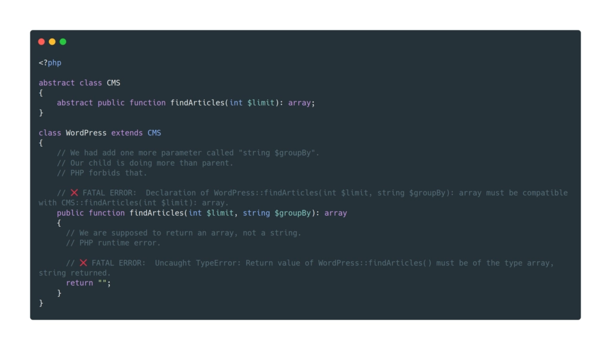

# Notes S.O.L.I.D

# Qu’est-ce que SOLID ?

Tu dois sans doute déjà connaître quelques initiales, voici les 5 principes SOLID complet.

(On me les a demandés une fois en entretien d’embauche d’ailleurs).

SOLID, c’est un acronyme pour ces 5 principes de programmation.

- S : Single Responsibility Principle
- O : Open/Closed Principle
- L : Liskov’s Substitution Principle
- I : Interface Segregation Principle
- D : Dependency Inversion Principle
  
Le but n’est pas de les connaître par cœur, mais de suffisamment les comprendre pour pouvoir les utiliser.

En informatique, ces principes sont considérés comme des bonnes pratiques pour les développeurs.

Nous sommes censés les appliquer afin de produire du code de qualité.

C’est ça SOLID.

Mais bon dans la pratique, je vois très peu de personnes appliquer ces principes en entreprise ! 🙁


# Pourquoi faire du code SOLID ?
SOLID est un ensemble de (seulement) 5 bonnes pratiques dont le but est de rendre le code :

- Code moins bogué
- Code - plus lisible
- Code plus logique
- Code maintenable
- Code testable
- Code extensible (tu changes une partie du programme et il continue de fonctionner)

**Comprendre SOLID et l’utiliser au quotidien te permettront surtout d’améliorer la qualité de ton code et de comprendre des codes plus évolués (comme celui de ton framework par exemple).**

En une ligne : cela te fera devenir un meilleur développeur.

Ce sont des bonnes pratiques de développement un peu vieilles, mais toujours utilisées.

Tu as donc tout intérêt à comprendre ces principes, et mieux encore, à les appliquer dans ton quotidien de dev.

Faire du code SOLID diminuera grandement la dette technique de tes projets.

Une raison de plus de te former à son utilisation.


# Comment utiliser SOLID dans son code (avec exemples concrets) ?


Dans cette partie, j’aimerais te montrer comment tu peux inclure du code SOLID dans ton projet sans que cela devienne compliqué.

**Le plus gros frein à l'utilisation des principes de SOLID, c'est que tout le monde pense que c'est compliqué et que c'est réservé aux génies du dev.**

Mais SOLID n’est pas si compliqué que ça à comprendre.

Le seul prérequis pour bien le maîtriser, c’est d’avoir un peu d’expérience en programmation.


Avant de commencer, ne sois pas frustré de ne pas tout comprendre du premier coup.

Personnellement, j’ai mis des mois à assimiler ces notions.

Mais quand tu arriveras à comprendre et à utiliser les principes SOLID dans ton code, ta carrière de développeur fera un bond en avant.

# S : Single Responsibility Principle (SRP)

C’est sans doute le principe SOLID le plus simple à comprendre.

Une classe ne doit avoir qu'une seule et unique responsabilité.

Une erreur que l’on retrouve beaucoup dans les projets, c’est d’avoir une classe type UserService.php avec tout et n’importe quoi dedans.

De plus, le nom UserService.php n’est pas du tout explicite, on ne sait pas ce que le fichier contient.

Double problème !

## ❌ Code qui ne respecte pas le principe de responsabilité unique (SRP)

```php
<?php
/**
*** Single Responsibility Principle in PHP (not working)
**/

class UserService 
{
	public function updateFromAPI( User $user): User
	{
		// ...	
	}

	public function removeSession( User $user ): void
	{
		// ...	
	}

	public function isUserAllowedToAccessAdmin( User $user ): bool
	{
		// ...
	}

	public function serialize( User $user ): string
	{
		// ...
	}
}
```

Ici, UserService.php a plusieurs rôles (ou responsabilités).

- Gérer la mise à jour d’un utilisateur
- Gérer la session de l’utilisateur
- Vérifier ses droits
- Convertir l’objet d’un format vers un autre


Cela fait déjà pas mal, et encore.

*Généralement quand cela commence comme ça sur les projets, on se retrouve avec des services un peu fourre-tout de plusieurs centaines de lignes.*

Plusieurs méthodes qui font la même chose, le code est dupliqué de toute part, les classes deviennent de plus en plus lourdes…

À maintenir c’est très compliqué.

## ✅ Code PHP qui respecte le principe de responsabilité unique (SRP)

Reprenons l’exemple ci-dessus.

Plutôt que d’avoir une arborescence de telle sorte.


    Services/
    └── UserService.php
    ├── ...

Et ainsi avoir un service énorme par type de données (comme UserService, ImageService, StatsService…) qui contient beaucoup (trop) de codes.

On applique le principe SRP qui va naturellement tendre vers une arborescence plus facile à lire.


    Services/
    ├── ...
    └── User
        ├── UserAuthenticatorService.php
        ├── UserFormatterService.php
        ├── UserSessionService.php
        └── UserUpdatorService.php
        ├── ...

Et voici le code séparé par fichier.

```php
<?php
/**
 * Single Responsibility Principle in PHP
 * 
 * Each class should be stored in a folder called Services/User/*.
 */

// Located in Services/User/UserAuthenticatorService.php
class UserAuthenticatorService
{
	public function isAllowedToAccessAdmin( User $user ): bool
	{
		// ...
	}
}

// Located in Services/User/UserFormatterService.php
class UserFormatterService
{
	public function serialize( User $user ): string
	{
		// ...
	}
}

// Located in Services/User/UserSessionService.php
class UserSessionService
{
	public function invalidate( User $user ): void
	{
		// ...
	}
}

// Located in Services/User/UserUpdatorService.php
class UserUpdatorService
{
	public function updateFromAPI( User $user): User
	{
		// ...
	}
}
```


## ⭐️ Pourquoi utiliser le principe de responsabilité unique (SRP) ?

- Le code est beaucoup plus clair (une classe de 1000 lignes, ce n’est pas clair).
- Chaque fichier a désormais un rôle qui lui est propre.
- Tout le monde peut comprendre à quoi servent les classes dans le dossier Services/User grâce à au nommage.
- Le projet sera beaucoup plus maintenable, plus facile et agréable à faire évoluer.
- La conception modulaire aide les développeurs à coder plus rapidement (en se concentrant sur une seule action).


# O : Open/Closed Principle

On commence à rentrer dans le vif du sujet avec le principe SOLID « ouvert / fermé ».

**Les entités doivent être ouvertes à l'extension et fermées à la modification.**


Cela signifie que l’on doit toujours favoriser l’extension du code à sa modification : on ne modifie pas le fonctionnement suivant l’entité à utiliser, on définit une fonction commune.

Souviens-toi de ceci :

Si tu commences à utiliser des instanceof avec des if ou des switch case en fonction d’un type, c’est sans doute que tu es tombé dans le piège.


## ❌ Code qui ne respecte pas le principe ouvert/fermé (OC)


La plupart des exemples du principe d’ouverture / fermeture que tu trouves sur internet te parlent d’objet, d’entité.

Mais cela s’applique également aux services, modules, fonctions, classes…

Ici je choisis d’afficher un message de bienvenue à mon utilisateur, et peu importe son type, mon action ne doit pas être modifiée pour chaque élément, même si son affichage est différent.

Malheureusement dans ce code, mon action displayWelcomeMessage() se devra de changer au fur et à mesure que j’ajouterai des types d’utilisateurs…

```php
<?php
/**
 * Open/Closed principle in PHP (not working)
 */

class User
{
    public $name;
    public $firstname;

    public function __construct(string $firstname, string $name)
    {
        $this->firstname = $firstname;
        $this->name = $name;
    }
}

class Customer
{
    public $fullname;

    public function __construct(string $fullname)
    {
        $this->fullname = $fullname;
    }
}

class AccountDisplayerService
{
    public function displayWelcomeMessage(User | Customer $entity): void
    {
        if ($entity instanceof User) {
            printf("Hello, %s %s", strtoupper($entity->name), $entity->firstname);
        } elseif ($entity instanceof Customer) {
            printf("Welcome again, dear %s\n", $entity->fullname);
        }
    }
}

$user = new User('Lucien', 'Bramard');
$customer = new Customer('Mr Elliot Alderson');

$accountDisplayer = new AccountDisplayerService();

$accountDisplayer->displayWelcomeMessage($user);
$accountDisplayer->displayWelcomeMessage($customer);
```

Si je veux rajouter un nouveau type d’utilisateur, disons un affilié, je vais devoir (encore) modifier le service qui fait l’action.

C’est contraire au principe ouvert / fermé.

## ✅ Code qui respecte le principe ouvert/fermé (OC)

Voici comment nous avons rendu notre code conforme.

- Ouvert pour l’extension : c’est le cas ci-dessous, on peut étendre le comportement d’une méthode (ici theName()), chaque classe qui l’implémente fait ce qu’elle veut dans sa méthode.
- Fermé à la modification : on ne change pas le code source de l’action en fonction du paramètre reçu (que j’ai un client, un utilisateur, un affilié, un administrateur ou que sais-je, le code de l’action ne sera pas modifié).

```php
<?php
/**
 *  Open/Closed Principle in PHP
 */

interface NameableInterface {
    public function theName(): void;
}

class User implements NameableInterface
{
    public $name;
    public $firstname;

    public function __construct(string $firstname, string $name)
    {
        $this->firstname = $firstname;
        $this->name = $name;
    }

    public function theName(): void
    {
        printf("Hello, %s %s", strtoupper($this->name), $this->firstname);
    }
}

class Customer implements NameableInterface
{
    public $fullname;

    public function __construct(string $fullname)
    {
        $this->fullname = $fullname;
    }

    public function theName(): void
    {
        printf("Welcome again, dear %s\n", $this->fullname);
    }
}

class AccountDisplayerService
{
    public function displayWelcomeMessage(NameableInterface $entity): void
    {
        $entity->theName();
    }
}

$user = new User('Lucien', 'Bramard');
$customer = new Customer('Mr Elliot Alderson');

$accountDisplayer = new AccountDisplayerService();

$accountDisplayer->displayWelcomeMessage($user);
$accountDisplayer->displayWelcomeMessage($customer);
```

Le choix d’une interface m’a permis de déterminer une action dans le service.

Désormais je n’ai plus à modifier le comportement de mon service à chaque ajout d’entité.

L’interface m’a permis de créer un contrat entre le service et l’objet qui est affiché.

En une ligne :

« Tu veux que je t’affiche ? Pas de problème, implémente juste l’interface NameableInterface ! »

## ⭐️ Pourquoi utiliser le principe ouvert/fermé (OC) ?

- Un code beaucoup plus lisible et plus clair.
- On aura beaucoup moins de bugs ou de comportements bizarres.
- En termes de maintenabilité, c’est génial, car l’interface et son contrat te permettent de savoir où tu vas.


# L : Liskov’s Substitution Principle (LSP)

Le principe SOLID de substitution de Barbara Liskov.

*Les objets dans un programme doivent être remplaçables par des instances de leur sous-type sans pour autant altérer le bon fonctionnement du programme.*


Là, c’est le moment où tu es tenté de quitter ce site à tout jamais.

Apprendre SOLID c’est galère, ce principe, c’est le plus difficile pour moi.

*L’idée du principe est que les enfants ne peuvent pas faire plus ou moins que leur parent.*

Voici les 4 conditions que tu dois remplir pour être conforme au Liskov’s Substitution Principle.

- La signature des fonctions (paramètres et retour) doit être identique entre l’enfant et le parent.
- Les paramètres de la fonction de l’enfant ne peuvent pas être plus nombreux que ceux du parent.
- Le retour de la fonction doit retourner le même type que le parent.
- Les exceptions retournées doivent être les mêmes.

C’est assez théorique, mais tout est là.



En PHP, les exceptions ne peuvent pas être associées à une méthode (contrairement en Java avec throws par exemple), mais on s’égare là !

## ❌ Code qui ne respecte pas le principe de substitution de Liskov (LSP)


Un exemple parlant est de créer un système pour récupérer des articles en base de données suivant le CMS (comme WordPress, Joomla, MediaWiki…).

```php
<?php
/**
 * Liskov’s Substitution Principle (LSP) in PHP (not working) 
 */

abstract class CMS 
{
    abstract public function findArticles(int $limit);
}   
    
class WordPress extends CMS
{
    /**
     * @param int $limit
     * @return array
     * @throws \Exception|\Doctrine\DBAL\Driver\Exception
     */
    public function findArticles(int $limit)
    {
        // ❌ Throws a different exception, Joomla's class cannot do it.
        $connection = $this->getEntityManager()->getConnection();

        $statement = $connection->prepare
        (
            'SELECT
              post_title AS title
              post_content AS content
              post_date AS createdAt
            FROM `post`
            WHERE `post_type` = "post"
                AND `post_status` = "publish"
            ORDER BY `post_date` DESC
            LIMIT :limit'
        );
        $statement->bindValue(':limit', $limit, PDO::PARAM_INT);

        return $statement->fetchAll();
    }
}

class Joomla extends CMS
{
    public function findArticles(int $limit)
    {
      try {
          $pdo = new PDO('...');

          $statement = $pdo->prepare
          (
              'SELECT
                `title` AS title,
                `fulltext` AS content,
                `publish_up` AS createdAt
              FROM content
              WHERE `state` = 1
              ORDER BY `publish_up` DESC
              DESC LIMIT 10'
          );

          return $statement->fetchAll();
        } catch (\Exception $e) {
          // ❌ Return type is string, we are supposed to return array.
          return $e->getMessage();
        }
    }
}
```

Plusieurs choses ne vont pas dans ce code :

- Pas les mêmes retours de fonction.
- Des exceptions différentes suivant les enfants.

Heureusement les paramètres en entrée ne changent pas…

## ✅ Code qui respecte le principe de substitution de Liskov (LSP)

Pour rappel, un enfant (un objet) ne peut pas faire plus ou moins que son parent (une interface ou une classe parente, abstraite ou non).

```php
<?php
/**
 * Liskov’s Substitution Principle (LSP) in PHP
 */

abstract class CMS
{
    abstract public function findArticles(int $limit = 10): array;

    /**
     * @throws PDOException
     */
    public function getConnection(): PDO
    {
        $pdo = new PDO('');
        
        $pdo->setAttribute(PDO::ATTR_ERRMODE, PDO::ERRMODE_EXCEPTION);
        $pdo->setAttribute(PDO::ATTR_EMULATE_PREPARES, false);
        
        return $pdo;
    }
}

class WordPress extends CMS
{
    public function findArticles(int $limit = 10): array
    {
        $pdo = $this->getConnection();

        $statement = $pdo->prepare
        (
            'SELECT
              post_title AS title
              post_content AS content
              post_date AS createdAt
            FROM `post`
            WHERE `post_type` = "post"
                AND `post_status` = "publish"
            ORDER BY `post_date` DESC
            LIMIT :limit'
        );
        $statement->bindValue(':limit', $limit, PDO::PARAM_INT);

        return $statement->fetchAll();
    }
}

class Joomla extends CMS
{
    public function findArticles(int $limit = 10): array
    {
        $pdo = $this->getConnection();

        $statement = $pdo->prepare
        (
            'SELECT
              `title` AS title,
              `fulltext` AS content,
              `publish_up` AS createdAt
            FROM content
            WHERE `state` = 1
            ORDER BY `publish_up` DESC
            DESC LIMIT :limit'
        );
        $statement->bindValue(':limit', $limit, PDO::PARAM_INT);

        return $statement->fetchAll();
    }
}
```

J’ai déclaré une classe abstraite parente à étendre pour être certain que chacun des enfants me retourne bien une liste d’articles avec une limite en entrée.

Partout dans mon code, je peux donc interchanger WordPress et Joomla, sans que ça ne casse rien.

**Ces 2 classes respectent la définition du parent, elles ne font ni plus, ni moins.**

On sait à quoi s’attendre en les utilisant.

Voici un autre exemple du principe de substitution de Liskov avec PHP.

```php
<?php

class Vehicle
{
}

class Car extends Vehicle
{
}

class Boat extends Vehicle {

}

abstract class VehicleManager
{
    abstract function sell(Vehicle $vehicle): void;
}

class CarManager extends VehicleManager
{
    function sell(Car $car): void // ❌ Declaration of CarManager::sell(Car $car): void must be compatible with VehicleManager::sell(Vehicle $vehicle):
    {
        /**
         * This is a limitation of PHP language, technically speaking, this is NOT an error.
         *
         * If you wish to do so, use interfaces!
         */
    }
}

$carManager = new CarManager();
$carManager->sell(new Car());

class VehicleOrder
{
    /**
     * Children can be substitute with there parent.
     */
    function order(Vehicule $vehicle)
    {
    }
}

$vehicleOrder = new VehicleOrder();
$vehicleOrder->order(new Car()); // substitution works, it is all ok 👌
$vehicleOrder->order(new Boat()); // substitution works, it is all ok 👌
```

Ici, on ne peut pas typer le service enfant (CarManager) avec l’enfant (Car) alors que pourtant, nous pourrions…

PHP nous oblige à respecter notre contrat avec la classe abstraite et d’utiliser un Vehicle !

La méthode sell(Vehicle $vehicle) ne peut donc pas être surchargée dans l’enfant (CarManager) avec un type différent que Vehicle.

Quand bien même nous respecterions le principe de substitution de Liskov.

C’est une limitation de PHP.

En revanche, il est tout à fait possible de substituer les objets entre eux dans un appel de fonction (comme l’appel order()).

## ⭐️ Pourquoi utiliser le principe de substitution de Liskov (LSP) ?

- Ça évite les bogues où un enfant fait (surtout) plus qu’un parent (plus de paramètres, de retours, d’exceptions levées…).
- Les mises à jour de code seront plus faciles à organiser (chaque changement du parent induit des changements vers les enfants = sécurité).
- On gagne niveau lisibilité et qualité, le code est beaucoup plus simple à lire et à (ré-)utiliser.


# I : Interface Segregation Principle (ISP)
Voici ce que dit le principe SOLID de ségrégation de l’interface.

**Aucun client ne devrait être forcé d'implémenter des méthodes / fonctions qu'il n'utilise pas.**

En résumé…

Il vaut mieux faire plusieurs petites interfaces qu’une seule grande.

## ❌ Code qui ne respecte pas le principe de ségrégation des interfaces (ISP)


Imaginons que nous ayons besoin d’afficher des informations dans l’administration, comme des utilisateurs et des commandes.

Les utilisateurs peuvent être mis à jour (le nom, le prénom…), mais pas les commandes !

Une fois que la commande est passée, on ne peut plus la modifier (normal).

Nous avons donc 2 besoins.
- Afficher les informations de l’objet requêté en front.
- Envoyer la mise à jour vers le back d’un de nos deux objets.

```php
<?php
/**
 * Interface Segregation Principle (ISP) in PHP (not working)
 */

// ❌ We have only 1 interface for 2 different needs.
interface EntityInterface
{
    public function getId(): int;
    public function getName(): string;
    public function serializeToApi(): string;
}

/**
 * Class User
 *
 * The class should be displayed in front-end, so getId() and getName() are mandatory.
 * The class should be sent to a web service, the function serializeToApi() is mandatory.
 */
class User implements EntityInterface
{
    private int $id;
    private int $name;

    public function serializeToApi(): string
    {
        return json_encode($this);
    }

    public function getId(): int
    {
        return $this->id;
    }

    public function setId(int $id): void
    {
        $this->id = $id;
    }

    public function getName(): int
    {
        return $this->name;
    }

    public function setName(int $name): void
    {
        $this->name = $name;
    }
}

/**
 * Class Order
 *
 * The class order is only used to display orders from the user, no modification allowed.
 * The class DOES NOT need serializeToApi().
 */
class Order implements EntityInterface
{
    private int $id;
    private int $name;

    // ❌ The function is not needed, but since it is in our interface, we have to implement it.
    public function serializeToApi(): string
    {
        return "";
    }

    public function getId(): int
    {
        return $this->id;
    }

    public function getName(): int
    {
        return $this->name;
    }
}
```

Nous avons 2 besoins distincts, mais la même interface est utilisée.

serializeToApi() est incluse dans la classe Order même si celle-ci n’en a pas besoin.

Du coup, chaque entité du projet qui implémente EntityInterface devra implémenter la méthode pour être postée via une API…

Même si ce n’est pas le cas.

## ✅ Code qui respecte le principe de ségrégation des interfaces (ISP)

Nous avons séparé nos 2 besoins en 2 interfaces séparées.

```php
<?php
/**
 * Interface Segregation Principle (ISP) in PHP
 * 
 * We have 2 dedicated Interfaces for 2 different needs.
 */

interface EntityInterface
{
    public function getId(): int;
    public function getName(): string;
}

interface SerializableInterface
{
    public function serializeToApi(): string;
}

/**
 * Class User
 * 
 * The class should be displayed in front-end, so getId() and getName() are mandatory.
 * The class should be sent to a web service, the function serializeToApi() is mandatory.
 */
class User implements EntityInterface, SerializableInterface
{
    private int $id;
    private int $name;

    public function serializeToApi(): string
    {
        return json_encode($this);
    }

    public function getId(): int
    {
        return $this->id;
    }

    public function setId(int $id): void
    {
        $this->id = $id;
    }

    public function getName(): int
    {
        return $this->name;
    }

    public function setName(int $name): void
    {
        $this->name = $name;
    }
}

/**
 * Class Order
 * 
 * The class order is only used to display passed orders from the user, no modification allowed.
 * The class DOES NOT need serializeToApi().
 */
class Order implements EntityInterface
{
    private int $id;
    private int $name;

    public function getId(): int
    {
        return $this->id;
    }

    public function getName(): int
    {
        return $this->name;
    }
}
```

Le principe « Interface Segregation Principle » de SOLID est respecté, on ne passe de contrat qu’avec l’entité qui en a besoin.

La classe n’a pas besoin d’être postée via une API ?

Pas de problème, je n’implémenterai pas l’interface SerializableInterface.

Aussi simple que cela !

## ⭐️ Pourquoi utiliser le principe de ségrégation des interfaces (ISP) ?

- Améliorer la qualité du code.
- Le code est plus modulable, plus ré-utilisable.
- Éviter les grosses interfaces rendra le code plus facile à lire et à comprendre.
- On respecte aussi le principe de responsabilité unique.


# D : Dependency Inversion Principle (DIP)

Le dernier principe SOLID stipule :

**Une classe doit dépendre de son abstraction, pas de son implémentation.**

Autrement dit, on évite de passer des objets en paramètre lorsqu’une interface est disponible.

Passer en paramètre une interface permet d’être certain que l’objet que tu manipules, peu importe son type, aura les bonnes méthodes associées.

Comme tu te poses la question je te réponds :

Non il n’y a aucun mal à passer des objets en paramètres de tes fonctions.

Ce principe s’applique surtout quand tu as une action commune à exercer pour plusieurs objets différents !

Exemple.

## ❌ Code qui ne respecte pas le principe d’inversion de dépendance (DIP)

Nous avons plusieurs moyens de paiement dans notre projet.

Ils ont une fonction commune qui est le paiement (la méthode pay()).

Pour pouvoir être correctement utilisés, ils doivent avoir cette méthode.

```php
<?php
/**
 * Dependency Inversion Principle (DIP) in PHP (not working)
 */

class PayPal
{
	public function pay(int $amount): void
	{
		echo "Discussing with PayPal...\n";
	}
}

class Stripe
{
	public function pay(int $amount): void
	{
		echo "Discussing with Stripe...\n";
	}
}

class AliPay
{
	public function pay(int $amount): void
	{
		echo "Discussing with AliPay...\n";
	}
}

// So many providers exist...

class PaymentProvider
{
	public function goToPaymentPage( PayPal | AliPay | Stripe $paymentChoosen, int $amount ): void
	{
		// ❌ This fails here, how can you be sure that $paymentChoosen has a pay() method?
		$paymentChoosen->pay($amount);
	}
}

// Luckily, we had implemented the same method named pay() on all classes, but it was luck, nothing forces us to do so.
$paymentProvider = new PaymentProvider();
$paymentProvider->goToPaymentPage(new PayPal(), 100);
$paymentProvider->goToPaymentPage(new Stripe(), 100);
$paymentProvider->goToPaymentPage(new AliPay(), 100);
```

Ici, le problème est qu’aucune des classes n’a de contrat pour s’assurer que la méthode pay() existe bien dans chaque classe.

Dans la méthode goToPaymentPage(), on ne pourra jamais être certain que le paramètre $paymentChoosen a bien une méthode pay().

Si le prochain développeur qui rajoute un moyen de paiement ne nomme pas ses méthodes comme il faut, tout le code plante.

## ✅ Code qui respecte le principe d’inversion de dépendance (DIP)

Une interface pour rappel, c’est un contrat avec la classe qui l’implémente.

Ici on certifie au programme qu’il trouvera bien la méthode pay() dans chacune des classes.


```php
<?php
/**
 * Dependency Inversion Principle (DIP) in PHP
 */

interface PaymentInterface
{
    public function pay(int $amount): void;
}

class PayPal implements PaymentInterface
{
	public function pay(int $amount): void
	{
		echo "Discussing with PayPal...\n";
	}
}

class Stripe implements PaymentInterface
{
	public function pay(int $amount): void
	{
		echo "Discussing with Stripe...\n";
	}
}

class AliPay implements PaymentInterface
{
	public function pay(int $amount): void
	{
		echo "Discussing with AliPay...\n";
	}
}

// So many providers exist...

class PaymentProvider
{
	public function goToPaymentPage( PaymentInterface $paymentChoosen, int $amount ): void
	{
		$paymentChoosen->pay($amount);
	}
}

$paymentProvider = new PaymentProvider();
$paymentProvider->goToPaymentPage(new PayPal(), 100);
$paymentProvider->goToPaymentPage(new Stripe(), 100);
$paymentProvider->goToPaymentPage(new AliPay(), 100);
```

On passe désormais en paramètre l’interface PaymentInterface.

Chaque objet (PayPal, Stripe…) peut être utilisé en paramètre donc, étant donné qu’il implémente cette interface.

Nous sommes désormais certains que chaque objet passé aura bien une méthode pay() !

En plus de ça, le code est bien plus élégant à lire dans la méthode goToPaymentPage().

De plus, avec 20 moyens de paiement, la lisibilité des paramètres aurait été ingérable.

## ⭐️ Pourquoi utiliser le principe d’inversion de dépendance (DIP) ?

- Un code beaucoup plus facile à modifier, on peut ajouter des fonctionnalités sans crainte de bug.
- Une lisibilité et une qualité de code accrue.

Voilà, c’était le dernier principe de SOLID… 🙂

# Récapitulatif des 5 principes SOLID

En quelques mots pour résumer et finir cet article.

- (S) Le principe de responsabilité unique te permet de t’assurer qu’une fonction ne fait qu’une seule et unique chose, mais qu’elle le fait bien.
- (O) Le principe Ouvert/Fermé te demande de ne pas modifier le comportement d’une action en fonction d’un paramètre, mais plutôt d’étendre les capacités dudit paramètre grâce à une fonction définie en amont.
- (L) Le principe de substitution de Liskov te permet d’interchanger les enfants d’une classe sans que cela ait d’incidence sur l’exécution du code.
- (I) Le principe de ségrégation des interfaces te demande de séparer les actions le plus possible.
- (D) Le principe d’inversion de dépendance préconise de passer des abstractions en paramètre (des contrats grâce aux interfaces) plutôt que les objets eux-mêmes.


Eh voilà !

