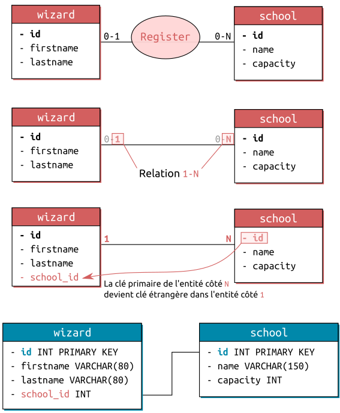

# Notes SQL

## Tables of contents

1. [Installation de MySQL](#installation-de-mysql)
2. [Création d'une base de données](#création-dune-base-de-donnée)
3. [Récupérer les informations d'une BDD](#récupérer-les-informations)
4. [Manipuler/Modifier les données](#manipulermodifier-les-données)
4. [Bilan](#bilan)


##### [Return to Top](#notes-sql)
# **Installation de MySQL**

D'abord on installe :
``` sh
$sudo apt update 
$sudo apt install mysql-server
```

Ensuite on configure :

``` sh
$sudo mysql_secure_installation
```

``` sh
mysql > CREATE USER 'USERNAME_OF_YOUR_CHOICE'@'localhost' IDENTIFIED WITH caching_sha2_password BY 'PASSWORD_OF_YOUR_CHOICE_TO_NEVER_FORGET';
mysql > GRANT ALL PRIVILEGES ON * . * TO 'USERNAME_OF_YOUR_CHOICE'@'localhost';
mysql > FLUSH PRIVILEGES;
```

Pour se connecter à notre base de donnée :

``` sh
$mysql -u USERNAME_YOU_CHOOSE_JUST_BEFORE -p
```

Pour se connecter à une base de donnée précise :

``` sh
$mysql -u USERNAME_YOU_CHOOSE_JUST_BEFORE -D wizard -p
```
##### [Return to Top](#notes-sql)
# **Création d'une base de donnée**

* Importer une BDD existante

``` sh
mysql> source ~/path/to/file.sql
```

* Créer une base de données :
``` sql
CREATE DATABASE wild;
```
On peut également préciser l'encodage des caractères :

``` sql
CREATE DATABASE maBase DEFAULT CHARACTER SET utf8mb4;
```


Il existe en plus du set de caractère ce qu'on appelle l'interclassement ou collation. Elle précise au set de caractères les spécificités d'une langue. Par exemple que le "E" est semblable au "e" ou au "é".

Pour consulter les charset disponibles
``` sql
SHOW CHARACTET SET;
```
Pour consulter les collations disponibles
``` sql
SHOW COLLATION
```
Voici un exemple de définition pour l’UTF-8 avec une collation unicode multilingue insensible à la casse :
``` sql
CREATE DATABASE maBase DEFAULT CHARACTER SET utf8mb4 COLLATE utf8mb4_unicode_ci;
```

La commande générique est donc la suivante :
``` sql
CREATE DATABASE db_name [DEFAULT CHARACTER SET character_set_name [COLLATE collation_name]];
```

* Se placer dans une BDD :
``` sql
USE wild;
```

* Créer une table dans une BDD :

La syntaxe générale est la suivante :

``` sql
CREATE TABLE nom_table (
    colonne_1 type de champs [NULL | NOT NULL] [AUTO_INCREMENT] [DEFAULT 'valeur'],
    [colonne_2 type de champs [NULL | NOT NULL] [AUTO_INCREMENT] [DEFAULT 'valeur']]
    …
    [PRIMARY KEY (nom_colonne)]
    [DEFAULT CHARACTER SET character_set_name [COLLATE collation_name]]
)
[ENGINE = MYISAM | INNODB];
```

Exemple :

``` sql
CREATE TABLE `wizard` (
  `id` INT NOT NULL AUTO_INCREMENT,
  `firstname` VARCHAR(100) NOT NULL,
  `lastname` VARCHAR(100) NOT NULL,
  `birthday` DATE NOT NULL,
  `birth_place` VARCHAR(255) NULL,
  `biography` TEXT NULL
  PRIMARY KEY (`id`)
);
```

* Importer une BDD existante

``` sh
mysql> source ~/path/to/file.sql
```

* Voir les BDD de l'utilisateurs :
``` sql
SHOW DATABASES;
```
* Voir les tables d'une BDD :
``` sql
SHOW TABLES;
```
* Voir la description d'une table :

On voit les différents champs de la table.
``` sql
DESCRIBE wizard;
```
##### [Return to Top](#notes-sql)
# **Récupérer les informations**

* La commande SELECT

La syntaxe de base est la suivante :
``` sql
SELECT <champs> FROM <table>;
```
``` sql
SELECT colonne1, [colonne2, …]
FROM nom_table
[WHERE arguments [ORDER BY DESC|ASC]] [LIMIT un_nombre [OFFSET un_nombre]]
```
Pour récupérer toutes les données d'une table :
``` sql
SELECT * FROM wizard;
```
Pour ne récupérer que des champs en particulier :
``` sql
SELECT firstname, lastname FROM wizard;
```
Utiliser des alias plutôt que le nom des champs :
``` sql
SELECT lastname AS student_name FROM wizard;
```

* La clause WHERE

``` sql
SELECT firstname, birthday FROM wizard WHERE lastname='Weasley';
```
On peut également 

| utiliser les signe `!=, >, <, >!, <=`.

| choisir une valeur parmi plusieurs possible avec `IN`, une valeur numérique (ou une date) dans une fourchette avec `BETWEEN xx AND yy`.

| viser une chaîne commençant ou finissant par avec `LIKE et %`

| une valeur `IS NULL` ou `IS NOT NULL`

On peut également combiner les conditions avec `AND` et `OR`

``` sql
SELECT firstname, birthday 
FROM wizard 
WHERE 
lastname LIKE 'Weas%' AND
birthday BETWEEN '1970-01-01' AND '2000-01-01';
```
Autre exemple :
``` sql
SELECT *
FROM films
WHERE format = 'mp4' OR format = 'webm';
```

* ORDER / LIMIT

Pour limiter le nombre de résultats :
``` sql
SELECT <champs> FROM <table> LIMIT <nb_results>;
```
``` sql
SELECT * FROM wizard LIMIT 5;
```
Associée à la clause `OFFSET`, la clause `LIMIT` peut être très utilise pour une pagination. Par défaut, la LIMIT renvoie les résultats à partir du 1er trouvé (résultat 0). L'OFFSET permet d'indiquer que la LIMIT d'appliqera à oartir du Nième trouvé :

``` sql
SELECT * FROM wizard LIMIT 5 OFFSET 20;
```
Autre exemple :
``` sql
SELECT *
FROM films
WHERE format = 'mp4' OR format = 'webm'
ORDER BY titre;
```

* Le tri ascendant ou descendant

``` sql
SELECT firstname, lastname FROM wizard ORDER BY lastname ASC, birthday DESC;
```
On n'est pas obligé d'afficher les champs qui nous servent à trier. Ici la date de naissance.
``` sql
SELECT * FROM wizard WHERE lastname='Weasley' ORDER BY birthday DESC LIMIT 0,3;
```
Autre exemple :
``` sql
SELECT *
FROM films
WHERE format = 'mp4' OR format = 'webm'
ORDER BY id DESC;
```

* Eliminer les doublons : DISTINCT

Si on veut savoir tous les âges représentés par les membres de notre site :
``` sql
SELECT ages
FROM membres
ORDER BY ages;
```
Avec cette commande on affichera tous les membres, ce n'est pas très pratique pour une vue d'ensemble.
``` sql
SELECT DISTINCT ages
FROM membres
ORDER BY ages;
```
On aura donc la liste de tous les âges représentés par les membres de notre site, sans doublons, et par ordre croissant.

##### [Return to Top](#notes-sql)

# **Manipuler/Modifier les données**
* ## Modifier une table : ALTER

Pour modifier des éléments de la base de données :
``` sql
ALTER DATABASE nom_de_la_base CHARACTER SET character_set_name COLLATE collation_name;
```
* ## Ajouter un champ : ALTER TABLE + ADD

``` sql
ALTER TABLE Nom_de_la_table 
ADD Nom_de_la_colonne Type_de_donnees desc [AFTER colonne];
```

* ## Modifier un champ : ALTER TABLE + MODIFY

Ici on préciser le nom du champ à modifier.
``` sql
ALTER TABLE Nom_de_la_table
MODIFY Nom_de_la_colonne Type_de_donnees
```
Changer et renommer une colonne :
``` sql
ALTER TABLE nom_table
CHANGE nom_colonne nouveau_nom_colonne TYPE [NULL|NOT NULL] [AUTO_INCREMENT];
```
* ## Supprimer un champ : ALTER TABLE + DROP

Ici on préciser le nom du champ à modifier.
``` sql
ALTER TABLE Nom_de_la_table
DROP COLUMN Nom_de_la_colonnE
```
* ## Ajouter des données : INSERT

La syntaxe est la suivante :

``` sql
INSERT INTO table (col1, col2, ...) VALUES ('valeur1', 'valeur2', ...);
```
Pour ajouter une valeur dans la table school  :

``` sql
INSERT INTO school (name, country, capacity) VALUES ('Hogwarts School of Witchcraft and Wizardry', 'United Kingdom', 400);
```

On peut également en ajouter plusieurs en même temps :
``` sql
INSERT INTO school (name, country, capacity) 
VALUES ('Beauxbatons Academy of Magic', 'France', 550), 
('Castelobruxo', 'Brazil', 380), 
('Durmstrang Institute', 'Norway', 570);
```

* ## Modifer les données : UPDATE

La syntaxe est la suivante :
``` sql
UPDATE <table>
SET colonne1 = valeur1, colonne2 = valeur2, etc...
WHERE <conditions>;
```
Il faut faire attention à ne pas oublier la clause `WHERE` sinon toutes les données de la table seront modifiées.

Exemple : pour modifier la capacité d'une école qui a l'iD 1 :

``` sql
UPDATE school
SET capacity = 450
WHERE id = 1;
```

La plupart du temps on ne souhaite modifier qu'une valeur donc on utilise la clé primaire pour s'assumer de n'identifier que cette ligne.

* ## Supprimer les données : UPDATE

La syntaxe est la suivante :

``` sql
DELETE FROM <table>
WHERE <conditions>;
```
Comme pour `UPDATE`, il faut faire attention à ne pas oublier la clause `WHERE` pour ne pas supprimer toutes les données de la table.

Exemple :

``` sql
DELETE FROM school
WHERE id = 3;
```
Ou encore :

``` sql
DELETE FROM school
WHERE capacity > 500;
```


* ## Renommer une table : RENAME

``` sql
RENAME TABLE ancien_nom TO nouveau_nom;
```

* ## Supprimer un champ

``` sql
ALTER TABLE table1
DROP COLUMN colonne2,
DROP COLUMN colonne3;
```
Exemple :
``` sql
ALTER TABLE wizard
DROP COLUMN birthday,
DROP COLUMN biography;
```
* ## Vider une table : TRUNCATE

Pour vider une table de toutes ses données, on utilise la commande `TRUNCATE`. Cela ne supprimer pas la structure de la table. Cette commande est plus performante qu'un `DELETE`.  
De plus `TRUNCATE` réinitialise l'auto-incrémentation, ce qui n'est pas le cas de `DELETE`.

``` sql
TRUNCATE school;
```

* ## Supprimer une table

``` sql
DROP TABLE table1, table2 ;
```
* ## Supprimer la BDD

``` sql
DROP DATABASE test ;
```
##### [Return to Top](#notes-sql)
# **Bilan**
## Création base, table et insertion de valeur :
``` sql
CREATE DATABASE checkpoint1;
USE checkpoint1;
CREATE TABLE bribe (
    `id` INT PRIMARY KEY AUTO_INCREMENT NOT NULL, 
    `name` VARCHAR(100) NOT NULL, 
    `payment` INT NOT NULL
    );

INSERT INTO bribe (name, payment) 
VALUES ('Alexandre D', 250),
('Jessica P', 500),
('Maxence H', 1200),
('Megane P', 850),
('Axel C', 1500),
('Marine V', 1400);
```


##### [Return to Top](#notes-sql)
# **Les bases de la modélisation**

* ## Quelques définitions

**Les entités :** la modélisation consiste à regrouper de manière logique des données (un élève, une école, un livre), que l’on va appeler des entités. Chaque entité possède un certain nombre d’attributs qui lui sont propres (un nom et un prénom pour un élève ; un nom et une capacité pour une école ; un titre et un nombre de pages pour un livre, etc.). Il faut également un identifiant unique (correspondant à un ou plusieurs attributs) qui permettra de caractériser sans ambiguïté possible un représentant de cette entité.


**Les relations :** les entités vont interagir entre elles, les relations caractérisent donc le type de lien entre ces entités.
Par exemple, pour la bibliothèque de Poudlard, si tu as une entité Wizard et une entité Book, un sorcier va pouvoir interagir avec un livre en empruntant celui-ci.
De plus, une relation peut parfois posséder elle-même des attributs. En effet, pour l’emprunt, une date peut être associée (pour calculer une date de retour limite), ce qui n’empêchera pas le sorcier de ré-emprunter le livre une autre fois (à une autre date).


**Les cardinalités :** les relations entre entités peuvent être de plusieurs types. On parle de cardinalités pour décrire le nombre d'interactions possibles entre un élément d’une entité et une autre entité. Note que pour calculer les cardinalités, il ne faut considérer qu’un et un seul élément d’une entité. Par exemple, pour une entité Sorcier, tu considères un seul sorcier à la fois (Harry ou Ron ou Hermione ou même Draco si tu es fan de serpentard) et non l’ensemble des sorciers correspondant à l’entité.

Par exemple, un sorcier ne pourra être inscrit que dans une seule école à la fois (ou ne pas être inscrit du tout). La cardinalité de la relation Wizard -> School est donc 0-1.
Le sens de la relation est très important. Considère maintenant la relation dans l’autre direction. Une école (on part donc bien ici d’un seul élément de l’entité School) peut accueillir de 0 à N sorciers (ainsi cette école peut interagir avec plusieurs éléments de l’entité Wizard). La cardinalité de la relation School -> Wizard est donc 0-N (N représente un nombre potentiellement infini).


Schéla final de base de donées : e nom de l’entité devient un nom de table
les propriétés de l’entité deviennent les champs de la table. Il faut également penser à leur attribuer les bons types (int, varchar, boolean, etc.)
les identifiants deviennent des clés primaires


* ## Les types de relations

Comment relier les données d’une table avec celles d’une autre table ? Considère un sorcier (un tuple de la table wizard, identifié par sa clé primaire id) scolarisé dans une école (un tuple de la table school, identifié par sa clé primaire, également appelée id).

1. Comme tu l’as vu plus haut, un élève ne peut être inscrit que dans 0 à 1 école à la fois. La cardinalité de la relation wizard->school est donc 0-1.
2. La relation inverse school->wizard est quant à elle de type 0 à N, une école peut en effet accueillir de 0 à N élèves.
3. Maintenant que tu as les cardinalités de ta relation, dans les deux sens, tu ne vas plus considérer que les bornes maximales. Ce sont elles qui nous intéressent pour la suite. Tu te retrouves donc avec une relation 1-N (1 est la borne maximale pour la relation wizard->school et N la borne maximale pour la relation school->wizard).

Il existe trois types de relation :

**1. Many To One (1-N)**

C’est le cas juste au-dessus du sorcier inscrit dans une seule Ecole (une école peut inscrire plusieurs sorciers).

**2. One To One (1-1)**

Une relation unique entre deux entités. Par exemple, un Sorcier ne pourra posséder qu’une et une seule Baguette, et une Baguette n’a qu’un seul Sorcier (ce n’est pas tout à fait vrai dans le livre 7, mais JK Rowling n’a pas voulu réécrire l’histoire pour coller à la quête, aucun effort de sa part !).

**3. Many To Many (N-M)**

une entité peut interagir avec plusieurs éléments d’une autre entité, et vice versa. Par exemple, un Sorcier peut connaître plusieurs Sortilèges, et un sortilège peut être connu par plusieurs Sorciers en même temps.
Pour cette dernière relation, les cardinalités maximales sont bien N-N mais on écrit plutôt N-M.


* ## Les clés étrangères

Maintenant que tu as défini les types de relation, il va falloir trouver un moyen un peu plus concret qu’un trait sur un schéma, pour indiquer à une table qu’elle est reliée à une autre table.
Considère à nouveau l’exemple Many-To-One vu juste au-dessus. Le 1 de la relation 1-N est côté wizard tandis que le N est côté school. Ce sens est très important, car c’est maintenant dans la table wizard que tu vas venir ajouter un nouveau champ, qui aura pour but de relier les deux tables.
Tu l’appelleras par exemple school_id. Pour chaque tuple, le but de ce champ sera de prendre la valeur de la clé primaire de la table school, correspondant à l’école dans laquelle ce sorcier est inscrit.


Ainsi, si le sorcier avec l’id 1 (par exemple Harry Potter) est inscrit à Hogwarts (avec l’id 2 dans la table school, le champ school_id de la table wizard prendra la valeur 2. Les tables sont donc reliées par ces champs school_id de la table wizard et id de la table school. Et le tour est joué !

Enfin presque… car celui-dont-on-ne-doit-pas-requêter-le-nom ne rôde jamais loin de ta console MySQL. Imagine (via un INSERT ou un UPDATE) que la valeur 8 soit insérée dans le school_id d’un élève, alors que cette école n’existerait pas dans la table school.
De même, si le tuple 2 est effacé de la table school, Harry se retrouverait alors relié à un tuple qui n’existe plus. Tu te retrouves avec une incohérence dans l’intégrité de tes données, ce qui entraînera à coup sûr divers bugs dans ton application !

Pour pallier ce problème, il existe un type de contrainte appelée clé étrangère ou foreign key. Elle permet d’empêcher une insertion dans la table wizard si la valeur du school_id associée n’existe pas dans la table school (idem, elle empêche la suppression d’un tuple qui serait relié à des données dans une autre table). Ainsi, cela te protège de nombreuses erreurs. C’est donc indispensable pour conserver des données saines et cohérentes.

Pour définir une contrainte de clé étrangère, une fois le champ school_id créé, il faut taper la commande SQL suivante :

``` sql
ALTER TABLE wizard
ADD CONSTRAINT fk_wizard_school 
FOREIGN KEY (school_id) 
REFERENCES school(id);
```

``` sql
CREATE TABLE wizard (
    id INT PRIMARY KEY AUTO_INCREMENT,
    firstname VARCHAR(100) NOT NULL,
    lastname VARCHAR(100) NOT NULL,
    school_id INT NOT NULL,
    CONSTRAINT fk_wizard_school      
        FOREIGN KEY (school_id)             
        REFERENCES school(id)    
);
```

Dans les deux cas, les mots-clés à retenir sont :

    CONSTRAINT : tu indiques ici le nom que tu souhaites, qui te permet d’identifier ta contrainte.
    FOREIGN KEY() : indique que tu souhaites créer une contrainte de type “clé étrangère” sur le champ indiqué entre les parenthèses, ici school_id, de la table wizard.
    REFERENCES () : et ce dernier mot-clé indique que la clé étrangère fait référence ici au champ id de la table school.


Remarque : en règle générale, une clé étrangère fait référence à une clé primaire d’une autre table (puisque la clé primaire permet d’identifier formellement un tuple) mais tu pourrais très bien faire référence à un autre champ “unique” de la table si celle-ci en possède.
Les règles de création des clés étrangères dépendent du type de relation entre les entités.
One To One : reprend l’exemple donné plus haut d’un Sorcier (table wizard) qui possède une et une seule Baguette (table wand). Dans ce cas, il y a deux solutions possibles. Soit la table wizard prend une clé étrangère wand_id, soit la table wand prend une clé étrangère wizard_id. C’est donc à toi de choisir la solution qui te semble la plus pratique, en fonction des requêtes que tu seras amené à faire.
Many To One : c’est le type de relation la plus fréquente et la plus simple à gérer. Ici un sorcier est dans une seule école (côté 1 de la relation 1-N), mais une école peut recevoir plusieurs sorciers (côté N de la relation 1-N). Dans ce cas, tu ajoutes toujours dans la table ayant la plus faible cardinalité (0 ou 1), ici wizard, la clé étrangère référençant la table de plus haute cardinalité (le N), ici school. En effet, un sorcier est bien relié à une école. Par contre, cela n’aurait pas de sens de créer une clé wizard_id pour une école, puisqu’une école peut avoir plusieurs élèves, car tu ne peux pas mettre une liste d’id dans un champ.
Many To Many : le dernier (le plus compliqué) des cas est la relation N-M. Ici un élève peut emprunter plusieurs livres, et un livre peut être emprunté par plusieurs élèves. Dans ce cas, tu ne peux ni mettre une clé book_id dans wizard, ni mettre une clé wizard_id dans book ! Il va donc falloir créer une nouvelle table intermédiaire qui va contenir les deux clés étrangères ! Cette table pourra s’appeler par exemple borrowing (emprunt). Selon les cas, la clé primaire pourra être composite, c’est-à-dire que l’unicité sera définie par le couple de clés étrangères wizard_id ET book_id. Dans cet exemple, un même sorcier peut emprunter un même livre à différentes dates. Dans ce cas, il faudrait plutôt créer une clé primaire auto-incrémentée pour s’assurer de l’unicité de la clé. Si besoin, cette table intermédiaire peut également accueillir des champs supplémentaires (par exemple date de réservation) qui ne seraient à leur place ni dans la table wizard, ni dans la table book.
Remarque : ces différentes règles te permettent de passer d’un MCD à un MLD (Modèle Logique de Données). La partie MPD (Modèle Physique de données) est moins utile de nos jours. Elle est censée prendre en compte les spécificités du SGBDR utilisé, mais celles-ci étant beaucoup plus proches aujourd’hui qu’à l’époque où Merise à été créé, cette étape est aujourd’hui bien moins pertinente. Tes MLD/MPD peuvent être “fusionnés”. Il faut que ton MLD soit le reflet de ta base finale (telle qu’elle sera écrite en SQL), avec toutes les informations sur les tables, leurs champs et les types utilisés pour ces champs.

Cas 1 : Un Sorcier

La relation reste donc de type 1-1. Ici, on choisit de mettre une clé wizard_id dans la table pet, mais le contraire est tout à fait possible.


Cas 2 : Un Sorcier peut avoir de 0 à N Familiers et un Familier 0 à N Sorciers

Dans ce cas, la relation est de type N-M. Il faut donc créer une table intermédiaire, appelée ici wizard_pet. La clé primaire est composite, car l’unicité est vérifiée par le couple des deux clés étrangères wizard_id et pet_id.


##### [Return to Top](#notes-sql)
# **Les Jointures**

Une fois que tes tables sont reliées avec les **foreign key**, cela va permettre de récupérer les informations de plusieurs tables en une seule requête SQL. Pour cela, on va utiliser les jointures :


``` sql
SELECT <column1>, <column2>… 
FROM <table1>
INNER JOIN <table2> ON <condition>
```


Exemple :
``` sql
SELECT firstname, lastname, name
FROM wizard
INNER JOIN school ON school.id=wizard.school_id;
```
## Utilisation des Alias

``` sql
SELECT name AS school_name FROM school AS s;
```
Ou plus simplement :
``` sql
SELECT name school_name FROM school s;
```

``` sql
SELECT w.firstname, w.lastname, s.name as school_name
FROM wizard as w
JOIN school as s ON s.id=w.school_id;
```
## Jointures avancées

https://sql.sh/cours/jointures#google_vignette

Il existe plusieurs autres types de jointures. Tu vas t’intéresser ici aux jointures RIGHT et LEFT. Elles sont assez simples à comprendre. Reprends l’exemple : la table wizard possède deux tuples non reliés à une école. Cependant, comment faire si tu souhaites ressortir les informations sur tous les élèves, même ceux non inscrits dans une école ?

Dans ce cas, c’est la requête LEFT JOIN qui va t’être utile. Elle permet, comme son nom l’indique, de ressortir toutes les informations de la table de gauche (à gauche du JOIN), même si celles-ci ne sont reliées à aucune information de la table de droite (en plus des données renvoyées par un JOIN classique). Comme le montre l’exemple ci-dessous, pour ces lignes, la colonne school_name prend la valeur NULL.

Pour vous montrer l'utilité d'un LEFT JOIN, nous allons mettre à jour le champ school_id de toute la famille pour lui donner la valeur NULL.

``` sql
UPDATE wizard SET school_id=NULL WHERE lastname='weasley';
```

``` sql
SELECT w.firstname, w.lastname, s.name  
FROM wizard AS w 
LEFT JOIN school AS s ON s.id=w.school_id;
```
De la même manière, si tu veux récupérer toutes les écoles, même celles sans étudiants, tu peux utiliser RIGHT JOIN et cette fois, pour les écoles sans étudiant, les champs firstname et lastname seront NULL.


``` sql
SELECT w.firstname, w.lastname, s.name  
FROM wizard AS w
RIGHT JOIN school AS s ON s.id=w.school_id;
```

##### [Return to Top](#notes-sql)
# **SQL Avancé**
* ## Fonctions SQL

Fonction d'agrégation :

``` sql
SELECT count(*) as nb_school FROM school;
```
Il existe plusieurs autres fonctions permettant d’effectuer un calcul sur un ensemble de tuples. En voici quelques-unes parmi les plus utiles :

    SUM(champ) : effectue la somme des valeurs pour le champ entre les parenthèses.
    AVG(champ) : effectue la moyenne des valeurs pour le champ entre les parenthèses.
    MIN(champ) et MAX(champ) : retourne la valeur minimale/maximale du champ sélectionné.


Il existe également de nombreuses autres fonctions qui ont pour but de manipuler des chaînes (LOWER(), UPPER(), LENGTH() ...), effectuer des calculs mathématiques (ROUND(), ABS(), SIN() ...) ou manipuler des dates (DATEDIFF(), MONTH(), NOW() ...). Reporte-toi aux ressources pour voir une liste exhaustive de ces dernières. Voici un exemple avec une fonction de concaténation :

https://sql.sh/fonctions


* ## GROUP BY / HAVING

La jointure ici ne sert à rien pour “grouper”, puisque c’est le school_id de la table wizard qui est utilisé. Mais elle est cependant utile pour récupérer le name de l’école.

La syntaxe du GROUP BY est très simple. Elle attend une liste de champs sur lesquels grouper (tu peux indiquer plusieurs champs, elle fera alors les groupes dans l’ordre de ces champs).

Par exemple, voici comment récupérer le nombre d'étudiants par école :

``` sql
SELECT s.name, COUNT(*) as nb_student FROM wizard w INNER JOIN school s ON s.id=school_id GROUP BY s.id;
```

Il est possible d’aller encore plus loin dans les regroupements, en y ajoutant des critères de filtre sur ces groupes. Par exemple, si tu souhaites ne ressortir que les groupes ayant plus de trois élèves, tu peux écrire :

``` sql
SELECT s.name, COUNT(*) AS nb_student
  FROM wizard w
  INNER JOIN school s ON s.id=w.school_id
  GROUP BY school_id
  HAVING nb_student > 3;
```

Le HAVING a donc un fonctionnement très similaire à une clause WHERE, puisqu’il a également besoin d’une condition. Cependant, ces deux clauses sont différentes et ne sont pas interchangeables.

En effet, lorsque tu fais un SELECT, tu ressors un certain nombre de tuples. Un WHERE va imposer un filtre qui va potentiellement diminuer ce nombre de résultats. Si tu ajoutes ensuite un GROUP BY, le regroupement ne se fera QUE sur les tuples préalablement filtrés par le WHERE. Une fois le regroupement fait, si tu ajoutes un HAVING, ce dernier s’appliquera sur les résultats du regroupement. C’est pour cela qu’un WHERE s’écrit toujours avant un bloc GROUP BY/HAVING.


##### [Return to Top](#notes-sql)
# **Main Title**
* ## Subtitle

``` sql


```


[u]Texte[/u]
<color=red>Texte</color> / [color=#FF3300]Texte[/color]

<font color=red>Texte</font>

[size=3]Texte[/size]

*TODO*

Commande   ==ALTER== 


### qfsdf
#### qfsfsfsfd
##### qfsfsfsfd
###### qfsfsfsfd
fsfsfs