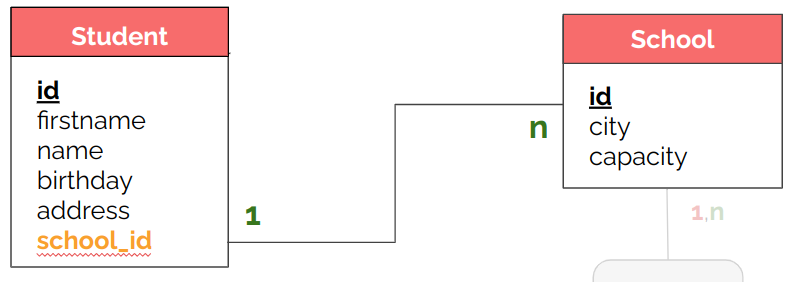
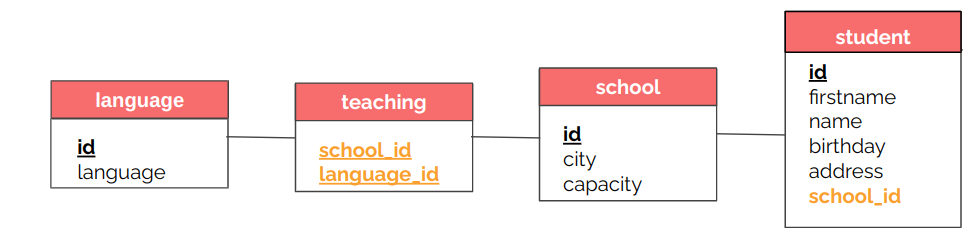

# Notes SQL

## Tables of contents

1. [Installation de MySQL](#installation-de-mysql)
2. [Création d'une base de données](#création-dune-base-de-donnée)
3. [Récupérer les informations d'une BDD](#récupérer-les-informations)
4. [Manipuler/Modifier les données](#manipulermodifier-les-données)
5. [Bilan](#bilan)
6. [Les bases de la modélisation](#les-bases-de-la-modélisation)
7. [les jointures](#les-jointures)
8. [SQL avancé](#sql-avancé)


##### [Return to Top](#notes-sql)
# **Installation de MySQL**

D'abord on installe :
``` sh
$sudo apt update 
$sudo apt install mysql-server
```

Ensuite on configure :

``` sh
$sudo mysql_secure_installation
```

``` sh
mysql > CREATE USER 'USERNAME_OF_YOUR_CHOICE'@'localhost' IDENTIFIED WITH caching_sha2_password BY 'PASSWORD_OF_YOUR_CHOICE_TO_NEVER_FORGET';
mysql > GRANT ALL PRIVILEGES ON * . * TO 'USERNAME_OF_YOUR_CHOICE'@'localhost';
mysql > FLUSH PRIVILEGES;
```

Pour se connecter à notre base de donnée :

``` sh
$mysql -u USERNAME_YOU_CHOOSE_JUST_BEFORE -p
```

Pour se connecter à une base de donnée précise :

``` sh
$mysql -u USERNAME_YOU_CHOOSE_JUST_BEFORE -D wizard -p
```
##### [Return to Top](#notes-sql)
# **Création d'une base de donnée**

* Importer une BDD existante

``` sh
mysql> source ~/path/to/file.sql
```

* Créer une base de données :
``` sql
CREATE DATABASE wild;
```
On peut également préciser l'encodage des caractères :

``` sql
CREATE DATABASE maBase DEFAULT CHARACTER SET utf8mb4;
```


Il existe en plus du set de caractère ce qu'on appelle l'interclassement ou collation. Elle précise au set de caractères les spécificités d'une langue. Par exemple que le "E" est semblable au "e" ou au "é".

Pour consulter les charset disponibles
``` sql
SHOW CHARACTET SET;
```
Pour consulter les collations disponibles
``` sql
SHOW COLLATION
```
Voici un exemple de définition pour l’UTF-8 avec une collation unicode multilingue insensible à la casse :
``` sql
CREATE DATABASE maBase DEFAULT CHARACTER SET utf8mb4 COLLATE utf8mb4_unicode_ci;
```

La commande générique est donc la suivante :
``` sql
CREATE DATABASE db_name [DEFAULT CHARACTER SET character_set_name [COLLATE collation_name]];
```

* Se placer dans une BDD :
``` sql
USE wild;
```

* Créer une table dans une BDD :

La syntaxe générale est la suivante :

``` sql
CREATE TABLE nom_table (
    colonne_1 type de champs [NULL | NOT NULL] [AUTO_INCREMENT] [DEFAULT 'valeur'],
    [colonne_2 type de champs [NULL | NOT NULL] [AUTO_INCREMENT] [DEFAULT 'valeur']]
    …
    [PRIMARY KEY (nom_colonne)]
    [DEFAULT CHARACTER SET character_set_name [COLLATE collation_name]]
)
[ENGINE = MYISAM | INNODB];
```

Exemple :

``` sql
CREATE TABLE `wizard` (
  `id` INT NOT NULL AUTO_INCREMENT,
  `firstname` VARCHAR(100) NOT NULL,
  `lastname` VARCHAR(100) NOT NULL,
  `birthday` DATE NOT NULL,
  `birth_place` VARCHAR(255) NULL,
  `biography` TEXT NULL
  PRIMARY KEY (`id`)
);
```

* Importer une BDD existante

``` sh
mysql> source ~/path/to/file.sql
```

* Voir les BDD de l'utilisateurs :
``` sql
SHOW DATABASES;
```
* Voir les tables d'une BDD :
``` sql
SHOW TABLES;
```
* Voir la description d'une table :

On voit les différents champs de la table.
``` sql
DESCRIBE wizard;
```
##### [Return to Top](#notes-sql)
# **Récupérer les informations**

* La commande SELECT

La syntaxe de base est la suivante :
``` sql
SELECT <champs> FROM <table>;
```
``` sql
SELECT colonne1, [colonne2, …]
FROM nom_table
[WHERE arguments [ORDER BY DESC|ASC]] [LIMIT un_nombre [OFFSET un_nombre]]
```
Pour récupérer toutes les données d'une table :
``` sql
SELECT * FROM wizard;
```
Pour ne récupérer que des champs en particulier :
``` sql
SELECT firstname, lastname FROM wizard;
```
Utiliser des alias plutôt que le nom des champs :
``` sql
SELECT lastname AS student_name FROM wizard;
```

* La clause WHERE

``` sql
SELECT firstname, birthday FROM wizard WHERE lastname='Weasley';
```
On peut également 

| utiliser les signe `!=, >, <, >!, <=`.

| choisir une valeur parmi plusieurs possible avec `IN`, une valeur numérique (ou une date) dans une fourchette avec `BETWEEN xx AND yy`.

| viser une chaîne commençant ou finissant par avec `LIKE et %`

| une valeur `IS NULL` ou `IS NOT NULL`

On peut également combiner les conditions avec `AND` et `OR`

``` sql
SELECT firstname, birthday 
FROM wizard 
WHERE 
lastname LIKE 'Weas%' AND
birthday BETWEEN '1970-01-01' AND '2000-01-01';
```
Autre exemple :
``` sql
SELECT *
FROM films
WHERE format = 'mp4' OR format = 'webm';
```

* ORDER / LIMIT

Pour limiter le nombre de résultats :
``` sql
SELECT <champs> FROM <table> LIMIT <nb_results>;
```
``` sql
SELECT * FROM wizard LIMIT 5;
```
Associée à la clause `OFFSET`, la clause `LIMIT` peut être très utilise pour une pagination. Par défaut, la LIMIT renvoie les résultats à partir du 1er trouvé (résultat 0). L'OFFSET permet d'indiquer que la LIMIT d'appliqera à oartir du Nième trouvé :

``` sql
SELECT * FROM wizard LIMIT 5 OFFSET 20;
```
Autre exemple :
``` sql
SELECT *
FROM films
WHERE format = 'mp4' OR format = 'webm'
ORDER BY titre;
```

* Le tri ascendant ou descendant

``` sql
SELECT firstname, lastname FROM wizard ORDER BY lastname ASC, birthday DESC;
```
On n'est pas obligé d'afficher les champs qui nous servent à trier. Ici la date de naissance.
``` sql
SELECT * FROM wizard WHERE lastname='Weasley' ORDER BY birthday DESC LIMIT 0,3;
```
Autre exemple :
``` sql
SELECT *
FROM films
WHERE format = 'mp4' OR format = 'webm'
ORDER BY id DESC;
```

* Eliminer les doublons : DISTINCT

Si on veut savoir tous les âges représentés par les membres de notre site :
``` sql
SELECT ages
FROM membres
ORDER BY ages;
```
Avec cette commande on affichera tous les membres, ce n'est pas très pratique pour une vue d'ensemble.
``` sql
SELECT DISTINCT ages
FROM membres
ORDER BY ages;
```
On aura donc la liste de tous les âges représentés par les membres de notre site, sans doublons, et par ordre croissant.

##### [Return to Top](#notes-sql)

# **Manipuler/Modifier les données**
* ## Modifier une table : ALTER

Pour modifier des éléments de la base de données :
``` sql
ALTER DATABASE nom_de_la_base CHARACTER SET character_set_name COLLATE collation_name;
```
* ## Ajouter un champ : ALTER TABLE + ADD

``` sql
ALTER TABLE Nom_de_la_table 
ADD Nom_de_la_colonne Type_de_donnees desc [AFTER colonne];
```

* ## Modifier un champ : ALTER TABLE + MODIFY

Ici on préciser le nom du champ à modifier.
``` sql
ALTER TABLE Nom_de_la_table
MODIFY Nom_de_la_colonne Type_de_donnees
```
Changer et renommer une colonne :
``` sql
ALTER TABLE nom_table
CHANGE nom_colonne nouveau_nom_colonne TYPE [NULL|NOT NULL] [AUTO_INCREMENT];
```
* ## Supprimer un champ : ALTER TABLE + DROP

Ici on préciser le nom du champ à modifier.
``` sql
ALTER TABLE Nom_de_la_table
DROP COLUMN Nom_de_la_colonnE
```
* ## Ajouter des données : INSERT

La syntaxe est la suivante :

``` sql
INSERT INTO table (col1, col2, ...) VALUES ('valeur1', 'valeur2', ...);
```
Pour ajouter une valeur dans la table school  :

``` sql
INSERT INTO school (name, country, capacity) VALUES ('Hogwarts School of Witchcraft and Wizardry', 'United Kingdom', 400);
```

On peut également en ajouter plusieurs en même temps :
``` sql
INSERT INTO school (name, country, capacity) 
VALUES ('Beauxbatons Academy of Magic', 'France', 550), 
('Castelobruxo', 'Brazil', 380), 
('Durmstrang Institute', 'Norway', 570);
```

* ## Modifer les données : UPDATE

La syntaxe est la suivante :
``` sql
UPDATE <table>
SET colonne1 = valeur1, colonne2 = valeur2, etc...
WHERE <conditions>;
```
Il faut faire attention à ne pas oublier la clause `WHERE` sinon toutes les données de la table seront modifiées.

Exemple : pour modifier la capacité d'une école qui a l'iD 1 :

``` sql
UPDATE school
SET capacity = 450
WHERE id = 1;
```

La plupart du temps on ne souhaite modifier qu'une valeur donc on utilise la clé primaire pour s'assumer de n'identifier que cette ligne.

* ## Supprimer les données : UPDATE

La syntaxe est la suivante :

``` sql
DELETE FROM <table>
WHERE <conditions>;
```
Comme pour `UPDATE`, il faut faire attention à ne pas oublier la clause `WHERE` pour ne pas supprimer toutes les données de la table.

Exemple :

``` sql
DELETE FROM school
WHERE id = 3;
```
Ou encore :

``` sql
DELETE FROM school
WHERE capacity > 500;
```


* ## Renommer une table : RENAME

``` sql
RENAME TABLE ancien_nom TO nouveau_nom;
```

* ## Supprimer un champ

``` sql
ALTER TABLE table1
DROP COLUMN colonne2,
DROP COLUMN colonne3;
```
Exemple :
``` sql
ALTER TABLE wizard
DROP COLUMN birthday,
DROP COLUMN biography;
```
* ## Vider une table : TRUNCATE

Pour vider une table de toutes ses données, on utilise la commande `TRUNCATE`. Cela ne supprimer pas la structure de la table. Cette commande est plus performante qu'un `DELETE`.  
De plus `TRUNCATE` réinitialise l'auto-incrémentation, ce qui n'est pas le cas de `DELETE`.

``` sql
TRUNCATE school;
```

* ## Supprimer une table

``` sql
DROP TABLE table1, table2 ;
```
* ## Supprimer la BDD

``` sql
DROP DATABASE test ;
```
##### [Return to Top](#notes-sql)
# **Bilan**
## Création base, table et insertion de valeur :
``` sql
CREATE DATABASE checkpoint1;
USE checkpoint1;
CREATE TABLE bribe (
    `id` INT PRIMARY KEY AUTO_INCREMENT NOT NULL, 
    `name` VARCHAR(100) NOT NULL, 
    `payment` INT NOT NULL
    );

INSERT INTO bribe (name, payment) 
VALUES ('Alexandre D', 250),
('Jessica P', 500),
('Maxence H', 1200),
('Megane P', 850),
('Axel C', 1500),
('Marine V', 1400);
```


##### [Return to Top](#notes-sql)
# **Les bases de la modélisation**


* ## MODELISATION CONCEPTUELLEE DE DONNEES (MCD)


**Les entités :** Une entité est un regroupement d’éléments ayant les mêmes caractéristiques. Une entité possède des propriétés permettant de caractériser celle-ci :un nom et un prénom pour un élève ; un nom et une capacité pour une école ; un titre et un nombre de pages pour un livre, etc.).   
Il faut également un identifiant unique qui permettra de caractériser sans ambiguïté possible un représentant de cette entité.


**Les relations :** ce sont les liens entre deux entités ou plus. Une relation peut parfois posséder elle-même des attributs. En effet, pour l’emprunt, une date peut être associée (pour calculer une date de retour limite).  
Par exemple, pour la bibliothèque de Poudlard, si tu as une entité Wizard et une entité Book, un sorcier va pouvoir interagir avec un livre en empruntant celui-ci.


**Les cardinalités :** On parle de cardinalités pour décrire le nombre d'interactions possibles entre un élément d’une entité et une autre entité.  
Par exemple, un sorcier ne pourra être inscrit que dans une seule école à la fois (ou ne pas être inscrit du tout) et une école peut accueillir de 0 à N sorciers.   
Pour une association de 2 entités, il y a donc 4 cardinalités à indiquer :
- La cardinalité de la relation Wizard -> School est donc 0-1.
- La cardinalité de la relation School -> Wizard est donc 0-N (N représente un nombre potentiellement infini).

Le sens de la cardinalité est donc important.


* ## Passage de la MCD à la MLD (Modèle Logique de Données)

On ne garde que les entités On prend les bornes maximales des cardinalités des deux côtés pour déterminer le type de relation, 3 possibles :

**1. Many To One (1-N)**

C’est le cas juste d'un élève inscrit dans 0 ou 1 seule Ecole  alors qu'une école peut inscrire de 0 à N élèves.

Ajout d’une clé étrangère côté “1”. Ce champ prend la valeur d’un champ unique (généralement l’id) de la table côté “n”



**2. One To One (1-1)**

Une relation unique entre deux entités. Par exemple, un Sorcier ne pourra posséder qu’une et une seule Baguette, et une Baguette n’a qu’un seul Sorcier.

**3. Many To Many (N-M)**

Une entité peut interagir avec plusieurs éléments d’une autre entité, et vice versa. Par exemple, un Sorcier peut connaître plusieurs Sortilèges, et un sortilège peut être connu par plusieurs Sorciers en même temps.
Pour cette dernière relation, les cardinalités maximales sont bien N-N mais on écrit plutôt N-M.

Exemple : Plusieurs écoles ET plusieurs langages. On prend les plus grandes cardinalités des deux côtés. L’une des deux “n” devient “m” pour plus de lisibilité.  
Création d’une table de jointure contenant les deux clés étrangères (ce couple de clés peut suffire comme clé primaire de la table de jointure).  


Bilan :


* ## Modèle Physique de Données (MPD)

Le niveau physique tient compte des particularités de chaque SGBDR :
- Types des données (INT, VARCHAR, CHAR, BOOL…) 
- Contraintes (unique, nullable, auto-incrémentation…)
- ....

Schéma final de base de donées : le nom de l’entité devient un nom de table, les propriétés de l’entité deviennent les champs de la table. Il faut également penser à leur attribuer les bons types (int, varchar, boolean, etc.). Les identifiants deviennent des clés primaires  


* ## Les clés étrangères

Les clés étrangères servent à indiquer à une table qu’elle est reliée à une autre table.  
En règle générale, une clé étrangère fait référence à une clé primaire d’une autre table (puisque la clé primaire permet d’identifier formellement un tuple) mais tu pourrais très bien faire référence à un autre champ “unique” de la table si celle-ci en possède.


Les règles de création des clés étrangères dépendent du type de relation entre les entités.

**1. Many To One (1-N)**

C’est le type de relation la plus fréquente et la plus simple à gérer. Un sorcier est dans une seule école (côté 1 de la relation 1-N), mais une école peut recevoir plusieurs sorciers (côté N de la relation 1-N). Dans ce cas, tu ajoutes toujours dans la table ayant la plus faible cardinalité (0 ou 1), ici wizard, la clé étrangère référençant la table de plus haute cardinalité (le N), ici school, qu'on appellera par exemple `school_id`.   


Ainsi, si chaque sorcier aura un champ `school_id` qui aura pour valeur l'id de l'école dans laquelle il est inscrit. Les tables sont donc reliées par les champs `school_id` de la table wizard et `id`de la table school.

Cependant on peut toujours à ce stade affecter un `school_id` à un sorcier d'une école qui n'existerait pas. On peut également supprimer une école et dans ce cas un sorcier se retrouverait avec une école qui n'existerait plus. On se retrouverait alors avec une incohérence dans l’intégrité de tes données, ce qui entraînera à coup sûr divers bugs dans ton application !

Pour pallier ce problème, il existe un type de contrainte appelée clé étrangère ou foreign key. Elle permet d’empêcher une insertion dans la table `wizard` si la valeur du `school_id` associée n’existe pas dans la table school (idem, elle empêche la suppression d’un tuple qui serait relié à des données dans une autre table). Ainsi, cela te protège de nombreuses erreurs. C’est donc indispensable pour conserver des données saines et cohérentes.

Pour définir une contrainte de clé étrangère, une fois le champ `school_id` créé, il faut taper la commande SQL suivante :

``` sql
ALTER TABLE wizard
ADD CONSTRAINT fk_wizard_school 
FOREIGN KEY (school_id) 
REFERENCES school(id);
```

``` sql
CREATE TABLE wizard (
    id INT PRIMARY KEY AUTO_INCREMENT,
    firstname VARCHAR(100) NOT NULL,
    lastname VARCHAR(100) NOT NULL,
    school_id INT NOT NULL,
    CONSTRAINT fk_wizard_school      
        FOREIGN KEY (school_id)             
        REFERENCES school(id)    
);
```

Dans les deux cas, les mots-clés à retenir sont :

    CONSTRAINT : tu indiques ici le nom que tu souhaites, qui te permet d’identifier ta contrainte.
    FOREIGN KEY() : indique que tu souhaites créer une contrainte de type “clé étrangère” sur le champ indiqué entre les parenthèses, ici school_id, de la table wizard.
    REFERENCES () : et ce dernier mot-clé indique que la clé étrangère fait référence ici au champ id de la table school.


**2. One To One (1-1)**

One To One : reprend l’exemple donné plus haut d’un Sorcier (table `wizard`) qui possède une et une seule Baguette (table `wand`). Dans ce cas, il y a deux solutions possibles. Soit la table `wizard` prend une clé étrangère `wand_id`, soit la table `wand` prend une clé étrangère `wizard_id`. C’est donc à nous de choisir la solution qui te semble la plus pratique, en fonction des requêtes que tu seras amené à faire.

La relation reste donc de type 1-1. Ici, on choisit de mettre une clé wizard_id dans la table pet, mais le contraire est tout à fait possible.


**3. Many To Many (N-M)**

Ce derniercas, et le plus compliqué est la relation N-M. Ici un élève peut emprunter plusieurs livres, et un livre peut être emprunté par plusieurs élèves. 
Dans ce cas, on ne peut ni mettre une clé `book_id` dans `wizard`, ni mettre une clé `wizard_id` dans `book`.
Il va donc falloir créer une nouvelle table intermédiaire qui va contenir les deux clés étrangères. Cette table pourra s’appeler par exemple `borrowing` (emprunt). Selon les cas, la clé primaire pourra être composite, c’est-à-dire que l’unicité sera définie par le couple de clés étrangères `wizard_id` ET `book_id`. Dans cet exemple, un même sorcier peut emprunter un même livre à différentes dates. Dans ce cas, il faudrait plutôt créer une clé primaire auto-incrémentée pour s’assurer de l’unicité de la clé. Si besoin, cette table intermédiaire peut également accueillir des champs supplémentaires (par exemple date de réservation) qui ne seraient à leur place ni dans la table wizard, ni dans la table book.

Dans ce cas, la relation est de type N-M. Il faut donc créer une table intermédiaire, appelée ici wizard_pet. La clé primaire est composite, car l’unicité est vérifiée par le couple des deux clés étrangères wizard_id et pet_id.


Remarque : ces différentes règles te permettent de passer d’un MCD à un MLD (Modèle Logique de Données). La partie MPD (Modèle Physique de données) est moins utile de nos jours. Elle est censée prendre en compte les spécificités du SGBDR utilisé, mais celles-ci étant beaucoup plus proches aujourd’hui qu’à l’époque où Merise à été créé, cette étape est aujourd’hui bien moins pertinente. Tes MLD/MPD peuvent être “fusionnés”. Il faut que ton MLD soit le reflet de ta base finale (telle qu’elle sera écrite en SQL), avec toutes les informations sur les tables, leurs champs et les types utilisés pour ces champs.

* ## Les contraintes d'intégrité

Règles à suivre quand des enregistrements de tables reliées sont mis à jour ou supprimés. Exemple : 

J’efface une école de la table school, reliée à des élèves de la table student
- Si aucune contrainte n’est définie, l’école est effacée et les élèves reliés à cette école se retrouvent alors “orphelins”
- Si une contrainte est définie sans option, la suppression est refusée car des élèves sont associés à cette école (par contre, on pourra effacer un élève qui lui n’est relié qu’à une et une seule école !)
- Si une option CASCADE est définie, les élèves associés à école seront automatiquement supprimés

``` sql
CREATE TABLE student
  	…
  PRIMARY_KEY(id)
  FOREIGN KEY (school_id)
	REFERENCES school(id)
  	ON DELETE CASCADE
  	ON UPDATE NO ACTION;

```
Options après `ON DELETE`  et `ON UPDATE` :
- `CASCADE` : si je tente de supprimer la clé primaire, alors supprime tous les enregistrements avec l'id associé
- `SET NULL` : si je tente de supprimer la clé primaire, alors met NULL dans les enregistrements avec l'id associé
- `NO ACTION` : si je tente de supprimer la clé primaire, laisse les enregistrements dépendants avec l'id associé (perte d'intégrité)
- `RESTRICT` : si je tente de supprimer la clé primaire, empêche la suppression si id référencée ailleurs


##### [Return to Top](#notes-sql)
# **Les Jointures**

Une fois que tes tables sont reliées avec les **foreign key**, cela va permettre de récupérer les informations de plusieurs tables en une seule requête SQL. Pour cela, on va utiliser les jointures :


``` sql
SELECT <column1>, <column2>… 
FROM <table1>
INNER JOIN <table2> ON <condition>
```


Exemple :
``` sql
SELECT firstname, lastname, name
FROM wizard
INNER JOIN school ON school.id=wizard.school_id;
```
## Utilisation des Alias

``` sql
SELECT name AS school_name FROM school AS s;
```
Ou plus simplement :
``` sql
SELECT name school_name FROM school s;
```

``` sql
SELECT w.firstname, w.lastname, s.name as school_name
FROM wizard as w
JOIN school as s ON s.id=w.school_id;
```

Autre Exemple :
Récupération de tous les élèves de l’école de Bordeaux. Les lignes renvoyées sont celles vérifiant la condition. Elles contiennent les champs des deux tables

``` sql
SELECT st.firstname, st.lastname, sc.city
       FROM student AS st
       JOIN school AS sc ON sc.id=st.school_id
       WHERE sc.city = 'Bordeaux';
```
Retourne :
``` sql
firstname |  lastname  |  city
----------+------------+----------
Arthur    | Pendragon  | Bordeaux 
Lancelot  | Du Lac     | Bordeaux
```

* ## Jointures Avancées

**Jointures Imbriquées**

Récupération de tous les élèves dans une école proposant le langage PHP
``` sql
SELECT firstname, name
       FROM student AS st
       JOIN school AS sc ON sc.id=st.school_id
         JOIN teaching AS t ON t.school_id = sc.id
           JOIN language AS la ON t.language_id=la.id
       WHERE la.language='PHP';
```


https://sql.sh/cours/jointures#google_vignette


**LEFT JOIN & RIGTH JOIN**

Par exemple la table wizard possède deux tuples non reliés à une école. Cependant, comment faire si tu souhaites ressortir les informations sur tous les élèves, même ceux non inscrits dans une école ?

Dans ce cas, c’est la requête `LEFT JOIN` qui va t’être utile. Elle permet, comme son nom l’indique, de ressortir toutes les informations de la table de gauche (à gauche du JOIN), même si celles-ci ne sont reliées à aucune information de la table de droite (en plus des données renvoyées par un JOIN classique). 

On supprime l'école de certains élèves :
``` sql
UPDATE wizard SET school_id=NULL WHERE lastname='weasley';
```
On fait la requête
``` sql
SELECT w.firstname, w.lastname, s.name  
FROM wizard AS w 
LEFT JOIN school AS s ON s.id=w.school_id;
```
On obtient :
``` sh
+-----------+-------------+--------------------------------------------+
| firstname | lastname    | name                                       |
+-----------+-------------+--------------------------------------------+
| harry     | potter      | Hogwarts School of Witchcraft and Wizardry |
| hermione  | granger     | Hogwarts School of Witchcraft and Wizardry |
| lily      | potter      | Hogwarts School of Witchcraft and Wizardry |
| ron       | weasley     | NULL                                       |
| ginny     | weasley     | NULL                                       |
| fred      | weasley     | NULL                                       |
| george    | weasley     | NULL                                       |
| arthur    | weasley     | NULL                                       |
| molly     | weasley     | NULL                                       |
| drago     | malefoy     | Hogwarts School of Witchcraft and Wizardry |
| albus     | dumbledore  | Hogwarts School of Witchcraft and Wizardry |
| severus   | rogue       | Hogwarts School of Witchcraft and Wizardry |
| tom       | jédusor     | Hogwarts School of Witchcraft and Wizardry |
| dudley    | dursley     | Hogwarts School of Witchcraft and Wizardry |
| fleur     | delacour    | Beauxbatons Academy of Magic               |
| gabrielle | delacour    | Beauxbatons Academy of Magic               |
| viktor    | krum        | Durmstrang Institute                       |
| gellert   | grindelwald | Durmstrang Institute                       |
| babajide  | akingbade   | Uagadou School of Magic                    |
+-----------+-------------+--------------------------------------------+
```
On fait un INNER JOIN classique, on n'aurait pas obtenu les élèves qui ne seraient inscrits dans aucune école.


De la même manière, si tu veux récupérer toutes les écoles, même celles sans étudiants, tu peux utiliser `RIGHT JOIN` et cette fois, pour les écoles sans étudiant, les champs firstname et lastname seront NULL.

``` sql
SELECT w.firstname, w.lastname, s.name  
FROM wizard AS w
RIGHT JOIN school AS s ON s.id=w.school_id;
```
On obtiendrait :
``` sql
+-----------+-------------+----------------------------------------------+
| firstname | lastname    | name                                         |
+-----------+-------------+----------------------------------------------+
| fleur     | delacour    | Beauxbatons Academy of Magic                 |
| gabrielle | delacour    | Beauxbatons Academy of Magic                 |
| NULL      | NULL        | Castelobruxo                                 |
| viktor    | krum        | Durmstrang Institute                         |
| gellert   | grindelwald | Durmstrang Institute                         |
| harry     | potter      | Hogwarts School of Witchcraft and Wizardry   |
| hermione  | granger     | Hogwarts School of Witchcraft and Wizardry   |
| lily      | potter      | Hogwarts School of Witchcraft and Wizardry   |
| drago     | malefoy     | Hogwarts School of Witchcraft and Wizardry   |
| albus     | dumbledore  | Hogwarts School of Witchcraft and Wizardry   |
| severus   | rogue       | Hogwarts School of Witchcraft and Wizardry   |
| tom       | jédusor     | Hogwarts School of Witchcraft and Wizardry   |
| dudley    | dursley     | Hogwarts School of Witchcraft and Wizardry   |
| NULL      | NULL        | Ilvermorny School of Witchcraft and Wizardry |
| NULL      | NULL        | Koldovstoretz                                |
| NULL      | NULL        | Mahoutokoro School of Magic                  |
| babajide  | akingbade   | Uagadou School of Magic                      |
+-----------+-------------+----------------------------------------------+
```

    LEFT JOIN renvoie TOUS les enregistrements de la table de gauche (dans le FROM) même quand il n’y a pas de correspondance avec la table de droite (dans ce cas on renvoie NULL)
    (INNER) JOIN La plus utilisée. 

    Renvoie les enregistrements quand la condition (après le ON) est remplie. Seuls les enregistrements communs des tables A et B sont retournés 

    RIGHT JOIN renvoie TOUS les enregistrement de la table de droite (après le JOIN) même quand il n’y a pas de correspondance avec la table de gauche (dans ce cas il renvoie NULL)

https://sql.sh/cours/jointures

**UNION**
UNION permet de cumuler les résultats de deux requêtes
``` sql
SELECT firstname FROM student WHERE firstname LIKE 'A%'
UNION
SELECT firstname FROM student WHERE firstname LIKE 'L%'

```
Retourne :
``` sh
firstname
----------
Arthur
Lancelot
Léodagan
```
S’il y a des doublons dans les résultats des deux requêtes, ils ne sont pas affichés. Si on veut les afficher, il faut utiliser UNION ALL

``` sql


```

##### [Return to Top](#notes-sql)
# **SQL Avancé**

* ## WHERE Avancée

**AND/OR**
``` sql
SELECT firstname, lastname FROM student WHERE firstname='Arthur' AND lastname='Pendragon';
```
Les AND/OR peuvent se suivre et se cumuler.

**LIKE**
``` sql
SELECT firstname FROM student WHERE firstname LIKE 'L%';
```
Le symbole % sert de Joker. L’exemple renvoie “Lancelot”, “Léodagan”...  
Remarque : MySQL est insensible à la casse, donc "L%" équivaut à "l%", ce qui n’est pas le cas de tous les SGBDR.

``` sql
SELECT * FROM student WHERE firstname LIKE '%l%';
```
Renvoie Lancelot, Leodagan, Perceval, Merlin

**BETWEEN**
``` sql
SELECT city, capacity FROM school WHERE capacity BETWEEN 20 AND 40;
```

**IS NULL/IS NOT NULL**
``` sql
SELECT * FROM school WHERE capacity IS NOT NULL;
```

**IN** : 
``` sql
SELECT * FROM school WHERE city IN ('Reims', 'Lille', 'Biarritz');
```
On peut faire des requêtes imbriquées mais il faut mieux préférer les jointures :
``` sql
SELECT * FROM student
	   WHERE school_id IN (
           SELECT id FROM school WHERE capacity>10);
```

* ## Fonctions SQL

**DISTINCT**
``` sql
SELECT DISTINCT(firstname) FROM student;
```
Si un prénom est présent plusieurs fois, le distinct permet de ne l’afficher qu’une seule fois. Les doublons sont ainsi éliminés.

**CONCAT**
``` sql
SELECT CONCAT(firstname,' ',lastname) AS fullname FROM student;
```
Retourne
``` sh
fullname
-----------------
Arthur Pendragon
Lancelot Du Lac
```
**LENGTH**
``` sql
SELECT firstname, LENGTH(firstname) AS len
    FROM student
    WHERE LENGTH(firstname) > 7;
```
Retourne :
``` sh
firstname   |  len
------------+----------
Lancelot    |  8
Perceval    |  8
Guenièvre   |  9
```

Il existe également de nombreuses autres fonctions qui ont pour but de manipuler des chaînes (LOWER(), UPPER(), LENGTH(), REPLACE(), SUBSTRING(), TRIM() ...).

* ## Fonctions Mathématiques

**RAND**
Permet de générer un nombre aléatoire

**ROUND**
Permet d'arrondir un décimal

Ou encore ABS(), SIN(), COS(), EXP(), LOG(), PI()...

``` sql
SELECT price, ROUND(price,1) AS rounded_price FROM product;
```
Retourne
``` sh
price | rounded_price
------+---------------
20.54 | 20.5
20.99 | 21
```

* ## Fonctions Date

**NOW()** : renvoie la date du jour
**MONTH()** : extrait le numéro de mois d'une date
**DATEDIFF()**

* ## Fonctions D'agrégation

Fonctions permettant de réaliser des calculs sur un ensemble de résultats.

**COUNT()** compte le nombre de résultats
**SUM()** calcul la somme pour un champ donné
**MAX()** renvoi la valeur max pour un champ donné
**MIN()** renvoi la valeur min pour un champ donné
**AVG()** calcul la moyenne pour un champ donné


``` sql
SELECT AVG(note) as average FROM note;
SELECT MIN(note), MAX(note) FROM note;
SELECT SUM(payment) AS total, AVG(payment) AS avg FROM bribe;
SELECT count(*) as nb_school FROM school;
```
Attention on ne peut pas mélanger ce type de reqiête dite d'agrégation avec des requêtes classiques ligne par ligne.


https://sql.sh/fonctions
https://fr.wikibooks.org/wiki/MySQL/Fonctions


* ## GROUP BY / HAVING

La jointure ici ne sert à rien pour “grouper”, puisque c’est le school_id de la table wizard qui est utilisé. Mais elle est cependant utile pour récupérer le name de l’école.

La syntaxe du GROUP BY est très simple. Elle attend une liste de champs sur lesquels grouper (tu peux indiquer plusieurs champs, elle fera alors les groupes dans l’ordre de ces champs).

Par exemple, voici comment récupérer le nombre d'étudiants par école :

``` sql
SELECT s.name, COUNT(*) as nb_student 
    FROM wizard w 
    INNER JOIN school s ON s.id=school_id 
    GROUP BY s.id;
```

``` sql
SELECT region, count(*) AS nb FROM student
       GROUP BY region
       ORDER BY nb DESC
```
Retourne
``` sh
 region              | nb
---------------------+----------
Ile de France        | 12
Auvergne-Rhône Alpes | 10
Centre               | 6
Occitanie            | 3
```
Il est possible d'avoir plusieurs champs dans une clause GROUP BY :
``` sql
SELECT region, city, count(*) AS nb
       FROM student
       GROUP BY region, city
       ORDER BY nb DESC
```
``` sh
region      	    |  city 	    | nb
---------------------+------------+--------
Ile de France        | Paris  	    | 12
Auvergne-Rhône Alpes | Lyon       | 10
Centre               | Orléans    | 3
Centre               | La Loupe   | 2
Occitanie            | Toulouse   | 1
```


Il est possible d’aller encore plus loin dans les regroupements, en y ajoutant des critères de filtre sur ces groupes. Par exemple, si tu souhaites ne ressortir que les groupes ayant plus de trois élèves, tu peux écrire :

``` sql
SELECT s.name, COUNT(*) AS nb_student
  FROM wizard w
  INNER JOIN school s ON s.id=w.school_id
  GROUP BY school_id
  HAVING nb_student > 3;
```

Le HAVING a donc un fonctionnement très similaire à une clause WHERE, puisqu’il a également besoin d’une condition. Cependant, ces deux clauses sont différentes et ne sont pas interchangeables.

En effet, lorsque tu fais un SELECT, tu ressors un certain nombre de tuples. Un WHERE va imposer un filtre qui va potentiellement diminuer ce nombre de résultats. Si tu ajoutes ensuite un GROUP BY, le regroupement ne se fera QUE sur les tuples préalablement filtrés par le WHERE. Une fois le regroupement fait, si tu ajoutes un HAVING, ce dernier s’appliquera sur les résultats du regroupement. C’est pour cela qu’un WHERE s’écrit toujours avant un bloc GROUP BY/HAVING.


Exemple :
``` sql
SELECT city, count(*) as nb FROM student
       GROUP BY city
       HAVING nb>2
       ORDER BY nb DESC
```
``` sh
 city     |  nb
----------+---------
Paris     | 12
Lyon      | 10
Orléans   | 3
```

* ## Administration avancée
Il est possible de créer/supprimer des utilisateurs 

``` sql
CREATE USER 'myuser'@'localhost' IDENTIFIED BY 'mypassword';
DROP USER 'myuser'@'localhost';
```
Et de gérer très finement leurs droits
- Limiter le type de requête (par exemple pas de DELETE ou d’INSERT, mais SELECT autorisé)
- Limiter les tables accessibles 

``` sql
GRANT ALL ON mydb TO 'perceval'@'localhost';
// Perceval a tous les droits sur la bdd mydb
GRANT SELECT, UPDATE ON mydb.Eleve TO 'caradoc'@'localhost';
// Caradoc n’a que les droits de SELECT et UPDATE et uniquement sur la table Eleve de la bdd mydb
```
* ## Administration avancée

**Procédure stockée** : Suite d’instructions SQL définies par un nom 
et enregistrées dans la base de données elle-même. Il est possible 
d’appeler la procédure par son nom et d’exécuter ces instructions. 
Elles peuvent être comparées à des fonctions.

**Transaction** : Suite de requêtes dont l'exécution se fait par bloc. Si tout le bloc d’instruction n’est pas exécuté (erreur), il est possible de revenir en arrière (ROLLBACK). Très utile pour s’assurer de l'intégrité des données (notamment des données sensibles).

**Trigger** : Instructions associées à une table qui se déclenchent lorsqu’un événement prédéterminé survient (INSERT, UPDATE…)

**Table temporaire** : Permet de stocker des résultats dans une table à durée de vie limitée (supprimées si on se déconnecte du SGBDR) : gain de performance pour des grosses requêtes répétitives.

https://openclassrooms.com/fr/courses/6971126-implementez-vos-bases-de-donnees-relationnelles-avec-sql?archived-source=1959476


##### [Return to Top](#notes-sql)
# **Main Title**
* ## Subtitle

``` sql


```


[u]Texte[/u]
<color=red>Texte</color> / [color=#FF3300]Texte[/color]

<font color=red>Texte</font>

[size=3]Texte[/size]

*TODO*

Commande   ==ALTER== 


### qfsdf
#### qfsfsfsfd
##### qfsfsfsfd
###### qfsfsfsfd
fsfsfs