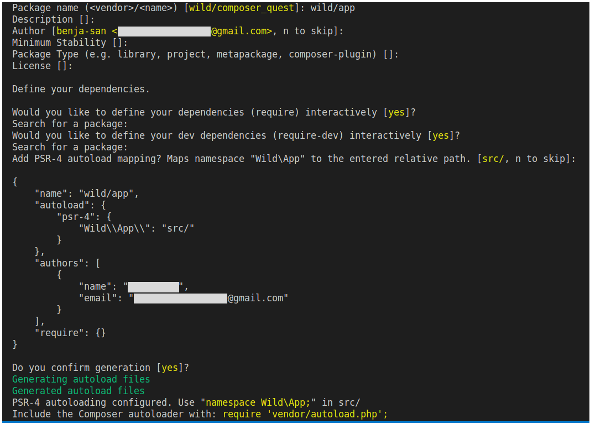

# Notes composer


## Tables of contents

1. [Installation](#installation)
2. [Initialisation d'un projet composer](#initialisation-dun-projet-composer)
3. [Chargement des classes (Autoloading)](#chargement-des-classes-autoloading)


##### [Return to Top](#notes-composer)
# **Installation**

* ## Installation locale

Il faut ouvrir un terminal et se rendre dans le dossier de son projet et exécuter les commandes suivantes une par une afin de télécharger **composer** dans le dossier de notre projet.

```sh
php -r "copy('https://getcomposer.org/installer', 'composer-setup.php');"
php composer-setup.php --filename=composer
php -r "unlink('composer-setup.php');"
```
Quand ces commandes seront exécutées, on devrait avoir un fichier nommé **composer** à la racine de notre projet.

* ## Installation globale

Il faut d'abord suivre les instructions de la section [installation locale](#installation-locale). Il faut ensuite déplacer le fichier **composer** que l'on a téléchargé précédemment dans n'importe quel dossier situé dans notre **PATH** avec la commande suivante :

```sh
$sudo mv composer /usr/local/bin
```
##### [Return to Top](#notes-composer)
# **Initialisation d'un projet composer**
Avant tout utilisation de composer,il faut vérifier si on utilise bien une version à jour. Pour mettre à jour automatiquement il faut lancer la commande suivante :
```sh
composer self-update
```
Pour initialiser un projet qui va utiliser **Composer**, on se place à la racine du projet et on lance la commande :
```sh
composer init
```
Cette commande est interactive. Elle va donc te demander de renseigner des informations spécifiques à ton projet :



Attention, si un fichier `composer.json` est déjà présent dans le projet, cette commande va l'écraser et le remplacer avec le fichier `composer.json` nouvellement initialisé.

Une fois que l'on a répondu à toutes les questions, **Composer** crée un fichier très important : **composer.json**.

Ce fichier contient toutes les informations relatives au projet que l'on a renseigné dans le terminal. Il contiendra également la liste des dépendantes à gérer. Exemple :
```json
{
    "name": "wild/app",
    "description": "Wild composer quest",
    "autoload": {
        "psr-4": {
            "App\\": "src/"
    },
    "authors": [
        {
            "name": "wilderName",
            "email": "wilder@email.com"
        }
    ],
    "require": {}
}
```

##### [Return to Top](#notes-composer)
# **Chargement des classes (Autoloading)**

Dans certains cas, il arrive que différentes classes, fonctions ou constantes portent le même nom (d'une bibliothèque à une autre par exemple). Afin d'éviter tout conflit PHP met à disposition des espaces de noms: les **namespaces**.

Il s'agit de "*dossiers virtuels*" qui permettent de faire la distinction entre une `Class Cat` importée d'une bibliothèque externe et une `Class Cat` définie dans notre projet par exemple. Ainsi, si ta classe `Cat` se trouve dans le *Namespace Animal,* le vrai nom complet de la classe sera `Animal\Cat` et non pas Cat (ce qui permet bien de différencier deux classes portant le même nom mais dans des namespace différents). 

Ce nom, composé du *namespace* associé au nom de la classe est appelé **nom pleinement qualifié** de la classe ou *Fully Qualified Class Name* (FQCN) en anglais.

```php
<?php 

namespace App;

class Hello
{
    public function talk() : string
    {
        return "Hello World !";
    }
}
?>
```

Pour utiliser les classes dans nos projets on va devoir importer un à un les fichiers .php qui les contiennent (avec `include` ou `require`). À mesure que le nombre de fichiers grandit, cela devient vite ingérable ! C'est pour cela que PHP propose un système d'*autoloading*.

Même si, en théorie, on peut créer plusieurs classes dans un même fichier, c'est une très mauvaise pratique. Si on souhaite utiliser l'*autoload*, on va devoir faire attention de toujours créer **une seule classe par fichier**, et t'assurer que le fichier PHP ait bien le **même nom** que la classe. Soit pour `"Animal/Cat`", un fichier `Cat.php`, pour "`Animal/Dog`", un fichier "`Dog.php`", etc.

On va utiliser le système d'*autoloading* de **Composer**. Composer va se charger d'importer automatiquement tous les fichiers PHP de ton projet et de les rassembler sous un seul *namespace* racine que tu auras défini dans ton fichier `composer.json`.

Lors de la dernière phase d'initialisation de ta commande `composer init`  L'invite de commande te propose automatiquement de bénéficier de l'autoloading en intégrant une entrée `autoload:` à l'interieur de ton fichier composer.json.

    Si jamais on vient à changer les informations du fichier composer.json, il sera nécessaire de lancer la commande `composer install` pour que les changements soient pris en compte.

Si on décide de générer l'autoload de manière automatique, on pourra accéder au dossier `vendor/`. Dans ce dossier, un fichier `autoload.php` est généré. C'est lui qui va se charger d'importer les classes etc. **Il est nécessaire de `require` le fichier `autoload.php` dans index.php pour pouvoir utiliser les namesspaces**.

```php
<?php 

require_once __DIR__ . '/../vendor/autoload.php';

$object = new App\Hello();

echo $object->talk();
?>
```

Si on modifie l'autoload dans le composer.json après l'installation, il faudra jouer la commande `composer dump-autoload` pour ques les changements soient pris en compte.